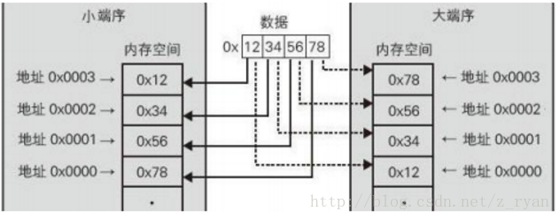

## C++

### C++特性 

- **封装**：把客观事物封装成抽象的类；将类的实现与接口分离，隐藏了类的实现细节，通过设置访问权限，保护类的成员不被随意访问【隐藏实现细节，代码模块化】
- **继承**：可以扩展已存在的类，让子类获得父类的属性【功能复用】
- **多态**：用父类的指针或引用统一操作各种子类对象。一个动作在不同情况下有不同的表现【向后兼容，可扩充】

```cpp
Animal *v[3]={&dog,&cat,&duck};
for(int i = 0; i<3; i++){
    v[i]->sound();
}
```

#### 多态

C++多态分为静态多态和动态多态

1. 静态多态<编译期完成>：函数重载（重载多态：函数重载、运算符重载）、泛型编程（参数多态：类模板、函数模板）
2. 动态多态<运行期完成>：虚函数，父类指针或引用可以根据所指的对象决定具体调用哪个类的虚函数

#### 重载 vs 重写（覆盖）

- 重载（overload）：允许存在多个**同名函数**，而这些函数的**参数表不同**（参数类型、参数数量、或两者）
  - 编译器根据函数不同的参数表，对同名函数的名称做修饰，然后这些同名函数就成了不同的函数（至少对于编译器来说是这样的）
  - 对于这两个函数的调用，在编译期就已经确定了，是静态的。也就是说，它们的地址在**编译期**就绑定了（早绑定）

- 重写（override）：子类重新定义父类虚函数的方法（和多态真正相关）
  - 当子类重新定义了父类的虚函数后，父类指针根据赋给它的不同的子类指针，动态的调用属于子类的该函数，这样的函数调用在编译期间是无法确定的（调用的子类的虚函数的地址无法给出）。因此，这样的函数地址是在**运行期**绑定的（晚绑定）。


#### 避免多继承二义性的办法

二义性：派生类与基类中存在名字相的数据或函数

解决方法：

1. 使用域运算符。在引用数据成员/成员函数时指明其作用域（类名::数据名）
2. 同名覆盖原则
3. 虚继承：让继承间接共同基类时只保留一份成员

```cpp
class A{};
class B:virtual A{};
class C:virtual A{};
class D:public B,public C{};
```

虚继承

父类对象中存在一个指向其虚拟父类子对象的一个指针（虚父指针）

#### 为什么可以由子类对象new一个父类对象，反之不行 [字客1]  

- 子类继承于父类，它含有父类的部分（除了父类私有属性和私有方法），又做了扩充。如果子类对象赋值给父类对象，则使用该对象只能访问子类的父类部分（因为子类含有父类的部分，所以不会有问题）
- 如果用子类指针指向父类的话,一旦访问子类特有的方法函数或者成员变量(父类是没有的),就会出现非法访问。因为被子类指针指向的由父类创建的对象,根本没有要访问的那些内容,那些是子类特有的,只有用子类初始化对象时才会有.（当子类指向父类的指针,因为内存空间比父类长,访问的话会导致内存溢出,所以不允许子类的指针指向父类）


### static

- 全局变量：本身是静态存储方式，作用域是整个源程序（可被其他源文件使用）
  static全局变量：静态存储，只初始化一次，作用域是变量所在的源文件

- static局部变量：只初始化一次，下一次依据上一次的结果

- 普通函数：在每个被调用中维持一份复制品
  static函数：作用域仅在本文件，需要在本文件中声明、定义，在内存中只有一份

### const

#### const关键字作用[字客1]

编译器通常不为普通const常量分配存储空间，而是将它们保存在符号表中，这使得它成为一个编译期间的常量，没有了存储与读内存的操作，使得它的效率也很高。

1. 修饰变量，说明该变量不可以被改变，编译器可以对其进行数据静态类型安全检查；
2. 修饰指针，分为**底层const**（指向常量的指针）和**顶层const**（常量指针，指针本身是常量）；

```cpp
//由近到远读
int a = 1;
const int* p1 = &a; //底层const：p1是个指针，指向int型对象，该对象是个常量
int* const p2 = &a; //顶层const：p2是个常量，p2是个指针，指向int型对象
```

3. 修饰引用，指向常量的引用（reference to const），用于形参类型，将值传递改为const &传递（不需要产生临时对象），即避免了拷贝，又避免了函数对值的修改；
4. 修饰函数的返回值，如果给“指针传递”的函数返回值加const，则返回值不能被直接修改，且只能被赋给加const修饰的同类指针
5. 修饰成员函数，说明该成员函数内不能修改成员变量，但可以读取数据成员。（声明、定义的时候都必须在参数列表后指定const）
6. 修饰数据成员：在某个对象生存期内是常量，而对于整个类而言是可变的，因为类可以创建多个对象，不同对象的const数据成员的值可以不同。（不能在类声明中初始化const数据成员，只能在类构造函数的初始化表中进行）
   常量对象及常量对象的引用/指针都只能调用常量成员函数

```cpp
class A{
    const int SIZE; //正确
    //const int SIZE=100; //错误，企图在类声明中初始化const数据成员
    //int array[SIZE]; //错误，SIZE未知
public:
    A(int size);
};
A::A(int size):SIZE(size)//构造函数的初始化表
{
}
```

【拓】建立在整个类中都恒定的常量：利用类中的枚举常量
枚举常量不会占用对象的存储空间，它们在编译时被全部求值。枚举常量的缺点是：它的隐含数据类型是整数，其最大值有限，且不能表示浮点数（如PI=3.14159）

> [相关链接](https://blog.csdn.net/love_gaohz/article/details/7567856?utm_medium=distribute.pc_relevant_t0.none-task-blog-BlogCommendFromMachineLearnPai2-1.nonecase&depth_1-utm_source=distribute.pc_relevant_t0.none-task-blog-BlogCommendFromMachineLearnPai2-1.nonecase)


1. 成员变量

- static 数据成员：类的全局变量，会被类的所有对象共享，包括派生类的对象
  必须在类外初始化，不同通过构造函数初始化，类外初始化时不加static修饰。(初始化格式：`int Base:var=10`)
- const 数据成员：限定变量不能被修改

2. 成员函数

- static 成员函数：所有对象共享该函数，不含this指针。static成员函数不能直接引用类中的非静态成员、const成员、const static成员，可以引用类中的static成员。可以获取类中的static成员、const static成员的值
- const成员函数：限定成员函数不能修改对象的普通数据成员（除了mutable、static数据成员），会在函数中添加一个隐式的参数this指针（这个指针总指向某个特定对象）`int GetCount(void) const;`


#### 类里面的变量可以既是const又是static

可以，表示类的静态常量<必须在定义的时候初始化>（如果是public，可以直接用类获取；如果是private，可以利用成员函数获取）

- static数据成员：必须在**类外**进行初始化，而不能在构造函数内进行初始化
- const数据成员：可以在**定义的时候初始化**，也可以通过**构造函数的初始化列表**进行初始化（但是不能在构造函数的函数体内初始化）
- const static 数据成员：可以在类内初始化`const static int m_const_static=1; `，也可以在类外初始化`const int Base::m_const_static(1);`  `const int Base::m_const_static=1;`。

但是，**类的成员函数不能既是const又是static**

C++编译器在实现const的成员函数的时候为了确保该函数不能修改类的实例的状态，会在函数中添加一个隐式的参数`const this` 。但当一个成员为static的时候，该函数是没有this指针的。也就是说此时const的用法和static是冲突的。

static的作用是表示该函数只作用在类型的静态变量上，与类的实例没有关系；
而const的作用是确保函数不能修改类的实例的状态，与类型的静态变量没有关系。


this的类型是指向类类型非常量版本的常量指针，不能把它绑定到一个常量对象上。
this的类型是`Base *const`（指向Base类对象的常量指针），常量成员函数的把this声明成了`const Base *const`（指向常量对象的常量指针）

#### `const char *p; char const *p; char * const p;`三个的区别

(从右往左读，`*` 读成 pointer to) 

1. `const char *p;`: p is a pointer to const char【底层const】
2. `char const *p;`: 同1，p is a pointer to const char【底层const】
3. `char * const p;`: p is a const pointer to char【顶层const】

#### 宏与const常量的区别

1. 编译器处理不同
   - 宏：是个“编译时”概念，在预处理阶段进行的（在编译时把所有用到宏定义值的地方用宏定义常量替换），生命周期结束于编译期
   - const：是个“运行时”概念，在程序运行时使用，可看作一个只读变量
2. 存储方式不同
   - 宏：直接替换，不为它分配内存
   - const：需要进行内存分配（static const 分配在全局变量区，局部变量分配在栈区）
3. 类型和安全检查不同
   - 宏：只进行文本替换（不计算、不进行表达式求解），没有数据类型，在编译时不会进行类型安全检查，可能产生边际效应等错误
   - const有具体的数据类型，在编译时会检查错误

【拓】
宏的缺点：

1. 容易出错，预处理器在拷贝代码时常常产生意想不到的边际效应
2. 宏不可调试，而内联函数可调试
3. 宏无法操作类的私有数据成员

#pragma pack

改变编译器的内存对齐方式 `pragma pack(n)` n字节的默认对齐方式

### sizeof

#### C++中不能被重载的运算符有哪些？

不能重载的运算符只有5个：

（1）. （成员访问运算符）。

（2）.* （成员指du针访问运算符）。

（3）∷（域运算符）。

（4）sizeof（长度运算符）。

（5）?: （条件运算符）。

#### 没有数据成员的类所占字节数

> [c++中各类型数据所占字节数（二）](https://www.cnblogs.com/zhangxuan/p/10751126.html)

空的类是会占用内存空间的，而且大小是1个字节，原因是C++要求每个实例在内存中都有独一无二的地址。

1. 类内部的数据成员：
   - 普通数据成员：是要占用内存的，但是要注意对齐原则(这点和struct类型很相似)
   - 静态数据成员：不占用内存，静态变量存放在全局变量区。
2. 类内部的成员函数：
   - 普通函数：不占用内存。
   - 虚函数：要占用4个字节，用来指定虚函数的虚拟函数表的入口地址。所以一个类的虚函数所占用的地址是不变的，和虚函数的个数是没有关系的。
3. 父类与子类：
   - 子类的大小是本身成员变量的大小加上父类的大小
   - 父类子类共享一个虚函数指针

[【C++拾遗】 从内存布局看C++虚继承的实现原理](https://blog.csdn.net/xiejingfa/article/details/48028491) 
    

```cpp
//1.空类
class A{
};
//2.仅含静态数据成员和函数
class B{
private:
    static int n;
public:
    int func(){};
}
//3.含有不同字节长度的数据成员
struct C{
    int i;
    short j;
    char ch;
};
//4.虚函数
class D{
    virtual void funcD1(){};
    virtual void funcD2(){};
};
struct E{
    virtual void funcE();
};
// 5.多重继承
struct F: public D,public E{
};
// 6.虚继承???????????????????
class G{}；

int main(){
    A a;
    cout<<sizeof(a)<<endl;// 1  (空类的对象)
    cout<<sizeof(A)<<endl;// 1  (空类)
    cout<<sizeof(B)<<endl;// 1  (仅含静态数据成员和函数)
    cout<<sizeof(C)<<endl;// 8=4+2+1+1 偏移量：i:0, j:4, ch:6 （自动补齐）
    cout<<sizeof(D)<<endl;//4 (C++类中有虚函数的时候有一个指向虚函数的指针(vptr)，指针大小为4字节。无论多少个虚函数，只有这一个指针，4字节)
    cout<<sizeof(F)<<endl;//8=4+4 多重继承（父类D的虚函数指针和父类E的虚函数指针）
    
    return 0;
}
//5.多继承
class a{
    virtual void f();
};
class b{
    char ch;
};
class c:public a{
    virtual void fun() = 0;
};
class d:public a{
    char t;
    virtual void fun() = 0;
};
class f:public b,public c{};
int main()
{
    cout << "sizeof(a)=" << sizeof(a)<<endl;//4
    cout << "sizeof(b)=" << sizeof(b)<<endl;//1
    cout << "sizeof(c)=" << sizeof(c)<<endl;//4（父类子类共享一个虚函数指针）
    cout << "sizeof(d)=" << sizeof(d)<<endl;//8 （自动补齐 1个char类型数据，一个父类子类共享的虚函数指针）
    cout << "sizeof(d)=" << sizeof(f)<<endl;//8（为了提高实例在内存中的存取效率。类的大小往往被调整到系统的整数倍）
    return 0;
}
```

#### sizeof vs strlen

sizeof带有'\0'占位符
strlen只计算字符长度

```cpp
int main()
{
    char a[] = "aaa";
    char *p =a;
    cout<<"sizeof:"<<sizeof(p)<<endl; //4
    cout<<"strlen:"<<strlen(p)<<endl; //3
    return 0;
}
```

### 内联

> [inline](https://zhuanlan.zhihu.com/p/50812510)

- 内联机制用于优化规模较小、流程直接、频繁调用的函数。
- 定义在类内的成员函数/友元函数是自动inline的
- 在类外部定义的函数可加inline显式指定内联

对于任何类型的函数，编译器会将函数类型(包括函数名字，参数类型，返回值类型)放入到符号表中。同样，当编译器看到内联函数，并且对内联函数体进行分析没有发现错误时，也会将内联函数放入符号表。
    当调用一个内联函数的时候，编译器首先确保传入参数类型是正确匹配的，或者如果类型不正完全匹配，但是可以将其转换为正确类型，并且返回值在目标表达式里匹配正确类型，或者可以转换为目标类型，内联函数就会直接替换函数调用，这就消除了函数调用的开销。假如内联函数是成员函数，对象this指针也会被放入合适位置。
    类型检查和类型转换、包括在合适位置放入对象this指针这些都是预处理器不能完成的（不能通过宏来实现）。

- 内联函数省去了函数调用的开销，从而提高程序的执行效率（省去了函数调用时压栈、跳转、返回的开销，以空间换时间）<调用函数：调用前先保存寄存器，并在返回时恢复；可能需要拷贝实参；程序转向一个新的位置继续执行>
- C++语言的函数内联机制既具备宏代码的效率，又增加了安全性，而且可以自由操作类的数据成员。
- 函数被内联后，编译器就可以通过上下文相关的优化技术对结果代码进行更深入的优化。

#### 何时不用内联

- 若函数体内的代码较长，使用内联将导致可执行代码膨胀过大
- 若函数体内出现循环或其他复杂的控制结构，那么执行函数体内代码的时间将比函数调用的开销大很多，使用内联意义不大（除非在大多数情况下，循环或switch语句从不执行）
- 不要轻易让构造函数和析构函数成为内联（对于析构函数，可能有隐含的成员和基类析构函数被调用）
- 很多编译器不支持内联递归函数（递归层数在编译时可能未知）

#### 内联 vs 宏定义

- 内联在编译时展开，宏在预编译时展开
- 内联函数可直接嵌入到目标代码中，而宏只是一个简单的文本替换
- 内联函数可以完成类型检测、语句是否正确等编译功能，而宏不具有
- 内联函数是函数，而宏不是
- 内联函数定义时不会出现二义性，而宏在定义时要小心处理，否则容易出现二义性

### 内存管理

#### 深拷贝 vs 浅拷贝

>[C++深拷贝和浅拷贝（深复制和浅复制）完全攻略](http://m.biancheng.net/view/2336.html)

- 浅拷贝：对内存地址的复制，让目标对象指针和源对象指向同一个内存空间【拷贝指针变量的值】
- 深拷贝：为目标对象分配一块内存，并将源对象所持有的内存拷贝过来。必须<u>显式地定义拷贝构造函数</u>才能达到深拷贝的目的【拷贝指针所指向的内存空间】
  

**浅拷贝存在的问题**
当内存销毁的时候，指向这片内存的几个指针需要重新定义才可以使用，要不然会成为野指针。
**何时深拷贝？**

- 当类持有其它资源（如动态分配的内存、指向其它数据的指针等）时
- 一个类拥有指针类型的成员变量（让源对象和目标对象的内存相互独立，不受影响）
- 创建对象时需要进行一些预处理（如统计创建过的对象数目、记录创建对象的时间等）

**深拷贝的应用**
STL中的string、vector、stack、set、map等都必须使用深拷贝


#### new vs malloc ▲

> https://www.cnblogs.com/ywliao/articles/8116622.html

在堆上创建和释放对象时，

new：分配空间，调用构造函数

1. 调用operator new 函数，申请足够的内存（底层通常使用malloc实现）
2. 调用类的构造函数，初始化成员变量，返回指针

delete：调用析构函数，释放空间

1. 调用析构函数
2. 调用operator delete函数，释放内存（底层通常使用free）

malloc/free只分配/释放空间，不调用构造/析构函数


|                    | malloc                                                   | new                                                          |
| ------------------ | -------------------------------------------------------- | ------------------------------------------------------------ |
| 属性               | 是库函数（需要添加头文件）                               | 是操作运算符，可重载（需要编译器支持）                       |
| 内存分配大小       | 按指定的大小分配，需要显式指定字节数                     | 按数据类型分配，编译器根据类型计算得到，不需要显式指定内存块大小 |
| 申请空间时         | 不调用构造函数                                           | 调用构造函数                                                 |
| 内存分配成功返回值 | void* （一般需要进行类型转换）                           | 指定对象的指针（类型安全性）                                 |
| 内存分配失败时     | 内存不够时，返回NULL（因此malloc后最好判断其是否为NULL） | 抛出bad_malloc异常                                           |
| 销毁               | free（不调用析构函数）                                   | delete（调用对象的析构函数）                                 |
| 已分配内存的扩充   | 可以用realloc扩容                                        | 无法直接处理                                                 |
| 申请数组时         | 只能用`sizeof(int)*n`                                    | new[]一次分配所有内存，多次调用构造函数                      |
| 销毁数组           | free                                                     | delete[]，多次调用析构函数，销毁每个对象                     |

```c++
int * a = (int *)malloc(sizeof(int));//分配单个变量
int * arr = (int *)malloc(sizeof(int) * n);//分配一个数组
free(a);//释放变量a
free(arr);//释放数组

A * ptr = new A;//分配单个对象
A * ptr_arr = new A[10];//分配10个A对象
delete ptr;
delete [] ptr_arr;
```


#### 内存泄漏 ▲

内存泄露：申请的内存空间没有被正确释放，导致后续程序里这块内存被永远占用

1. 指针变量超出作用域但其所指的内存没有被释放
2. 指针数组没有使用delete[]释放
3. 一个指针所指的对象没有其他指针指向这个对象，但这个指针转而指向别的对象，原对象所在的内存区域没有被释放

```cpp
Dog *pDog = new Dog();
pDog = nullptr;
```

4. 父类析构函数没有声明成虚函数，而子类中新分配了堆内存。当指向子类对象的父类指针被销毁时
5. shared_ptr中的循环引用
6. 使用指针时抛出异常而导致跳过delete语句

>  https://zhuanlan.zhihu.com/p/79850064

#### 野指针

野指针：指向被释放的或者访问受限内存的指针。
造成野指针的原因：

1. 指针变量没有被初始化（如果值不定，可以初始化为nullptr）
2. 指针被free或者delete后，没有置为nullptr, free和delete只是把指针所指向的内存给释放掉，并没有把指针本身干掉，此时指针指向的是“垃圾”内存。释放后的指针应该被置为nullptr. (悬垂指针)
3. 指针操作超越了变量的作用范围，比如返回指向栈内存的指针就是野指针。

#### struct vs class

唯一的区别是默认的访问权限不同，struct的默认访问权限和默认继承访问权限为public，而class为private

#### 引用 vs 指针 [T1]

引用：一个对象的别名，本身不是一个对象，必须初始化

- 同：两者都是对内存的间接访问
- 异：
  - 引用：“绑定”内存中的某个对象；指针：“指向”内存中的某个对象
  - 指针是一个对象，运行赋值拷贝，可以指向几个不同的对象；引用不是对象，不能重新绑定到另一个对象上
  - 指针可以不初始化，但引用必须初始化
  - 有指针的指针，但不能有引用的引用（引用本身不是一个对象）

### 类

#### 构造函数不能是const、static、虚函数

构造函数不能是const、static、虚函数

- 创建类的一个const对象时，直到构造函数完成初始化，对象才真正取得了常量属性（构造函数在const对象的构造过程中可以向其写值）
- static没有this指针

#### 析构函数

在虚基类中，如果不提供函数的缺省实现，一定要定义成纯虚函数，否则会出错`undefined reference to 'vtable for Shape'`。析构函数可以是纯虚的，但纯虚析构函数必须有定义体，因为析构函数的调用在子类中是隐含的

```cpp
class Shape{
public:
    virtual double getarea()=0;
    virtual ~Shape()=0;//没法直接在此处加定义体
};
Shape::~Shape(){}; //纯虚析构函数必须有定义体
```


#### 可以显式调用析构函数吗？

可以通过对象调用析构函数，也可以通过对象的指针或引用调用析构函数。
与调用destroy类似，调用析构函数可以清除给定对象，但不会释放该对象所在的空间。需要的话可以重新使用该空间。
（调用析构函数会销毁对象，但不会释放内存）

- 显式调用时，析构函数相当于一个普通的成员函数。调用析构函数会销毁对象，但不会释放内存。在对象生命周期结束后，编译器会隐式调用析构函数，释放栈内存
  重复释放堆内存
- 用户显式调用析构函数的时候，只单纯执行析构函数内的语句，不会释放栈内存

- 用delete释放指针所指空间，不改变指针的值（成为野指针），建议delete之后手动将指针置为NULL，并在delete之前用if语句加以判断，防止程序崩溃；
- 可以显式调用析构函数，但是编译器仅调用用户定义的部分，不调用系统隐含的析构函数，显式调用析构函数之后对象仍存在，只是释放了堆内存（如果有delete相关语句），仍然可以使用对象的其他部分，在对象生命周期结束时还会再调用系统隐含的析构函数以及用户定义的析构函数；
- 如想限制对象的生命周期或提前结束对象生命周期，请使用代码块（大括号），不要显式调用析构函数，但是显式调用析构函数确实可以“清理”诸如链表之类的对象（因为链表的节点都是动态分配的），当然，如果没有动态分配空间，自己编写析构函数的意义也不大。

#### 不存在基类向派生类的隐式类型转换

每个子类对象都包含一个父类部分，父类的引用或指针可以绑定到该父类部分上。一个基类的对象既可以以独立的形式存在，又可以作为派生类对象的一部分存在。
因为一个基类对象可能是派生类对象的一部分，也可能不是，所以不存在基类向派生类的自动类型转换
即使一个基类指针或引用绑定在一个派生类对象上，也不能实现基类向派生类的转换。

```cpp
Base base;
//Derived* derived = &base; //错
//Derived& derived = base;  //错
Derived derived;
Base * base1 = &derived;//对
//Derived *derived1 = base1;//错，基类不能向派生类的转换。
```

编译器只能通过检查指针或引用的静态类型来推断该转换是否合法。可采用dynamic_cast请求类型转换，该转换的安全检查在运行时执行。如果基类向派生类的转换是安全的，则可以使用static_cast强制覆盖编译器的检查工作。

派生类向基类的自动类型转换只对指针或引用类型有效，对象之间不存在类型转换。


#### 虚函数 vs 纯虚函数

纯虚函数：在基类中没有定义的虚函数，要求任何派生类都要定义自己的实现方法。在基类中实现纯虚函数的方法是在函数的原型后面加=0。让基类不可实例化

1. 为了方法使用多态特性，通常需要在基类中定义虚函数
2. 但是有的时候，基类本身生成对象是不合理的，比方说动物有猫、狗等，但动物本身生成对象是不合常理的
3. 纯虚函数一定没有定义，纯虚函数用来规范派生类的行为，即接口。包含纯虚函数的类是抽象类，抽象类不能定义实例，但可以声明指向实现该抽象类的具体类的指针或引用。

纯虚函数调用会发生什么，子类重写纯虚函数是在什么时候进行覆盖的，可不可能在期间调用纯虚函数

#### 虚函数的实现▲

> https://blog.csdn.net/lyztyycode/article/details/81326699?utm_medium=distribute.pc_relevant_t0.none-task-blog-BlogCommendFromMachineLearnPai2-1.nonecase&depth_1-utm_source=distribute.pc_relevant_t0.none-task-blog-BlogCommendFromMachineLearnPai2-1.nonecase

什么是虚函数？函数重载、覆盖、隐藏？虚函数如何创建、如何继承？如何访问？

虚函数：被virtual关键字修饰的成员函数

<u>创建</u>：每个含有虚函数的类都会有一个虚函数表与之对应，虚函数表是指针数组，数组中每个元素对应一个虚函数的函数指针。类创建一个对象的时候，会生成一个虚表指针，指向该类的虚函数表（同一个类的对象共用一个虚函数表）

<u>继承</u>：子类继承带有虚函数的父类时，首先会复制父类的虚函数表，然后把子类中已经重写的虚函数对应的函数指针替换掉，如果子类中有新的虚函数，则追加子类虚函数指针

<u>访问</u>：

- 当通过类对象调用一个虚函数时，直接调用该类对应的虚函数，这是静态绑定，没有用到多态
- 当通过指向对象的指针或引用调用虚函数，程序将根据对象类型来调用相应的虚函数，此时是动态绑定，体现了多态。


#### 不能声明为虚函数的函数

任何构造函数之外的非静态成员函数都可以是虚函数
虚函数是在运行期动态绑定的
**不能声明为虚函数的有**：普通函数（非成员函数）；静态成员函数；内联成员函数；构造函数；友元函数
虚函数是通过继承体现多态的，没有继承特性的函数也没有虚函数的说法

- **普通函数**：普通函数只能被重载，而不能被重写，编译器会在编译时绑定函数
- **静态成员函数**：没有this指针，属于某个类，而不属于某个对象
- **内联函数**：inline函数在编译时被展开，虚函数在运行时才动态绑定
- **构造函数**：1）构造函数不能被继承，2）构造函数用来初始化对象，只有在一个对象生成之后才能发挥多态的作用，如果将构造函数声明为虚函数，则表现为在对象还没有生成的时候来定义它的多态，这两点是不统一的。（调用构造函数时，虚表指针没有在对象的内存空间中，必须要构造函数调用完成后才会形成虚表指针）
- **友元函数**：友元函数不属于类的成员函数，不能被继承

【注】<u>析构函数通常声明为虚函数</u>

#### 析构函数应该是虚函数

这个是解决  删除指向子类对象的父类指针 ~~用父类指针删除其所指的子类对象~~ 可能出现的问题

如果析构函数不被声明成虚函数，则编译器实施静态绑定，在删除基类指针时，只会调用基类的析构函数而不调用派生类析构函数，这样就会造成派生类对象析构不完全。

- 子类分配的内存不能被释放

- ```cpp
  class Animal{
  class Animal{
  public:
      virtual void bark()=0;
      Animal(){
          cout<<"Animal ctor"<<endl;
      }
       ~Animal(){
          cout<<"Animal dctor"<<endl;
      };
  };
  class Cat:public Animal{
  public:
      //int a;
      Cat(){
          cout<<"Cat ctor"<<endl;
      }
      void bark(){
          cout<<"miao"<<endl;
      }
      ~Cat(){
          cout<<"Cat dctor"<<endl;
      };
  };
  class Dog: public Animal{
  private:
      int *dd;
  public:
      Dog(){
          dd = new int[200];
          cout<<"Dog ctor"<<endl;
      }
      void bark(){
          cout<<"wang"<<endl;
      }
      ~Dog(){
          delete[] dd;
          cout<<"Dog dctor"<<endl;
      };
  };
  int main(){
      Animal *pA = new Dog();
      delete pA;
      /* 输出：
      Animal ctor
      Dog ctor
      Animal dctor （没有调用Dog的析构函数）
      */
      
  	Animal *animals[2];
      animals[0] = new Cat();//&cat;
      animals[1] = new Dog();//&dog;
      delete[] animals;
      /* 内存泄漏 堆对象Dog中new的dd没有被delete
      Process returned -1073741819 (0xC0000005)
      */
      
      Cat cat; //栈对象
      Dog dog; //栈对象
      Animal *animals[2];
      animals[0] = &cat;
      animals[1] = &dog;
      delete[] animals;
      cat.bark();
      cout<<endl;
      /*
      Animal ctor
      Cat ctor
      Animal ctor
      Dog ctor
      miao
  
      Dog dctor  //退出main函数的时候调用析构函数，删除栈上的对象
      Animal dctor
      Cat dctor
      Animal dctor
      */
  }
  ```


#### 构造函数中调用虚函数

构造函数不能是虚函数，但构造函数里能调用虚函数

```cpp
class Base{
public:
    Base(){
        func();
    }
    virtual void func(){
        cout<<"Base func"<<endl;
    }
};
class Derived : public Base{
public:
    Derived(){
    }
    void func(){
        cout<<"Derived func"<<endl;
    }
};
int main(){
    Base *p = new Derived;
    return 0;
}
//输出：Base func
//父类指针生成子类对象，会隐式调用父类的构造函数，尽管对象是子类，但是在构造父类部分时，还只是Base，所以调用的是父类的虚函数
```

#### 友元

友元：允许其他类或者函数访问它的非公有成员

- 友元**声明**只能出现在类定义的内部（友元的声明仅仅指定了访问权限，而非真正意义上的声明），而定义在类内或者类外没有区别
- 友元不是类的成员，不受它所在区域访问控制级别的约束
- 友元关系是单向的，不能传递，不能继承

优：能够提高效率，表达清晰、简单；
缺：破坏了类的封装

应用：

- 为类重载二元运算符时（带两个参数的运算符）常常需要友元【计算两个点的距离：point类，distance友元函数】
- 两个类要共享数据的时候【遥控器类、电视机类，遥控器可以改变电视机状态】

```cpp
class wheel;
class car{
public:
    car(char *pn);
    void run(wheel &w); //成员函数，做成wheel类中友元函数实现
private:
    char name[20];
};
class wheel{
public:
    wheel(int s);
    friend void car::run(wheel &w);   //这里把car类的成员函数做了友元函数。
private:
    int speed;
};
```


### STL容器

#### 迭代器失效情况

- vector：添加、删除都可能使容器部分或全部迭代器失效
  1. 插入push_back元素后，若capacity返回值与插入前不同，则需要重新加载整个容器，所有迭代器失效；若与插入前相同，则插入位置之后元素的迭代器失效，end返回的迭代器失效
  2. 删除erase/pop_back元素后，指向删除点及其之后元素的迭代器都失效
- deque
  1. 首部/尾部插入元素不会使任何迭代器失效
  2. 在首部/尾部删除元素，只会使指向被删除元素的迭代器失效
  3. 在容器的其他任何位置插入或删除都会导致所有迭代器失效
- list：对于节点式容器(map, list, set)元素的删除，插入操作会导致指向该元素的迭代器失效，其他元素迭代器不受影响


#### push_back vs emplace_back

push_back()首先需要调用构造函数构造一个临时对象，然后调用拷贝构造函数将这个临时对象放入容器中，然后释放临时变量。这样造成的问题就是临时变量申请资源的浪费。

emplace_back()在容器尾部添加一个元素，这个元素原地构造，不需要触发拷贝构造和转移构造。而且调用形式更加简洁，直接根据参数初始化临时对象的成员。

#### map vs set

同：都是关联容器，底层实现都是红黑树，元素根据键排序

异：

- set：元素是键，不存在重复元素，不支持下标操作，不能通过迭代器改变set的值，因为set的值就是键
- map：元素是key-value键值对，key可以作为下标

#### 红黑树

性质：

1. 每个节点要么红，要么黑
2. 根节点是黑的
3. 每个叶节点（NIL）都为黑
4. 每个红色节点的两个子节点必为黑色
5. 任意一个节点到每个叶子节点的路径都包含相同数量的黑节点

**左旋**：以某个结点作为支点(旋转结点)，其右子结点变为旋转结点的父结点，右子结点的左子结点变为旋转结点的右子结点，左子结点保持不变。

**右旋**：以某个结点作为支点(旋转结点)，其左子结点变为旋转结点的父结点，左子结点的右子结点变为旋转结点的左子结点，右子结点保持不变。


### C++11新特性

#### 概览

- **nullptr**：空指针
- **constexpr**：将表达式/函数编译为常量结果
- **auto**：变量类型推导，让编译器自动分析某个变量的类型
- **decltype**：变量/表达式类型推导，让编译器自动分析表达式的类型得到相应类型（不用计算表达式的值）
- **范围for语句**：简化遍历序列的操作 `for(auto c : str)`
- **委托构造**：同个类中的一个构造函数可以调用另一个构造函数
- **继承构造**：子类可以直接调用父类的构造函数  `using Base::Base;`
- **Lambda表达式**：用于定义并创建匿名的函数对象，以简化编程工作
- **智能指针**：自动回收指针，防止内存泄漏
- **元组tuple**：可以存放任意数量的不同类型的元素
- **右值引用**：对右值进行引用操作，绑定到一个将要销毁的对象
- **move**：将一个左值强制转化为右值引用，继而可以通过右值引用使用该值
- **完美转发**：不改变原值的属性（左值还为左值，右值还是右值）

#### 右值

左值：表达式结束后依然存在的持久对象，变量

右值：表达式结束后就不再存在的临时对象（不能取地址），字面量、程序执行结果中产生的临时对象（例如函数返回值、lambda 表达式等）既无名称也无法获取其存储地址，属于右值

右值引用：只能绑定到一个将要销毁的临时对象，可以绑定到要求转换的表达式、字面常量或返回右值的表达式（右值引用主要用于移动语义和完美转发）

```cpp
int i = 42;
int &l = i;//对，左值引用
const int &lr = i*42;//对，可以将一个const引用绑定到一个右值上
//int &&r = i; //错，不能将右值引用绑定到左值上，不能绑定到变量上，即使变量是右值引用类型也不行
int &&rr = i*42;//对，可以将右值引用绑定到乘法结果上
```


#### move语义

移动语义：将其他对象（通常是临时对象）拥有的内存资源“移为己用”，以移动而非深拷贝的方式初始化含有指针成员的类对象。

对于程序执行过程中产生的临时对象，往往只用于传递数据（没有其它的用处），并且会很快会被销毁。因此在使用临时对象初始化新对象时，我们可以将其包含的指针成员指向的内存资源直接移给新对象所有，无需再新拷贝一份，这大大提高了初始化的执行效率。

#### 

#### Lambda表达式

定义并创建匿名的函数对象，用于替换独立函数或者函数对象，以简化编程工作（快速实现一些小功能但并不想为此单独编写整个函数）

```cpp
// 完整语法
[ capture-list ] ( params ) mutable(optional) constexpr(optional,c++17) exception attribute -> return type { body }

[](int x, int y)->int{return x+y;}

// 可选的简化语法
[ capture-list ] ( params ) -> ret { body }     
[ capture-list ] ( params ) { body }    
[ capture-list ] { body }
```

- `[函数对象参数]`：设置读取变量的方式（按值/址&）
  []表示不截取任何变量；
  [&]截取外部作用域中所有变量，并作为引用在函数体中使用；
  [=].....，拷贝一份在函数体内使用
  [=, &num] 截取外部作用域中所有变量，并拷贝一份在函数体中使用，但是对num变量使用引用
  [k] 截取k变量并且拷贝一份在函数体重使用，同时不截取其他变量
  [this] 截取当前类中的this指针。如果已经使用了&或者=就默认添加此选项。
- `(parameter list)`：形参列表（可省略）
- `->return type`：返回值类型（可省略）
- `{function body}`：函数体

```cpp
auto ptr = []() {cout << "hello" << endl; };	//lambda表达式
ptr();//调用函数

auto fun = [](int x, int y)->int {return x+y;};	//带参数的lambda表达式
auto z=fun(3, 4);
cout << z << endl; //7


int x=10;
//1.复制捕捉x，函数体内不能修改x
auto sum1=[x](int a, int b)->int{return x+a+b;};
cout<<sum1(1,2)<<endl;// 13
cout<<x<<endl;//x=10
//2.复制捕捉x，利用mutable修改函数体内的x，但不影响外部x的值
auto sum2=[x](int a, int b)mutable->int{x=20;return x+a+b;};
cout<<sum2(1,2)<<endl;// 23
cout<<x<<endl;//x=10
//3.引用捕捉x，函数体内修改x，影响外部x的值
auto sum3=[&x](int a, int b)->int{x=20; return x+a+b;};
cout<<sum3(1,2)<<endl;// 23
cout<<x<<endl;//x=20
```


从C++14开始，lambda表达式支持泛型：其参数可以使用自动推断类型的功能，而不需要显示地声明具体类型。这就如同函数模板一样，参数要使用类型自动推断功能，只需要将其类型指定为auto，类型推断规则与函数模板一样。这里给出一个简单例子：

```cpp
auto add = [](auto x, auto y) { return x + y; };

int x = add(2,3);   // 5
double y = add(2.5,3.5);  // 6.0
```

 

#### 可调用对象

可调用对象：函数、函数指针、重载了函数调用运算符的类、lambda表达式

- 构造函数
- 析构函数
- 函数对象
- lambda表达式

#### RAII 资源获取即初始化

C++资源管理、避免内存泄漏的方法（Java、Python有垃圾回收机制）

利用了类超出作用域时会自动调用析构函数的特点。把资源用类封装起来，在构造函数中获取对应的资源，在生命期内控制对资源的访问，使之始终保持有效，在析构函数中释放资源。<资源：网络套接字、互斥锁、文件句柄、内存等>

智能指针、模板类lock_guard（而mutex创建互斥量时通过调用成员函数lock()上锁、unlock()解锁，不易管理）

java、python具备垃圾回收机制

#### 智能指针及其实现原理 ▲

> [详解C++11智能指针](https://www.cnblogs.com/WindSun/p/11444429.html)

动态管理内存的时候可能会出现两个问题：

1. 忘记释放内存，导致内存泄漏
2. 在还有其他指针指向内存的情况下，释放了这个内存

智能指针的把普通的指针封装成一个类，当超出类的作用域时，类会自动调用析构函数释放资源。目的就是为了更安全地使用动态内存。

- unique_ptr（替代了auto_ptr）：是独占式的， 就是一个对象只能被一个智能指针拥有。auto_ptr 使用拷贝移动，拷贝后原对象变得无效，再次访问原对象时会导致程序崩溃；unique_ptr 则禁止了拷贝语义，但提供了移动语义，即可以使用 std::move() 进行控制权限的转移

```cpp
unique_ptr<string> p1(new string("hello"));
unique_ptr<string> p2;
//p2 = p1; //eg1:错误，避免了p1不再指向有效数据的问题
unique_ptr<string> p3;
p3 = unique_ptr<string>(new string("ok")); //eg2:编译正确，允许源unique_ptr是个临时右值（临时对象在其所有权让给 p3后就会被销毁）
```

- shared_ptr：允许多个指针指向同一对象，采用**引用计数**的方法记录当前内存资源被多少个智能指针引用（共同维护一个引用计数器），该对象和其相关资源会在“最后一个引用被销毁”时候释放。当新增一个时引用计数+1，当reset()时引用计数-1。只有引用计数为0时，智能指针才会自动释放引用的内存资源。（但是两个对象相互使用一个shared_ptr成员变量指向对方，会造成**循环引用**，会导致内存泄漏）
- weak_ptr：一种弱引用，指向shared_ptr所管理的对象，打破循环引用（死锁，内存泄漏） 主要用于监测shared_ptr中所管理的指针资源是否存在

> https://blog.csdn.net/king_way/article/details/95536938

```cpp
#include <iostream>
#include <bits/stdc++.h>
using namespace std;
class B;
class A {
public:
    shared_ptr<B> ptrB;
    A(){
        cout<<"A ctor"<<endl;
    }
    ~A(){
        cout<<"A dctor"<<endl;
    }
};

class B {
public:
    weak_ptr<A> ptrA;
    //shared_ptr<A> ptrA;
    B(){
        cout<<"B ctor"<<endl;
    }
    ~B(){
        cout<<"B dctor"<<endl;
    }
};

int main() {
    {
        shared_ptr<A> pA(new A);
        shared_ptr<B> pB(new B);
        cout<<pA.use_count()<<endl;
        cout<<pB.use_count()<<endl;
        pA->ptrB = pB;
        pB->ptrA = pA;
        cout<<pA.use_count()<<endl;
        cout<<pB.use_count()<<endl;
    }
    return 0;
} 
/*
A ctor
B ctor
1
1
1
2
A dctor
B dctor
*/
```


#### 类型转换

const_cast, static_cast, dynamic_cast, reinterpret_cast

1. **const_cast**
   去掉const性质，只能改变对象的底层const。只能改变表达式的常量属性，不能改变表达式的类型。

```cpp
char c ='2';
const char *pc=&c;
char *p = const_cast<char*>(pc);
*p = 'a';
```

const_cast 常用于有函数重载的上下文中

2. **static_cast**
   静态转换（在编译期间转换）基本类型转换

- 基本数据类型转换，例如 short 转 int、int 转 double等；
- 父类和子类之间指针或引用的转换，但没有运行时类型检查来保证转换的安全性
  向上转换（子类指针/引用转换成父类的）：安全
  向下转换（父类指针/引用转换为子类的）：由于没有运行时类型检查，所以不安全
- void 指针和具体类型指针之间的转换，例如`void *`转`int *`、`char *`转`void *`等；必须确保转换后所得类型就是指针所指类型，强制转换的结果将与原始地址值相等
  <任何非常量对象的地址都能存入void*>
- 可以显式地将一个左值转换为一个右值引用（move函数）
- 不能在两个具体类型的指针间转换
- 不能将整数转换为指针类型

3. **dynamic_cast**
   动态类型转换（运行时检查类型安全），多态类之间的类型转换，只能转换指针或引用
   （1）`dynamic_cast<type*>e`  e必须是有效指针，失败返回0
   （2）`dynamic_cast<type&>e`  e必须是左值，因为不存在空引用，所以失败抛出bad_cast异常
   （3）`dynamic_cast<type&&>e`  e不能是左值，失败抛出bad_cast异常
   type必须是类类型（须含有**虚函数**）
   e的类型是type的公有子类/公有父类/type类型。

- 主要用于类层次间的上下行转换，也可用于类之间的交叉转换
  1. 向上转换：dynamic_cast和static_cast效果一样
  2. 下行转换：如果向下转换安全（基类指针/引用确实指向一个派生类对象），此时返回转换后的指针，否则返回0（基类指针/引用没有指向一个派生类对象）。dynamic_cast具有类型检查功能，比static_cast更安全。
  3. 交叉转换

```cpp
class Base{
public:
    virtual void fun(){};
};
class Derived1:public Base{
};
class Derived2: public Base{};
void foo(){
    Derived1 *pd1 = new Derived1;
    Derived2 *pd2 = dynamic_cast<Derived1*>(pd1);//交叉转换
    delete pd1;
 }
 
class Base1{
public:
    virtual void g(){}；
 };
 //多继承
 class MultiDerived: public Base, public Base1{
 };
 void foo_multi(){
    Base* pbmd = new MultiDerived;
    MultiDerived* pmd = dynamic_cast<MultiDerived*>(pbmd);
    Base1* pb1 = dynamic_cast<MultiDerived*>(pbmd);//如果要转化为Base的兄弟类Base1，必须使用dynamic_cast
 }
```


4. **reinterpret_cast**
   为运算对象的位模式提供较低层次上的重新解释。不同类型的指针类型转换（不常用）


## 编译、链接、装载与库

### 编译与链接

#### 编译 vs 链接

- **编译**(compile)：由编译程序把源文件编译成中间代码文件（object file，windows下为.obj，unix、Linux下为.o）
  编译时编译器需要<u>检查语法的正确、函数与变量声明的正确</u>
- **链接**(link)：由链接程序将编译后形成的大量的中间目标文件以及它们所需的库函数链接在一起（这里也包括.lib/.a文件，.lib/.a文件件本质上就是打包的.obj文件集合）
  链接是<u>让目标文件之间相互链接自己所需的函数和全局变量</u>（函数可能来源于其它目标文件或库函数）

#### 代码文件到可执行程序的过程 ▲

> https://www.cnblogs.com/xcywt/p/4951290.html

C++完整编译过程：预编译->编译->汇编->链接

- **预编译**：把头文件、宏定义等以#开头的预编译指令替换，删除注释。【得到.i文件】

- **编译**：编译器对预编译完的文件进行词法分析、语法分析、语义分析以及相应的优化，产生汇编代码文件。【得到.s文件】

- **汇编**：将编译完的汇编代码文件翻译成机器指令，生成可重定位目标程序的.o文件【得到.o文件】

  该文件为二进制文件，字节编码是机器指令。汇编器没有复杂的语法、语义，不需要做指令优化，只是根据汇编指令和机器指令对照表一一翻译。

- **链接**：通过链接器将一个个目标文件（或许还会有库文件）链接在一起生成一个完整的可执行程序。【得到.out/.exe文件】

#### 编译器

> https://www.cnblogs.com/xcywt/p/4902789.html

1. **词法分析**：利用有限状态机将源代码字符序列分割为一系列的记号。把标识符放在符号表，数字、字符串等字面量放在文字表

2. **语法分析**：产生语法树（以表达式为节点的树）。对符号含义、优先级进行区分，判断括号是否匹配、表达式是否缺少操作符等

3. **语义分析**：将语法树中节点表明含义（为语法树的表达式标明类型）。编译期分析的是静态语义。
   - 静态语义：编译阶段可以确定的语义，包括声明和类型的匹配、类型的转换
   - 动态语义：运行期才能确定的语义，eg.将0作为除数
4. **中间语言生成**：将整个语法树转换成中间代码（语法树的顺序表示），会在源码级别进行优化。eg.(2+6)会被优化为8
5. **目标代码生成与优化**：利用代码生成器将中间代码转换成目标机器代码，利用目标代码优化器对目标代码进行优化(eg.选择合适的寻址方式、使用位移代替乘法、删除多余的指令等)


- 现在的编译器可以将源代码文件编译程一个未链接的目标文件，然后由链接器最终将这些目标文件链接起来形成可执行文件

#### ELF文件结构

PE-COFF/ELF文件：可重定位文件(目标文件.obj/.o，静态链接库.lib/.a)、可执行文件(.exe)、共享目标文件(动态链接库.dll/.so)、核心转储文件

目标文件：编译后未链接的中间文件，与可执行文件的内容和结构很相似

- ELF文件头：描述整个文件的属性（ELF魔数<16字节：ELF标识码、字长、字节序大小端、文件版本>、程序头入口、段表位置、段表字符串表下标等）
- 常见的段：
  - 代码段(.text)
  - 重定位表(.rel.text)：每个要重定位的ELF段都有一个对应的重定位表（.text中有要被重定位的地方就会有对应的.rel.text表）每个重定位的入口都是对一个符号的引用，链接器会查找所有输入目标文件的符号表组成的全局符号表，找到相应的待引用符号的目标地址，进行重定位
  - 数据段(.data)：保存已经初始化的全局变量和局部静态变量
  - 只读数据段(.rodata)：存放只读变量（const修饰的变量）和字符串常量 (操作系统在加载时可以将该段属性映射为只读，保证了程序的安全性)
  - BSS段(.bss)：存放未初始化的全局变量和局部静态变量（默认值都为0，没必要用.data存放0），.bss段为它们预留了位置但不占空间，到最终链接成可执行文件时再在.bss段分配空间，在程序运行的时候占内存
  - 符号表(.symtab)
  - 字符串表(.strtab)：存储ELF文件中用到的各种字符串
  - 段名表(.shstrtab)
- 段表：保存段的基本属性，记录每个段的下标、段名、段长、偏移、读写权限等

#### 符号修饰

C++采用命名空间来减少多模块的符号冲突。通过符号修饰允许多个不同参数类型的函数有同样的名字（函数重载），允许在不同的名称空间有多个同样名字的符号

GCC编译器下：`int C::CF::func(int)`->`_ZN1C2CF4funcEi`

不同编译器下有不同的符号修饰方法，因此不同编译器编译的产生的目标文件可能无法正常链接

`extern "C"{}` 使括号内部的代码以C语言代码处理，C++的符号修饰机制不会起作用

#### 重复代码消除

C++编译器在很多时候会产生重复代码：如模板、外部内联函数、虚函数表等都可能在不用编译单元力生成相同的代码。可能造成1.空间浪费、2.地址较易出错、3.指令运行效率较低

解决方法：将每个模板的实例代码都单独存放在一个段里，每个段只包含一个模板实例(如int类型和float类型实例化的模板函数，分别生成两个段`.temp.add<int>`,`.temp.add<float>`）。链接器在最终链接的时候区分相同的模板实例段，再将它们合并到最后的代码段。外部内联函数、默认构造函数、默认拷贝构造函数、赋值操作符等都是采用类似的方法。


#### 静态语言 vs 动态语言

- 静态语言（强类型语言）：在编译时变量的数据类型即可确定的语言，大多静态语言要求在使用变量之前必须声明数据类型。如C、C++、Java
- 动态语言（弱类型语言）：在运行时确定数据类型的语言，变量使用之前不需要类型声明，不必每次都指定类型，代码开发快， 如Python、JavaScript

编译型语言：源代码一次性编译程可执行的机器码 C、C++

解释型语言：使用专门的解释器将源程序逐行解释长特定平台的机器码并立即执行。Python

java编译成.class文件（但不是机器可识别的语言），需要jvm解释实现跨平台执行


#### 装载

物理内存：通过物理内存条而获得的内存空间，CPU地址线可以直接进行寻址的内存空间

虚拟内存：指将硬盘的一块区域划分来作为内存。

虚拟地址空间(VAS)的大小由计算机硬件的寻址空间大小决定（32位的硬件平台决定了虚拟地址空间位0到$2^{32}-1$，即4GB虚拟空间大小）一般来说指针大小的位数与虚拟空间的位数相同（32位平台下指针为32位，即4字节）

4GB的虚拟空间一部分由操作系统占用(linux下1GB)，原则上进程最多可使用3GB虚拟空间

32位CPU下，程序使用的计算机内存空间可以超过４GB，采用36位的物理地址并使用新的映射方式可以访问64GB的物理内存（PAE物理地址扩展）


### 内存管理

操作系统通过给进程空间划分出若干个VMA（虚拟内存地址）来管理进程的虚拟空间，基本原则是将相同权限属性的、有相同映像文件的映射成一个VMA。

从高地址到低地址的分布为栈、堆、数据段（BSS被合并到数据段里）、代码段


页是映射的最小单位，默认页大小为4096字节

#### 大小端

大端：高位字节放在低地址（网络字节序）

小端：高位字节放在高地址（intel系列）



[大小端](https://www.jianshu.com/p/ca53bbed2495)

网络字节序：网络编程中,TCP/IP统一采用大端方式传送数据，所以有时我们也会把大端方式称之为网络字节序。

UDP/TCP/IP协议规定:把接收到的第一个字节当作高位字节看待,这就要求发送端发送的第一个字节是高位字节;而在发送端发送数据时,发送的第一个字节是该数值在内存中的起始地址处对应的那个字节,也就是说,该数值在内存中的起始地址处对应的那个字节就是要发送的第一个高位字节(即:高位字节存放在低地址处);由此可见,多字节数值在发送之前,在内存中因该是以大端法存放的;
　　所以说,网络字节序是大端字节序;

当两台采用不同字节序的主机通信时，在发送数据之前都必须经过字节序的转换成为网络字节序(即大端方式)后再进行传输。保持交互时数据的一致

- 字节序转换函数

```c
#include <arpa/inet.h>
/* 相关函数
//将主机(host)字节序转化为网络字节序 
uint32_t htonl(uint32_t hostlong);
uint16_t htons(uint16_t hostshort);
//将网络(net)字节序转换为主机字节序
uint32_t ntohl (uint32_t netlong);
uint16_t ntohs (uint16_t netshort);
*/
int main()
{
        struct in_addr ipaddr;
        unsigned long addr = inet_addr("192.168.1.100");
        printf("addr = %u\n", ntohl(addr));
 
        ipaddr.s_addr = addr;
        printf("%s\n", inet_ntoa(ipaddr));      
        return 0;       
}
```


#### 进程栈初始化

操作系统在进程启动前需要将系统环境变量、进程的运行参数等运行环境信息提前保存到进程的虚拟空间的栈中。

栈顶寄存器esp指向的位置是初始化后的栈顶，记录命令行参数的数量，指向这些参数字符串的指针，0，指向环境变量的指针，0表示结束。进程启动后，程序库部分会把栈里的初始化信息中的参数信息传给main函数，也就是argc和argv，分别对应命令行参数数量和参数字符串的指针数组

#### 栈（从高地址向低地址生长）

栈保存了一个函数调用所需维护的信息（栈帧），包括函数的返回地址和参数，临时变量（函数的非静态局部变量、编译器自动生成的其他临时变量），保存的上下文（包括函数调用前后需要保持不变的寄存器）

一个函数的栈帧由ebp和esp两个寄存器划定范围。esp寄存器始终指向栈顶，ebp指向调用该函数前的ebp值。

函数执行的过程：

1. 把调用该函数前的ebp压入栈中，让ebp指向当前的栈顶（esp）
2. 在栈上分配临时空间，存储局部变量、某些临时数据及调试信息
3. 可能要保存一些寄存器原本的值，以便在退出函数时恢复
4. 从栈上恢复寄存器
5. 恢复进入函数前的esp和ebp
6. 使用ret指令返回

在C++里返回一个对象时，需要经过2次拷贝构造函数的调用才能完成返回对象的传递。一次拷贝到栈上的临时对象里，另一次把临时对象拷贝到存储返回值的对象里。

#### 堆

栈上的数据在函数返回的时候就被释放掉，所以无法将数据传递至函数外部。而全局变量没法动态产生，只能在编译时定义，因此采用堆

问题：如果进程的内存管理交给操作系统内核做，每次程序申请/释放堆空间都需要进行系统调用，性能开销大。

解决：程序向操作系统申请一块适当大小的堆空间，然后又程序自己管理这块空间（管理对空间分配的往往是程序的运行库）【运行库从操作系统“批发”较大的堆空间，“零售”给程序用，全部“售完”后再向操作系统“进货”】

**Linux进程堆管理**

mmap()向操作系统申请一段虚拟地址空间，这块空间可以映射到某个文件，也可以不映射到某个文件（匿名空间）。匿名空间可以拿来作为堆空间。（mmap申请空间的起始地址和大小都必须是系统页的大小的整数倍）

malloc()函数处理用户的空间请求：

- 对于小于128KB的请求：再现有的对空间里，按照堆分配算法为其分配一块空间并返回
- 对于大于128KB的请求：使用mmap()函数为其分配一块匿名空间，然后在匿名空间中为用户分配空间

**Windows进程堆管理**

VirtualAlloc()与mmap相似，向系统预留了一块虚拟地址（不一定只用于堆）

每个进程在启动时会创建一个默认的堆，直到进程结束都一直存在（默认为1MB），如果堆空间不够，则通过VirtualAlloc向系统申请更多的空间。进程中可能存在多个堆。


- 不能重复释放堆里的同一片内存
- 堆不总是向上增长的，linux中用brk方法分配堆空间是向上的，但windows里HeapCreate产生的堆不遵照向上增长的规律
- 调用malloc不一定会调用到系统调用或API：如果当前进程向操作系统“批发”的空间还够，则不会；若不够，只能通过系统调用或API向操作系统“进货”
- malloc申请的内存在进程结束后不存在：进程结束后，所有与进程相关的资源，包括进程的地址空间、物理内存、打开的文件、网络链接等都被操作系统关闭或收回。
- malloc申请的空间是否连续？若指虚拟空间，则是连续的（每次malloc分配的后返回的空间都可以看成一块连续的地址）；若指物理空间，则不一定连续（一块连续的虚拟空间可能由多个不连续的物理页拼凑而成）

**堆分配**

1. 空闲链表：把堆中各个空闲块按照链表的方式连接起来，当用户申请一块空间时，可以遍历整个列表，直到找到合适大小的块并将它拆分；当用户释放空间时，将它合并大空闲链表中。（请求k字节的空间时，实际分配k+4个字节，4个字节用于存储分配的大小，释放内存时，根据4个字节的值知道内存块的大小）
2. 位图：将整个堆划分为大量的块，每个块的大小相同。用户请求内存时，总是分配整数个块的空间给用户。使用一个整数数组来记录块的使用信息，每个块只有头、主体、空闲3种状态，因此只使用2位即可表示一个块
3. 对象池

### 程序运行

#### 进程的创建过程

1. 创建一个独立的虚拟地址空间：创建映射函数所需的相应的数据结构（**建立虚拟空间到物理内存的映射关系**）
2. 读取可执行文件头，并**建立虚拟空间与可执行文件的映射关系**（需要知道程序所需的页在可执行文件中的哪个位置）
3. 将CPU的指令寄存器设为可执行文件的入口地址，启动执行。操作系统通过CPU指令寄存器将控制权转交给进程，由此进程开始执行（OS层面设计内核堆栈和用户堆栈的切换、CPU运行权限的切换）

#### 程序运行步骤

1. 操作系统创建进程后，把控制权交给程序入口（这个入口往往是运行库中的某个入口函数）
2. 入口函数对运行库和程序运行环境进行初始化，包括堆、I/O、线程、全局变量构造等
3. 入口函数在完成初始化之后，调用main函数，正式开始执行程序主体部分
4. main函数执行完毕后，返回到入口函数，入口函数进行清理工作，包括全局变量析构、堆销毁、关闭I/O等，然后进行系统调用结束进程

#### 静态链接 vs 动态链接 ▲

>[link1](https://www.cnblogs.com/skynet/p/3372855.html)
>[link2](https://blog.csdn.net/sinat_33878959/article/details/81224155)

- **静态库**：静态库在程序编译时会被链接到目标代码中，程序运行时将不再需要改静态库。把.lib/.a文件中用到的<u>函数代码</u>直接链接进目标程序，对函数库的链接在**编译期**完成，程序运行时与函数库再无瓜葛
  【特点】

         1. 编译成功的可执行文件可以独立运行，代码装载效率高，移植比较方便，而不再需要向外部要求读取函数库的内容
            2. 全量更新：如果函数库更新，需要重新编译。(可维护性差)
               3. 空间浪费：静态库比较浪费空间和资源，所有相关的目标文件与牵涉到的函数库被链接合成一个可执行文件

- **动态库**：动态库在程序编译时并不会被链接到目标代码中，而是在程序运行时才被载入。把调用函数所在的<u>.dll/.so文件、其在文件中的位置等信息</u>链接进目标程序，程序**运行期**再从dll中寻找相应的函数代码（使用动态库时往往提供两个文件：引入库<需要调用的函数和变量符号名>和dll<包含实际的函数和数据>）
  【特点】

      1. **增量更新**：产品升级时只要替换对应动态库即可，不必重新编译整个可执行文件。

  2. **代码共享**：所有引用该动态库的可执行文件共享一份相同的代码和数据（动态库可以实现**进程之间的资源共享**，所以又被称为共享库）使用动态库会更加节省内存并减少页面交换
  3. 可以真正做到链接载入完全由程序员在程序代码中控制（显示调用）
  4. 无法单独运行：当可执行文件需要使用到函数库的机制时，程序才会去读取函数库来使用；也就是说可执行文件无法单独运行。