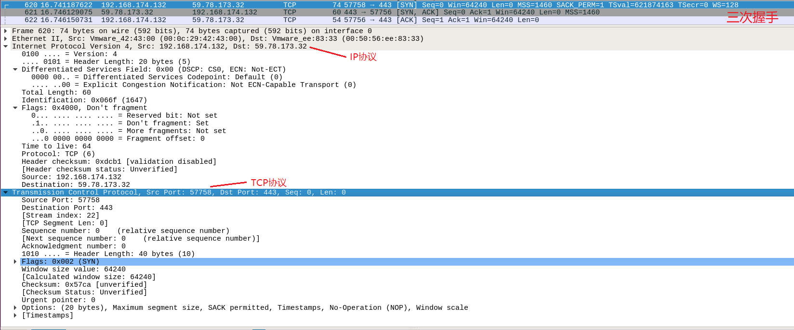

[TOC]


## linux

linux文件系统存储单位是块，每个文件对应一个inode（保存了一些文件信息，通过inode找到对应的文件）

硬链接：类似于浅拷贝、共享内存（创建一个硬链接，指向磁盘中某个节点，硬链接计数+1）【只有文件才能创建硬链接，目录不能】

软连接：相当于快捷方式

#### 快捷键

光标移动：向左ctrl+B(backward) 向右ctrl+F(forward) 最前面ctrl+A  到最后面ctrl+E

tab：目录补全：tab 1次；显示当前目录下的所有文件：tab 2次

清屏：ctrl+L

#### 目录结构：树状结构

##### 常用目录

/bin: bin(binary) 存放经常使用的命令

/boot: 存放启动Linux时使用的一些核心文件（连接文件及镜像文件）

/dev: device，存放linux的外部设备，把硬件外设保存成文件

/etc: 操作系统需要用到的**配置文件**

/home: 用户的主目录，每个用户有一个自己的目录

/lib: 基本的动态链接共享库，类似于windows下的DLL文件，几乎所有应用程序都要用到这些共享库

/mnt: 

/root:

/sbin: super user

/usr: user software resource存放应用程序和文件，与windows下的program files类似

##### 文件颜色

白：普通文件；蓝：目录；绿：可执行文件；青：链接文件；黄：设备文件（块、字符、管道）

##### 查看目录

```shell
#方法一 ls
ls -a #显示隐藏文件，以.开头
ls -l #显示详细信息

#所有者、同组用户、其他人rwx

#方法二 tree （需要下载）
```

判断一个命令是否执行成功

```shell
if [ $? -ne 0 ];then
上一命令执行失败时的操作

else
上一命令执行成功时的操作
fi
```


### 基本命令

```shell
# 用户权限设置
sudo su #切换到root权限
sudo -i #切换到root权限
exit #回到用户权限

pwd #显示当前路径
```

- 文件操作：ls echo cat rm cp mv
- 文件内容操作：grep sed awk
- 网络命令：ipconfig ps netstat

打开系统监视器： gnome-system-monitor

#### 系统状态检测


##### 2. free 显示当前系统中内存的使用量

```shell
#方法一
cat /proc/meminfo

#方法二
free #显示当前系统中内存的使用量（包括物理内存、交换内存、内核缓冲区内存）
free -h #以更直观的形式显示
free -m #以MB为单位进行查看
```


##### 3.df查看磁盘空间

```shell
#查看磁盘空间
df -h
```


##### 4.uname 查看系统内核与系统版本等

```shell
uname -a #查看当前系统的内核名称、主机名、内核发行版本、节点名、系统时间、硬件名称等
```


#### 文件目录管理

##### 1.touch创建空白文件

或设置文件的时间

```shell
touch filename #创建一个名为filename的文件
```

##### 2.mkdir创建空白目录

```shell
mkdir pathname  #mkdir(make directory)
mkdir -p a/b/c  #递归创建文件目录
```

##### 3.cp复制文件/目录

(copy)

```shell
cp -p srcfile.log dstfile.log #cp(copy)
#-p 保留原文件属性
#-r 递归复制（用于目录）
#-i 若目标文件存在，则询问是否覆盖
```

##### 4.mv剪切文件或重命名

```sh
mv oldname.log newname.log #mv(move)在同一目录中对一个文件的剪切操作即为重命名
```

##### 5.rm删除文件/目录

```shell
rm filename.log  #rm(remove)
rm -f filename.log #f(force)强制删除
rm -rf filepath #删除目录及其以下的所有文件/文件夹 (-r:recursive 向下递归)
```

##### 6.file查看文件/目录类型

```shell
file filename.log
```

##### 7.find\locate查找文件

```shell
#find path -name filename 
find /var -name test.cpp
#locate需要提前安装
locate test
```

##### 8.文件权限

```shell
ls -l path #查看文件权限
#修改权限
chmod 700 file #只有拥有者可读可写可执行
chmod o w file
u:user, g:group, o:other, a:所有人
r:read, w:write, x:可执行, -:删除权限

rwx:7, rw:6, rx:5
-rwxrwx---
1. 文件类型:-:普通文件,d:文件夹(directory),l:链接文件(类似于快捷方式),s:套接字文件(socket)
2-4:拥有者权限设置
5-7:群组
8-10:其他
```


#### 进程相关

##### 1.ps查看进程

```shell
ps [-aef] [-p pid] [-u userid]
#-a:(all) 显示任何用户标识和终端相关的进程
#-ax:显示没有控制终端的进程
#-u:根据用户过滤进程
#-ef:显示所有进程信息

ps -ef | grep bash #结合grep查找特定进程

#通过CPU和内存使用情况过滤
ps -aux --sort -pcpu | less #根据CPU使用来升序排序
ps -aux --sort -pmem | head -n 10 #根据内存使用升序排序，并显示前10个结果
ps -aux --sort -pcpu,+pmem | head -n 10 #对进程先按CPU升序，再内存降序排序，显示前10个

ps -C main #-C:根据进程名查看进程
ps -L pid  #-L:根据进程号显示线程信息 LWP(light weight process) 轻量级进程（线程）
```


###### 1-1 实时监控进程状态

```shell
watch -n 1 'ps -aux --sort -pmem, -pcpu'  #-n:每n秒刷新一次
#相对于top，能够自定义显示的字段
```


##### 2.结合 | 管道

```shell
指令1 | 指令2 #指令1的输出作为指令2的输入，指令2处理完毕后将信息输出到屏幕
ps aux | grep bash #查询是否有bash<终端>相关的进程（最后一个是grep进程）
ps -eo pid,ppid,lwp,nlwp,psr,args -L | grep process_name #-o表示输出形式
#ppid:父进程id，lwp:线程id，nlwp:线程数
```


##### 3.kill杀死进程

```shell
kill -l #显示所有信号
kill -9 pid
kill -SIGKILL pid
```


##### 4.env查看进程的环境变量

```shell
添加环境变量 key=value;value;value
```


##### 5.top任务管理器

```shell
top -Hp pid #显示
```


##### 6.lsof 列举系统中已经打开的文件

```shell
#lsof: list open files 查看打开进程的文件，打开文件的进程，进程打开的端口，

#1. -c:(command)根据进程名查看打开的文件
lsof -c filename   
#2. -p:(port)根据进程号查看
lsof -p 8080        
#3. -i:通过监听指定的协议、端和主机等信息，显示符合条件的进程信息
lsof -i|grep rssp  
lsof -i tcp #列出tcp/udp的连接情况
#4. -u:(user)列出某个用户打开的文件信息
lsof -u ^root 
lsof -u selena
#5. -U显示所有socket文件
lsof -U             
```


###### 6-1 显示使用文件的进程

```shell
lsof filename
```


###### 6-2 查看进程打开的文件

```shell
#1.根据进程名显示
lsof -c main

#2.根据进程号查看
ps -ef | grep main #根据进程名找到对应的进程id
lsof -p pid   #根据进程号查看该进程打开的文件

#3.查看进程打开的文件句柄数
ulimit -n #显示系统默认的最大文件句柄数
lsof -n | awk '{print $2}'| sort |uniq -c | sort -nr | more #查看当前进程打开了的句柄数
```

```cpp
#include <stdio.h>
#include <stdlib.h>
#include <unistd.h>
int main()
{
    FILE *fp = fopen("file", "w");
    if(fp == NULL){
        return 1;
    }
    while(1){
        sleep(1);
    }
    return 0;
}
```


```shell
COMMAND：表示进程名
PID：进程号
USER：进程的所有者
FD：文件描述符（0标准输出；1标准输入；2标准错误；u文件被打开并处于读取、写入模式；r文件被打开并处于只读模式；w文件被打开并处于写入模式）
TYPE：文件类型（REG表示普通文件regular）
DEVICE：指定磁盘的名称
SIZE/OFF：文件大小
NODE：索引节点
NAME：文件名称
```


###### 6-3 监听指定协议、端口、主机等信息，显示进程信息

```shell
lsof -i [4/6] [protocol] [@8hostname] [:service|port]
#4/6: 4:IPv4,6:IPv6
#protocol: TCP / UDP
#hostname: 主机名称/IP地址
#service：进程服务名，如NFS、SSH、FTP等
#port：端口号
lsof -i #查看所有进程
lsof -i tcp #显示所有tcp网络连接的进程
lsof -i :22 #显示端口为22的进程信息
```


#### 网络相关

##### 1.ifconfig 获取网卡配置与网络状态等信息

网卡名称、IP地址（inet）、MAC地址等


lo：回环地址

##### 2.ping

```shell
ping www.baidu.com
nslookup www.baidu.com
```

##### 3.netstat 显示网络相关信息

```shell
-t 显示TCP协议的连接情况
-u 显示UDP协议的连接情况。
-v 显示正在进行的工作。
-p 显示指定协议信息。
-n 打印IP地址
-i 打印接口信息

netstat -a #列出所有端口
netstat -at #列出所有 tcp 端口 

netstat -nat |awk '{print $6}' #TCP各种状态列表
netstat -nat |awk '{print $6}'|sort|uniq -c|sort -rn #先把状态全都取出来,然后使用uniq -c统计，之后再进行排序
```


### proc（伪文件系统）

存储当前内核运行状态的一系列特殊文件，用户可以根据这些文件查看有关**系统硬件**及当前正在运行**进程**的信息，甚至可以通过文件**改变内核的运行状态**

#### proc目录下常见文件

```shell
（该目录下文件大多为只读）
/proc/pid：存储当前正在运行的pid号进程的相关信息

/proc/cpuinfo：记录CPU信息

/proc/meminfo：记录内存信息，查看方式：free 或用文件查看命令，如cat /proc/meminfo

/proc/buddyinfo：用于诊断内存碎片问题的相关信息

/proc/kcore：存储系统使用的物理内存，以ELF core文件格式存储，大小为一直用物理内存RAM+4KB（拥有检查内核数据结构的当前状态，通常由GDB调试工具使用，不能用文件查看命令打开）

/proc/vmstat：记录当前系统虚拟内存的多种统计数据

/proc/sys：与/proc下的其它“只读”文件不同，管理员可以对/proc/sys中的许多文件内容进行修改。写入操作通常为echo DATA > /path/to/filename（一般不能用文本编辑器进行编辑）

可用cat, more, less等命令进行查看
可读性差的文件使用apm, free, lspci, top查看

```


##### ps：查看进程命令

 ```shell
#ps命令（Process Status）查看进程命令
ps a #显示现行终端机下的所有程序，包括其他用户的程序。
ps -aux,然后再利用一个管道符号导向到grep去查找特定的进程,然后再对特定的进程进行操作

ps -aux |more #可以用 | 管道和 more 连接起来分页查看。

#把所有进程显示出来，并输出到ps001.txt文件，然后再通过more 来分页查看
ps -aux > ps001.txt
more ps001.txt

#查看进程id
ps -ef | grep nginx
#ps -ef #表示显示所有进程的消息
#command1 | command2 # |:管道命令 将command1执行的结果交给command2处理
#grep nginx #在所有进程的消息查询名字为nginx的进程

#根据pid查看占用端口
lsof -i | grep pid
netstat -nap | grep pid

#根据端口号查看对应的进程名
lsof -i : port
netstat -nap | grep port

#grep:Linux下的文本过滤工具
grep -i abc test.txt #查找test.txt文件中的“abc”字符串，不区分大小写


 ```

### 网络

#### 抓包tcpdump

抓包需要管理员权限

```shell
tcpdump -D #查看当前主机的所有网卡编号和名称（即可抓包的接口）
# any 特殊接口，可用于抓取所有活动网络接口的数据包
```


```shell
tcpdump -i 1 -c 10 -A -n -nn port 80 -vvv
-i #设置抓包端口
-c #限制抓包数量
-n #显示IP地址
-nn #显示端口号
-v #显示详细信息 -vv更详细 -vvv最详细
-X / -A #输出包的头部数据，会以16进制(-X)和ASCII(-A)两种方式输出
-w #将抓包数据输出到文件中（保存为.pcap） -r表示读取该文件

tcpdump src host hostname and port 443
#src：截取主机发送的数据包 dst：截取发送到主机的数据包
host #监视指定主机的数据包
port #限制抓包端口
#icmp：抓取ping包，tcp：抓取tcp包
#多条件组合：and,&&：与  or,||：或 not,!：非
```

#### 包内容分析

1. 数据报被抓取的系统本地时间戳  11:50:21.523716
2. IP网络层协议类型：IP表示协议为IPv4，IP6表示协议为IPv6
3. 源ip地址及端口号：192.168.174.132.35948，192.168.174.132表示IP地址，35948表示端口号
4. 目的地址及端口号：58.205.221.222.80
5. TCP报文标记段：Flags[S]，[S]表示SYN，[F]表示FIN，[P]表示PUSH（数据推送），[R]表示RST（重置连接），[.]表示ACK，[S.]表示SYN-ACK数据包
6. 校验码：cksum
7. 序列号：seq 4285131841
8. ack值：ack （下图中第二个包的ack为 4285131842 = seq + 1）
9. 接受窗口大小：win
10. TCP选项：options，如MSS最大段，
11. 数据包的有效载荷（字节长度）：length


```
#======TCP建立连接阶段======
# 第一次握手 客户端发送SYN
11:50:21.523716 IP (tos 0x0, ttl 64, id 13590, offset 0, flags [DF], proto TCP (6), length 60)
    192.168.174.132.35948 > 58.205.221.222.80: Flags [S], cksum 0x8807 (incorrect -> 0xfe4a), seq 4285131841, win 64240, options [mss 1460,sackOK,TS val 2897191379 ecr 0,nop,wscale 7], length 0
E..<5.@.@.}.....:....l.P.i.A...................
............
# 第二次握手 服务器端发送SYN+ACK
11:50:21.536625 IP (tos 0x0, ttl 128, id 14154, offset 0, flags [none], proto TCP (6), length 44)
    58.205.221.222.80 > 192.168.174.132.35948: Flags [S.], cksum 0x6a2e (correct), seq 179644416, ack 4285131842, win 64240, options [mss 1460], length 0
E..,7J....{.:........P.l
.(..i.B`...j.........
# 第三次握手 客户端发送ACK
11:50:21.536646 IP (tos 0x0, ttl 64, id 13591, offset 0, flags [DF], proto TCP (6), length 40)
    192.168.174.132.35948 > 58.205.221.222.80: Flags [.], cksum 0x87f3 (incorrect -> 0x81eb), seq 1, ack 1, win 64240, length 0
E..(5.@.@.}.....:....l.P.i.B
.(.P.......

#======数据传输阶段======
# 客户端传输数据
11:50:21.539773 IP (tos 0x0, ttl 64, id 13592, offset 0, flags [DF], proto TCP (6), length 486)
    192.168.174.132.35948 > 58.205.221.222.80: Flags [P.], cksum 0x89b1 (incorrect -> 0x85fa), seq 1:447, ack 1, win 64240, length 446: HTTP, length: 446
    POST /gsorganizationvalsha2g2 HTTP/1.1
	Host: ocsp2.globalsign.com
	User-Agent: Mozilla/5.0 (X11; Ubuntu; Linux x86_64; rv:79.0) Gecko/20100101 Firefox/79.0
	Accept: */*
	Accept-Language: zh-CN,zh;q=0.8,zh-TW;q=0.7,zh-HK;q=0.5,en-US;q=0.3,en;q=0.2
	Accept-Encoding: gzip, deflate
	Content-Type: application/ocsp-request
	Content-Length: 79
	Connection: keep-alive

#服务器端返回ACK数据包
11:50:21.557136 IP (tos 0x0, ttl 64, id 13593, offset 0, flags [DF], proto TCP (6), length 40)
    192.168.174.132.35948 > 58.205.221.222.80: Flags [.], cksum 0x87f3 (incorrect -> 0x802d), seq 447, ack 1395, win 62846, length 0
	HTTP/1.1 200 OK
	Server: Tengine
	Content-Type: application/ocsp-response
	Content-Length: 1574
	Connection: keep-alive
	Date: Sat, 22 Aug 2020 02:18:24 GMT
	Expires: Tue, 25 Aug 2020 23:44:30 GMT
	X-Powered-By: Undertow/1
	ETag: "79628fb6651266ef2faaf9cfd0076ef2a399a42c"
	Last-Modified: Fri, 21 Aug 2020 23:44:30 GMT
	Cache-Control: public, no-transform, must-revalidate, s-maxage=3600
	Ali-Swift-Global-Savetime: 1598062704
	Via: cache50.l2cn2630[0,200-0,H], cache59.l2cn2630[0,0], cache5.cn60[0,200-0,H], cache5.cn60[1,0]
	Age: 5517
	X-Cache: HIT TCP_MEM_HIT dirn:4:344332155
	X-Swift-SaveTime: Sat, 22 Aug 2020 03:08:45 GMT
	X-Swift-CacheTime: 3600
	Timing-Allow-Origin: *
	EagleId: 3acdddcd15980682215333713e

11:50:21.558117 IP (tos 0x0, ttl 128, id 14158, offset 0, flags [none], proto TCP (6), length 938)
    58.205.221.222.80 > 192.168.174.132.35948: Flags [P.], cksum 0x16ff (correct), seq 1395:2293, ack 447, win 64240, length 898: HTTP
```


#### wireshark

[安装](https://blog.csdn.net/sheen_zhuang/article/details/80725486)


抓包



### 进程通信

#### 共享内存

> [mmap映射区和shm共享内存的区别总结](https://blog.csdn.net/hj605635529/article/details/73163513?utm_medium=distribute.pc_relevant.none-task-blog-BlogCommendFromMachineLearnPai2-1.channel_param&depth_1-utm_source=distribute.pc_relevant.none-task-blog-BlogCommendFromMachineLearnPai2-1.channel_param)

两个进程的一块虚拟地址空间映射到了同一块物理内存上

- Linux 实现共享内存的方式

1)mmap内存共享映射, 2) System V 3) POSIX

（SystemV和POSIX底层都是基于内存文件系统**tmpfs**实现，主要在接口设计上有差别，POSIX遵循了Linux系统一切皆文件的理念）

- 共享内存相关文件

 /proc/sys/kernel/shmmni：限制整个系统可创建共享内存段个数。 

 /proc/sys/kernel/shmall： 限制系统用在共享内存上的内存的页数。  

 /proc/sys/kernel/shmmax：限制一个共享内存段的最大长度，字节为单位。

- System V 共享内存

> https://blog.csdn.net/RayCongLiang/article/details/100027643

```c
#include <sys/ipc.h>
#include <sys/shm.h>
/* 0.ftok  系统建立IPC通讯（如消息队列、共享内存时）必须指定一个ID值。通常情况下，该id值通过ftok函数得到
参数：
pathname：一个指定的文件路径
proj_id：对应项目的id
通过返回的key_t类型让所有的进程都唯一映射到对应内存空间，失败返回-1
*/
key_t ftok (const char *pathname, int proj_id);

/*1.shmget 创建共享内存
参数：
key:段名，可以是自定义的整数，或者用字符串通过ftok() 生成（但每次生成的值可能不一样）
size:大小
shmflg:9个权限标志（与创建文件使用的mode模式标志一样）。
成功返回该内存段的标志码（非负整数），否则返回-1 
*/
int shmget(key_t key, int size, int shmflg);  

/*2.shmat 将共享内存段连接到进程地址空间
参数：
shmid:共享内存标识码
shmaddr:指定连接的地址(shmflg=SHM_RND时才可指定)，多数情况设为空指针，由系统自动选择地址
shmflg:SHM_RND 或 SHM_RDONLY（映射过来的地址只读）
成功返回指向映射地址的第一个字节的指针，失败返回-1
*/
void *shmat(int shmid, void *shmaddr, int shmflg);

/*3.shmdt 解除映射，将当前进程与共享内存段脱离
成功返回0，否则-1
*/
int shmdt(const void *shmaddr);

/*4.shmctl 控制共享内存
参数：
shmid:共享内存标志码
cmd:IPC_STAT:得到共享内存的状态，把共享内存的shmid_ds结构体复制到buf里
	IPC_SET：改变共享内存的状态，把buf所指的结构体中的uid,gid,mode,复制到共享内存的shmid_ds结构体内
	IPC_RMID:删除共享内存段
buf:指向一个保存共享内存的模式状态和访问权限的数据结构
成功返回0，否则-1
*/
int shmctl(int shmid, int cmd, struct shmid_ds *buf)
```

- 查看内存信息

```shell
~$ ipcs #显示进程通信消息（共享内存、消息队列、信号量）
~$ free #显示系统内存的使用情况，包括物理内存、交换内存(swap)和内核缓冲区内存。
```


mmap（内存映射函数）

普通文件的读写

进程调用**read**或**write**<系统调用>后会陷入内核，进入系统调用，内核开始读写文件。对于读文件，内核首先把数据从磁盘copy到内核缓冲区（页缓冲）中，然后进程从内核态回到用户态，内核把读入内核内存的数据copy到进程的用户态内存空间。（实际上对同一份文件内容进行2次拷贝，磁盘->内核空间->用户空间）

把内核中特定部分的内存空间映射到用户级程序的内存空间（用户空间和内核空间共享一块相同的内存）

mmap, 它把文件内容映射到进程地址空间后，进程可以像访问内存的方式对文件进行访问，不需要其他系统调用(read,write)去操作。

> [mmap](https://blog.csdn.net/Holy_666/article/details/86532671)

1. 进程在用户空间调用库函数mmap，进程启动映射过程，并在虚拟地址空间中为映射创建虚拟映射区域
2. 调用内核空间的mmap函数，实现文件物理地址和进程虚拟地址的一一映射关系
3. 进程发起对该映射空间的访问，引发缺页异常，实现文件内容到物理内存的拷贝**mmap只是在虚拟内存分配了地址空间，只有在第一次访问虚拟内存的时候才分配物理内存。**

创建新的虚拟内存区域和建立文件磁盘地址和虚拟内存区域映射这两步，没有任何文件拷贝操作。而之后访问数据时发现内存中并无数据而发起的缺页异常过程，可以通过已经建立好的映射关系，只使用一次数据拷贝，就从磁盘中将数据传入内存的用户空间中，供进程使用。

### 调试相关

#### GCC 命令

基本流程

```shell
gcc -E hello.c -o hello.i #预处理：头文件展开、宏替换、去掉注释
gcc -S hello.i -o hello.s #编译器：C文件转化为汇编文件
gcc -c hello.s -o hello.o #汇编器：汇编文件转化为二进制文件
gcc hello.o -o hello      #链接器：将函数库中相应的代码组合到目标文件中，得到可执行文件
```


```shell
#gcc不加参数可以直接编译成可执行文件
gcc main.c #默认生成a.out可执行文件
gcc main.c -o main #可以通过-o更改生成文件的名字

gcc -o <file>            #-o(out)将输出放入<文件>
gcc -c main.c            #-c(compile)编译和汇编，但不链接，生成main.o二进制目标文件
gcc -g main.c -o main    #-g添加gdb调试选项
gcc -I ./include -o main #-I指定头文件目录

gcc main.o #自动链接上一步生成的main.o来生成最终可执行文件a.out

gcc main.c -o main
./main #运行可执行文件main

```


#### Core dump

> [详解coredump](https://blog.csdn.net/MOU_IT/article/details/88903668)

##### core dump配置

产生core dump核心转储文件

```shell
~$ ulimit -c #若显示0，表明系统的core文件生成为开启
~$ gedit .bashrc # 修改当前用户的.bashrc或.bash_profile
#在文件末尾添加: ulimit -c unlimited 
~$ source .bashrc
~$ ulimit -c #ulimit生成的core文件大小不受限制
```

##### 产生coredump的原因

1. 内存访问越界
2. 非法指针
3. 堆栈溢出
4. 多线程程序使用了线程不安全的函数
5. 多线程读写数据未加锁保护


1. 段错误（segmentfault）


##### Core dump+gdb调试

```shell
#gcc编译成可执行文件后，运行该文件
~$ gcc -g -o main main.c #一般会加-g用来添加调试信息
~$./main #出现错误，相应文件夹下会产生core文件
~$ gdb main core #进入gdb调试，可以看到出错的代码位置及原因
(gdb) bt #进入gdb后，输入bt查看进程结束的地方
```


#### GDB调试

[GDB 调试指南](https://www.yanbinghu.com/2019/04/20/41283.html)

[GDB调试命令](https://darkdust.net/files/GDB Cheat Sheet.pdf)

```shell
#在编译时增加-g参数，保留调试信息
gcc -g testGDB.c -o testGDB
g++ -g testGDB.cpp -o testGDB
g++ -g -std=c++11 testGDB testGDB.cpp 

#==== 1.调试未运行的程序 ====
#调试启动无参程序
gdb testGDB 

#调试启动带参程序
gdb testGDB
#方法1：run后面跟参数
run arg_hello arg_world 
#方法2：set args后面跟参数，再run
set args arg_hello arg_world
run

#==== 2.调试正在运行的程序 ====
pidof testGDB #通过文件名找到该程序运行对应的进程号
ps -ef|grep 进程名
#调用GDB对该程序进行调试
gdb attach PID  #方法1
gdb filename PID#方法2
gdb -p PID      #方法3

#==== 3.调试执行异常奔溃的程序 ====
#常见bug：内存访问越界（数组下标月结、输出字符串是没有以\0结束等）、非法使用空指针等
#采用核心转储（core dump），将发生崩溃时的内存数据、调用堆栈情况等信息自动记录存储到core文件
gdb testGDB core
```


> [Linux下GDB调试指令](https://zhuanlan.zhihu.com/p/71519244)
>
> [GDB调试教程](http://c.biancheng.net/gdb/)

```shell
#运行指令
r/run：运行程序到断点
c/continue：继续执行到下一个断点
n/next：单步跳过，如果遇到函数调用，不进入函数
s/step：单步进入，如果遇到函数调用，则进入函数
finish：运行程序，知道当前函数完成返回，并打印函数返回时堆栈的地址、返回值、参数值等信息
q/quit：退出gdb
attch：用gdb调试一个正在运行的进程
#设置断点
b/break n：在第n行设置断点
b/break func：在func()函数入口处设置断点
b fn1 if a>b：条件断点
clear n：删除第n行的断点
info b/breakpoints：显示当前程序的所有断点
delete breakpoints：清除当前程序的所有断点
#查看源码
l/list
#打印表达式
p/print 表达式：显示程序中任何有效的表达式
p ptr：若ptr为指针，则打印指针地址
p *ptr：通过解引用打印指针指向的内容
p *ptr@10：打印指针所指数组的多个值

#监控变量值的变化
watch 表达式：设置一个监视点
info locals：显示当前堆栈页的所有变量

#查询运行信息
where/bt：当前运行的堆栈列表
bt backtrace：显示当前调用堆栈
info program：查看程序是否在运行，进程号，被暂停的原因等

```


#### 内存泄漏

top 指令。 在Linux或者mac上面可以快速定位泄漏的程序和程度

Valgrind


>https://www.cnblogs.com/caoer/p/12669183.html#autoid-h3-4-2-0

**VMware运行Ubuntu无法跨系统复制粘贴**

重新安装VMwareTools

1. 打开虚拟机菜单栏中 选择 虚拟机-->重新安装VMware Tools 即可打开VMware Tools窗口
2. 复制VMwareTools-10.1.6-5214329.tar.gz压缩包到下载
3. 在文件夹下打开终端输入：tar zxvf VMwareTools-10.1.6-5214329.tar.gz，回车，即可解压tar.gz文件，可以看到解压的文件夹
4. 终端输入cd vmware-tools-distrib,即可进入文件夹vmware-tools-distrib目录下，再输入命令sudo ./vmware-install.pl,回车，需要输入用户密码，回车，即开始安装VMware Tools工具，下面一直选择yes或者回车即可。

**yum命令“无法启用仓库”**

`yum -y install xxx`

Ubuntu下不支持yum命令，应替换为`apt-get install xxx`

最新版git


