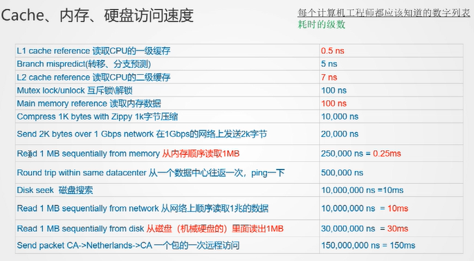
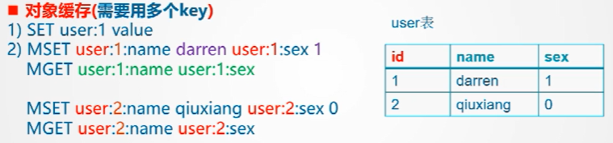

### Redis初识

Remote Dictionary Server (Redis) 基于键值对的缓存与存储系统

特点：

1. 高性能：加快数据的读写速度
2. 数据结构丰富：5种：string, hash, list, set, sorted set (zset)..
3. 高可用：支持分布式集群，集群可以时多主多从，数据自动由主节点备份到从节点。当主节点发生异常时，可有其对应的从节点顶替
4. 易于扩展
5. 原子性：Redis是**单线程**的，所有操作都是原子性的，避免了多线程带来的复杂性（6.0开始支持多线程）
6. 可持久化：可以将内存中的数据保存在磁盘中，重启的时候可以加载使用


如果redis中没有，则从数据库中加载

持久化到硬盘，为了更方便地重新加载


- 从内存顺序读取1MB，大约0.25ms；从磁盘（机械硬盘）顺序读取1MB，大约30ms




#### 安装redis

```shell
#安装redis
sudo apt-get install redis-server
#输入命令查看服务
redis-server  #启动redis服务端
redis-server & #以后台程序方式运行
service redis status #查看服务

#连接redis，检测连接是否正常
redis-cli     #启动redis客户端
#停止redis
redis-cli shutdown

netstat -lntp | grep 6379 #检测6379端口是否在监听
```

#### redis读写性能测试

读写性能与内存、CPU占用率等有关

```shell
$ redis-benchmark -h 127.0.0.1 -p 6379 -c 100 -n 1000
-h #指定服务器名 默认为127.0.0.1
-p #指定端口号 默认为6379
-c #指定并发的连接数 默认为50
-n #指定请求数 
-k #1=keepalive(使用连接池，高效), 0=reconnect(每执行一个命令都要重连)
```


### 数据结构

#### string

```shell
#单值缓存
SET key value
GET key
#对象缓存（多值缓存）参考数据库的key
SET user:1 value
MSET user:1:name jack   user:1:sex 1
MSET user:2:name rose   user:2:sex 0
MGET user:1:name        user:1:sex
```




```shell
#SET分两次发送包
SET user:1:name jack
SET user:1:sex 1
#MSET 只发送一次
MSET user:1:name jack   user:1:sex 1
```


计数器

```shell
INCR article:readcount:{文章id}  #+1操作，应用于点赞、在看、阅读等
```

cdn

源 边缘

#### list

可以重复

- 常用数据结构

栈：stack = LPUSH +LPOP

队列：queue = LPUSH + RPOP

阻塞队列：blocking mq=LPUSH +BRPOP

```shell
#jack关注了rose,mary
#1.rose发朋友圈，消息id为1000
LPUSH msg:{jack-id} 1000 
#2.mary发朋友圈，消息id为1010
LPUSH msg:{jack-id} 1010
#3.jack查看最新的5条朋友圈
LRANGE msg:{jack-id} 0 4
#4.jack查看所有的朋友圈消息
LRANGE msg:{jack-id} 0 -1
```


#### hash

键值对集合，类似mapString, object

```shell
HMSET user:1 name jack sex 1 mail
```

即时通信

以用户id为key，好友或者群id为field，未读消息数量为value

#### set

集合无序不重复

应用：

**1. 微信抽奖小程序**

```shell
#1.点击参与抽奖加入集合
SADD key {user-id}
#2.查看参与抽奖的所有用户
SMEMBERS key;
#3.抽取n名中奖者
SRANDMEMBER key [n] #有放回的抽
#或
SPOP key [n] #无放回的抽
```

**2.朋友圈点赞**

```shell
#1.点赞   user-id：点赞用户id
sadd like:{msg-id} {user-id}
#2.取消点赞
srem like:{msg-id} {user-id}
#3.检查用户是否点过赞
sismember like:{msg-id} {user-id}
#4.获取点赞用户列表
smembers like:{msg-id}
#5.获取点赞用户数量
scard like:{msg-id}
```

**3.微博/微信关注**

```shell
#1.添加jack关注的人
SADD jackSet rose mary cindy
#2.添加rose关注的人
SADD roseSet tom jack henry
#3.添加mary关注的人
SADD marySet rose tom jack
#4.rose和mary共同关注的人 （交）
SINTER roseSet marySet #{tom, jack}
#5.关注jack的人是否也关注tom 
SISMEMBER roseSet tom
#6.jack可能认识的人 （差）
SDIFF roseSet jackSet #{tom, henry}
#7.（并）
SUNION jackSet roseSet
```

#### zset

有序无重复元素

应用场景：

1.微博热搜

```shell
#1.点击新闻（今日热搜） 点击量+1
ZINCRBY hotNews:20200824 1 gossip_news_about_xxx
#2.展示当前top10
ZREVRANGE hotNews:20200824 0 9 WITHSCORES
#3.三天热搜榜单统计
ZUNIONSTORE hotNews:20200822-20200824 3 hotNews:20200822 hotNews:20200823 hotNews:20200824
#4.展示3天排行前10
ZREVRANGE hotNews:20200822-20200824 0 9 WITHSCORES
```


redis 连接池、持久化、源码分析、集群

内存引用计数模型


1.有序集合的节点个数>128时，或任意节点的member长度大于64时，采用跳表；否则采用ziplist

