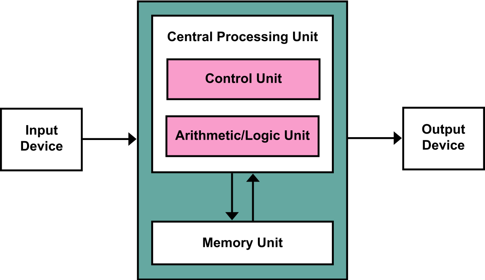

## 操作系统

### 1. 概述 

#### OS运行级别（用户态 内核态）

两种CPU状态 

1. 内核态
   - 可以执行任何cpu指令，也可以引用任何内存地址，包括外围设备, 例如硬盘, 网卡，权限等级最高。
   - 当一个任务（进程）执行系统调用而陷入内核代码中执行时，进程处于内核运行态。操作系统运行在内核态
2. 用户态
   - 只能受限地访问内存，且不允许访问外围设备。在执行cpu指令的时候也可以被高优先级抢占。
   - 所有用户程序都在用户态运行，但有时程序需要做一些内核态的事（如从硬盘读取数据、从键盘获取输入等）

意义：需要限制不同程序之间的访问能力，防止它们获取别的程序的内存数据或外围设备的数据，并发送到网络

CPU指令：特权指令、非特权指令
特权指令：只能由操作系统内核部分使用，而不允许用户直接使用的指令（如I/O指令、置终端屏蔽指令、清内存、建存储保护、设置时钟指令）
非特权指令：所有程序均可直接使用

#### 中断

中断是CPU从用户态切换为内核态的唯一途径，让操作系统获得计算机的控制权。有了中断才能实现多道程序并发执行

内核态->用户态：执行一个特权指令，将程序状态字（PSW）的标志位设为“用户态”
用户态->内核态：**中断**（内中断[中断信号来自CPU内部，与当前执行的指令有关]、外中断）

1. 系统调用
   用户态进程主动要求切换到内核态。eg. fork()执行创建新进程的系统调用；Linux的int80h中断
2. 强迫中断（硬件故障、软件中断）
   CPU执行运行在用户态的程序时，发生某些不可预知的异常，会触发由当前运行进程切换到处理此异常的内核相关程序中。eg. 缺页异常（硬件故障），除以0（软件中断）
3. 外中断
   当外围设备完成用户请求的操作后，会向CPU发出相应的中断信号，此时CPU会暂停执行下一条即将执行的指令，转而去执行与中断信号对应的处理程序。eg. 硬盘I/O操作完成，系统会切换到硬盘读写的中断处理程序中执行后续操作（外设请求）、用户强行终止一个进程（人工干预）


内核的功能
（1） I/O指令、置终端屏蔽指令、清内存、建存储保护、设置时钟指令。
（2） 中断、异常、陷入，比如缺页中断、除以0、I/O中断等
（3）进程（线程）管理（进程或线程的调度）
（4）系统调用，比如调用了设备驱动程序
（5）用户内存地址的转换（逻辑---> 物理地址映射）


系统调用是如何怎么切换到内核态的

用户运行库函数（系统调用的封装），函数里面其实是执行的int 0x80指令。系统调用先把系统调用号保存在eax寄存器中，然后执行int0x80指令。int 0x80指令先进行切换堆栈（找到进程的堆栈，将寄存器值压入到内核栈中，将esp，ss设置成对应内核栈的值），查找相应中断向量的中断处理程序(system_call)并调用，随后system_call 从系统调用表中找到相应的系统调用进行调用，调用结束后从system_call中返回。

##### 系统调用

> https://blog.csdn.net/qq_36822217/article/details/107237670

- 用户进程发起系统调用，操作系统先把系统调用号写入eax寄存器
- 然后执行int 0x80中断指令（CPU从用户态切换成内核态，需要把当前栈由用户栈转换为内核栈，需要找到当前进程的内核栈，在内核栈中保存用户态的esp栈指针和寄存器ss的值、eflag、cs、eip等，然后将esp和ss的值设为内核栈对应的值）。
- int指令切换到内核栈之后，程序切换到了中断向量表中的0x80号中断处理程序。
- system_call中断服务程序首先检查系统调用号的有效性，再根据eax寄存器存储的系统调用号从系统调用表上找到相应的系统调用，调用完成后从system_call中返回。（eax=1 sys_exit，eax=2 sys_fork，eax=3 sys_read）
- 当内核从系统调用返回时，要调用iret指令回到用户态（从内核栈里弹出寄存器ss、esp等值，使得恢复到之前用户栈的状态）。

由于每个系统调用都会有一个系统调用号，每个进程都有自己的内核栈

esp：栈指针。如果esp的值在用户栈范围内，则程序当前栈就是用户栈

寄存器ss：指向当前栈所在的页

##### 系统调用和普通函数调用的区别

用户态和内核态的切换

### 2. 进程管理

#### 进程和线程▲ 

>[图解进程线程](http://www.ruanyifeng.com/blog/2013/04/processes_and_threads.html)

1. 进程是操作系统资源分配的最小单位，线程是CPU任务调度的最小单位。
2. 一个进程可以有多个线程，一个线程只属于一个进程
3. 数据共享：不同进程间数据很难共享<共享内存>，同一进程下不同线程间数据很易共享。
   - 系统在运行的时候会为每个进程分配不同的内存空间，每个进程都有独立的代码和数据空间。
   - 线程可以看做轻量级的进程，除了CPU外，系统不会为线程分配内存，同一类线程共享代码和数据空间。
4. 系统开销：进程创建销毁开销大，线程创建销毁开销小
   - 创建/撤销进程时，系统都要为之分配/回收资源（内存空间、I/O设备等），进程间切换涉及当前执行进程CPU环境保存即新调度进程CPU环境的设置
   - 每个线程都有自己独立的运行栈和程序计数器，线程切换只需保存和设置少量寄存器内容，开销小
5. 通信：进程间通过IPC（Inter-Process communication，进程间通信）通信，线程可以通过读写数据段直接与进程内的其它线程通信
6. 进程间不会相互影响，一个进程报错不会影响其他进程正常运行，一个线程出错会导致同属该进程的线程停止运行。
7. 进程调试简单，线程调试较为复杂

##### 协程

子程序在执行时中断并转去执行别的子程序，在适当的时候再返回来执行。这种子程序之间的跳转不是函数调用也不是多线程执行，

协程是用户态轻量级线程，是对内核透明的，系统不知道有协程的存在，完全由用户的程序自己调度。通常进行协作式调度，需要协程自己主动让出控制权，其他协程才能被执行到。

优势：

1. 协程切换有程序自身控制，省去了线程切换的开销，效率很高
2. 不需要多线程间的锁机制，因为只有一个线程，不会发生变量写冲突，在协程中控制共享资源不加锁，只需要判断状态就好了

具体实现：协程进行中断跳转时将函数的上下文存放在其他位置中，而不是存放在函数堆栈里，当处理完其他事情跳转回来的时候，取回上下文继续执行原来的函数。

#### 多进程 vs 多线程 

I/O操作不占用CPU、计算占用CPU

**多进程**

优：

- 容错性好：一个进程崩溃了不会影响其他进程
- 有内核保证的隔离：数据和错误隔离
- 相关应用通常有一定的自恢复能力，master守护进程监控所有worker进程，发现进程挂掉后将其重启
- 编程，调试相对容易

适用场景：

- CPU密集型，如大量的数学计算（8核CPU，每核CPU开一个进程进行计算）
- 几乎所有的web server服务器服务都有多进程的，至少有一个守护进程配合一个worker进程，例如apached,httpd等等以d结尾的进程包括init.d本身就是0级总进程，所有你认知的进程都是它的子进程
- chrome浏览器：考虑一个页面崩溃不影响其他页面；网页之间互相隔离，保证安全，不必担心某个网页中的恶意代码会取得存放在其他网页中的敏感信息
- 多机分布的情况


**多线程**

- 创建销毁的开销小

适用场景

- 需要频繁创建销毁的优先用线程，适用于I/O密集型的工作场景（I/O阻塞导致频繁切换线程）
- 需要和用户交互时，使用多线程有利于提高系统的并行性和用户界面快速响应从而提高友好性。
- 迅雷下载
- 服务器同时处理多个客户端请求
- memcached


#### 进程的状态与转换

**三种状态**：运行、就绪、等待

- 运行：进程占有CPU，并在CPU上执行其程序

- 就绪：进程已获得除CPU外的资源，只差CPU 【等待CPU】“万事俱备，只欠CPU”

- 等待/阻塞：进程由于某些原因（I/O请求，申请缓存区失败）而不能继续运行下去，进程受到阻塞【等待除CPU外的其它资源】

  

**状态转换**

- 就绪态→运行态：进程被调度后，分配CPU时间片，并使其运行
- 运行态→就绪态。进程时间片用完后，让出CPU，转为就绪态
- 运行态→阻塞态。进程请求某一资源或等待某一事件发生（如I/O完成，需要人工干预），使自身阻塞
- 阻塞态→就绪态。进程等待的事件到来时，如I/O操作结束，转为就绪态

**进程切换**

1. 对原来运行进程各种数据的保存

2. 对新进程各种数据的回复

   如程序计数器PC、程序状态字、各种数据寄存器等处理机现场信息（一般保存在进程控制块中PCB）

#### CPU上下文切换

ＣPU寄存器(CPU内置的容量小但速度极快的内存)和程序计数器(用于存储CPU即将执行的下一条指令位置)

CPU上下文切换：进程上下文切换、线程上下文切换、中断上下文切换

1. 进程上下文切换：

   - 进程由内核管理调度，进程切换发生在内核态。只有进程调度的是否才需要切换上下文
   - 进程的上下文包括虚拟内存、栈、全局变量等用户空间的资源，还包括内核堆栈、寄存器等内核空间的状态。
   - 进程上下文切换：保存当前进程的虚拟内存、栈等->保存内核状态和CPU寄存器->加载下个进程得到内核态->加载下个进程的虚拟内存和用户栈

2. 线程上下文切换：

   - 两个线程同属于一个进程：此时虚拟内存是共享的，因此在切换时，只需要切换线程私有的数据、寄存器等不共享的资源，虚拟内存等共享资源保持不变
   - 两个线程不属于一个进程：类似于进程上下文切换

3. 中断上下文切换：

   许多操作系统的中断服务程序都不在进程上下文中执行，它们在一个与所有进程无关的、专门的中断上下文中执行。之所以存在这样一个专门的执行环境，为了保证中断服务程序能够在第一时间响应和处理中断请求，然后快速退出。

   **系统调用**是特权模式切换，会发生CPU上下文切换：

   - 保存CPU寄存器原来用户态的指令位置，将CPU寄存器更新为内核态指令的新位置，然后跳转到内核态运行内核任务。系统调用结束后，CPU寄存器恢复原来用户保存的状态，再切换到用户空间，继续运行进程。
   - 一次系统调用发生了两次CPU上下文切换
   - 系统调用不涉及虚拟内存等进程用户态的资源，也不会切换进程（系统调用一直在同一个进程中运行）

#### 孤儿进程  僵尸进程

> https://blog.csdn.net/u013616945/article/details/77606449

孤儿进程：没有父进程的进程。父进程退出，而它的子进程还在运行，这些子进程就会成为孤儿进程。这些子进程会被进程号为1的init进程收养，对它们完成状态收集工作

僵尸进程：子进程退出，而父进程没有调用wait或waitpid获取子进程的状态信息，子进程的进程描述符还保留在系统中。进程在调用exit命令结束自己生命的时候没有被完全销毁，而仅仅是退出（会造成资源浪费）

1. 信号机制：子进程退出时向父进程发送SIGCHILD信号，父进程处理SIGCHILD信号。在信号处理函数中调用wait进行处理僵尸进程。
2. 两次fork()，让子进程变成孤儿进程，其父进程变为init进程，通过init进程处理僵尸进程

守护进程：脱离终端，在后台执行的进程


#### 线程创建

C++：thread

thread()创建一个新的线程，可以接收任意可调用对象类型，包括**函数、函数指针、lambda表达式、函数对象（重载了函数调用运算符的类对象）**

```cpp
#include <iostream>
#include<thread>
#include<string>
using namespace std;

void func(string s){
    cout<<s<<endl;
}

class A{
public:
    void operator()(int i,string s){
        cout<<s<<endl;
    }
};


int main()
{
    thread funcThread(func,"用函数创建线程");
    funcThread.join();

    void (*pfunc)(string s); //= func;
    pfunc=func;
    thread pfuncThread(pfunc,"用函数指针创建线程");
    pfuncThread.join();


    A a;
    thread operatorThread(a,1,"用仿函数创建线程");
    operatorThread.join();

    auto lambdaFunc = [](string s){cout<<s<<endl;};
    thread lambdaThread(lambdaFunc,"用Lambda函数创建线程 ");
    lambdaThread.join();
	
    //用某个类中的某个函数作为线程的入口地址==未完

    cout<<"主线程"<<endl;
    return 0;
}
```


#### 线程共享与独占的资源

- 共享的资源有：
  1. **堆**：由于堆是在进程空间中开辟出来的，所以它是理所当然地被共享的；因此new出来的都是共享的（16位平台上分全局堆和局部堆，局部堆是独享的）
  2. **全局变量**：它与具体某一函数无关的，所以也与特定线程无关；因此也是共享的
  3. **静态变量**：虽然对于局部变量来说，它在代码中是“放”在某一函数中的，但是其存放位置和全局变量一样，存于堆中开辟的.bss和.data段，是共享的
  4. **文件等公用资源**：这个是共享的，使用这些公共资源的线程必须同步。Win32 提供了几种同步资源的方式，包括信号、临界区、事件和互斥体。
- 独享的资源有：
  1. **栈**：保存其运行状态和局部自动变量的。栈在线程开始的时候初始化，每个线程的栈互相独立，因此栈是thread safe的。操作系统在切换线程的时候会自动的切换栈，就是切换SS/ESP寄存器。栈空间不需要在高级语言里面显式的分配和释放。
  2. **寄存器**  包括**程序计数器PC**，存放执行流的基本数据（执行流：一段逻辑上独立的指令区域）
  3. 线程局部存储（TLS）某些操作系统为线程单独提供的私有空间，容量有限。可存储线程中的一个全局变量

栈（堆栈）：主线程的main函数、进行函数调用的参数和返回地址、局部变量等内容都会被压入栈内
PC（Program Couner）：程序计数器，PC的指针指向代码所在的内存地址。

1. 字节码解释器通过改变程序计数器来继续读取指令，从而实现代码的流程控制
2. 在多线程的情况下，程序计数器用于记录当前线程执行的位置，从而当线程被切换回来的时候，能够知道该线程上次运行到什么位置


#### 线程 join vs detach

join：1.主线程要等待子线程执行完毕才会继续向下执行，是一个阻塞函数 2.回收该线程中使用的资源

detach：线程被分离到后台运行，主线程不需要等待线程结束才结束（守护线程）

> 主线程不用等待子线程执行完毕，两者脱离关系。将当前线程对象所代表的执行实例与该线程对象分离，使得线程的执行可以单独进行。此线程将放在后台运行，所有权和控制权被转交给`C++`运行时库，以确保与线程相关联的资源在线程退出后能被正确的回收。一旦线程执行完毕，它所分配的资源将会被释放。一般用在**守护线程**上：有时候我们需要建立一个暗中观察的线程，默默查询程序的某种状态，这种的称为守护线程。这种线程会在主线程销毁之后自动销毁。线程被分离之后，即使该线程对象被析构了，线程还是能够在后台运行，只是由于对象被析构了，主线程不能够通过对象名与这个线程进行通信。

**线程对象和对象内部管理的线程的生命周期并不一样**，如果线程执行的快，可能内部的线程已经结束了，但是线程对象还活着，也有可能线程对象已经被析构了，内部的线程还在运行。

##### [拓] wait()和sleep()

（1）属于不同的两个类，sleep()方法是线程类（Thread）的静态方法，wait()方法是Object类里的方法。
（2）sleep()方法不会释放锁，wait()方法释放对象锁。
（3）sleep()方法可以在任何地方使用，wait()方法则只能在同步方法或同步块中使用。
（4）sleep()使线程进入阻塞状态（线程睡眠），wait()方法使线程进入等待队列（线程挂起），也就是阻塞类别不同。

#### 进程调度

按分配处理器的方式，进程调度有两种方式：

1. 非抢占方式：一旦进程占用CPU就一直运行，直到终止或等待。
2. 抢占方式：系统强行剥夺已分配给现运行进程的CPU，而重新分配给其他进程运行。

抢占原则：时间片原则；优先权原则；短作业（进程）优先原则。

1. **先来先服务调度算法（FCFS）- 非抢占**：先进入队列的先提供服务
   有利于长进程的执行，而不利于短进程，有利于计算密集型进程(CPU密集型)，而不利于I/O密集型进程。不会出现饥饿现象

2. **最短作业优先算法（SJF）- 非抢占**：对执行时间最短的进程优先分派处理器。
   相比于FCFS算法，SJF算法可改善平均周转时间和平均带权周转时间，缩短进程的等待时间，提高系统的吞吐量（在单位时间内CPU从存储设备读取->处理->存储信息的量）。
   对长进程非常不利，可能长时间不能执行（产生饥饿现象），而且不能根据进程的紧迫程度来划分进程执行的优先级，也很难准确预计进程的执行时间，从而降低调度性能。

3. **最短剩余时间优先（SRTF）- 抢占（进程到达时）**：此时哪个进程剩余的作业时间最短就优先执行该进程

4. **高响应比优先调度算法（HRRN）- 非抢占**
   等待时间=上一个作业的完成时刻-该作业到达的时刻
   响应比=（等待时间+服务时间）/服务时间=等待时间/服务时间+1

  只有当前运行的作业/进程主动放弃CPU时，才需要计算响应比进行调度。综合考虑了等待时间和运行时间，不会导致饥饿

5. **时间片轮转算法（RR）- 抢占（时间片）**：根据一定的时间片轮流执行每个进程。
   每个进程都被分配好一个时间段，也就是它的时间片，这就是该进程允许允许的时间。如果该进程超过了时间片的时间，就会发生时间中断，调度程序暂停当前进程的执行，将其送到就绪队列的末尾，并通过上下文切换执行当前的队首进程。进程可以未使用完一个时间片，就让出CPU（如阻塞）。
   算法优点：时间片轮转调度算法的优点是简单易行，平均响应时间短。
   算法缺点：不利于处理紧急进程。在时间片轮转算法中，时间片的大小对系统性能的影响很大，因此时间片的大小要选择恰当。

   仅用于进程调度（只有作业放入内存建立了相应的进程后，才能被分配CPU时间片）

6. **优先级调度**：调度时选择优先级最高的作业/进程，会导致饥饿

   可用于进程、作业、I/O调度

7. **多级反馈队列调度算法- 抢占（时间片）**

   - 按优先级设置多个就绪进程队列
   - 按优先级（或就绪队列）设置不同的时间片 
   - 各级就绪队列按FIFO组织，FCFS调度，每个进程被调度后运行一个当前队列的时间片长度。（如果没有完成就降低它的优先级，到下一个就绪队列中等待服务。 当低优先级队列中的一个进程正在占用 CPU 进行运行，但是此时高优先级队列中有一个新的进程进入，低优先级进程就需要退回到队列中，让新高优先级进程运行完成再继续运行。）
   - 最后一级按循环轮转方式组织调度
   - 会导致饥饿

各类操作系统对调度方式的选择：

- 批处理系统：无须及时的用户响应，采用**不可抢占**的调度方式，或**时间间隔很长的可抢占调度方式**，从而允许进程能长时间运行，减少进程的切换次数，提高系统的性能；
- 交互式系统：及时的用户响应非常重要，必须采用可抢占的调度方式。以防单个进程占用太多CPU时间，影响到其他进程的运行。（**基于时间片的抢占方式**）
- 实时系统：对响应时间要求苛刻，每个进程运行时间很短，可采用可抢占的调度方式。（**基于优先权的可抢占方式**）

#### 进程通信与线程通信

> 进程之间和线程之间是怎么通信的? [字客1] 
>
> 线程间共享内存通信有没有什么要注意的点 [字客1]

##### 进程通信方式▲

>  [进程间的五种通信方式介绍](https://www.cnblogs.com/zgq0/p/8780893.html)
>
>  [进程间通信及使用场景](https://www.jianshu.com/p/4989c35c9475)

1.无名管道(pipe)，2.命名管道（FIFO），3.消息队列(msg)，4.共享内存(shm)，5.信号量(sem)，6.信号(signal)，7.套接字（socket）

管道：实质是一个内核缓冲区，进程以先进先出的方式从缓冲区存取数据，管道一端的进程顺序的将数据写入缓冲区，另一端的进程则顺序的读出数据

1. 无名管道：
   - 半双工<单向通信>，即数据只能在一个方向上流动，具有固定的读端和写端（若双方要同时收发数据需要两个管道）
   - 只能用于具有亲缘关系的进程之间的通信（父子进程或兄弟进程之间）
   - 可以看成是一种特殊的文件，对于它的读写也可以使用普通的read、write 等函数。但是它不是普通的文件，并不属于其他任何文件系统，并且只存在于**内存**中，缓冲区有限。
   - 相关接口：`int pipe(int fd[2]); //fd[0]读，fd[1]写`
   
2. 命名管道（FIFO是一种**文件**类型）
   - 是FIFO文件，存在于文件系统中，通过文件路径名指出
   - 可以在任意关系的进程间交换数据，与无名管道不同
   - FIFO的通信方式类似于在进程中使用文件来传输数据，只不过FIFO类型文件同时具有管道的特性。在数据读出时，FIFO管道中同时清除数据，并且“先进先出”。
   - 常用于“客户—服务器”应用程序，FIFO用作**汇聚点**，在客户进程和服务器进程之间传递数据。`write_fifo`的作用类似于客户端，可以打开多个客户端向一个服务器发送请求信息，`read_fifo`类似于服务器，它实时监控着FIFO的读端，当有数据时，读出并进行处理。前提：每一个客户端必须预先知道服务器提供的FIFO接口
   - 相关接口：`int mkfifo(const char *pathname, mode_t mode); // pathname：FIFO文件路径，mode：和open()中的参数相同`
   
3. 消息队列：
   - 消息队列，是**消息的链接表**，存放在**内核**中（只有在内核重启或显式删除一个消息队列时才会被真正删除）。一个消息队列由一个标识符（即队列ID）来标识。
   - 将数据分成了一个个独立的数据单位，每个数据单位为一个消息体。每个消息体都是固定大小的存储块，在字节流上不连续（vs管道<字节流上连续>）
   - 可以实现任意进程间的通信，通过系统调用函数来实现消息发送和接收之间的同步
   - 面向记录，其中的消息具有特定的格式以及特定的优先级。
   - 独立于发送和接受进程。进程终止时，消息队列及其内容不会被删除
   - 可以实现消息的随机查询，消息不一定要以先进先出的次序读取，可以按消息的类型读取
   - 消息结构体被发送的时候，只是发送了消息结构体中成员的值，如果结构体成员是指针，并不会将指针所指向的空间的值发送，而只是发送了指针变量所保存的地址值。数组作为消息体结构体成员是可以的。因为整个数组空间都在消息体结构体中
   - 缺：信息的复制需要额外消耗CPU时间，不适合信息量大或操作频繁的场合
   
4. 信号量：

   - 信号量是一个**计数器**，信号量用于实现进程间的互斥与同步，而不是用于存储进程间通信数据。
   - 用于进程间同步，若要在进程间传递数据，需要结合共享内存
   - 信号量基于操作系统的PV操作，程序对信号量的操作都是原子操作
   - 每次对信号量的PV操作不仅限于对信号量值+1/-1，也可以加减任意正整数
   - 支持信号量组
   - 多线程同步的信号量是POSIX信号量， 而在进程里使用SYSTEM V信号量。
   - 相关接口：`创建信号量：int semget(key_t key, int nsems, int semflag);`   `改变信号量值：int semop(int semid, struct sembuf *sops, unsigned nsops);`   `直接控制信号量信息：int semctl(int semid, int semnum, int cmd, union semun arg);` 
   
5. 共享内存：
   - 共享内存指两个或多个进程共享一个给定的存储区，多个进程可以同时操作，需要用信号量同步对共享内存的访问。
   
   - 最快的一种IPC，进程直接对内存进行存取，不存在读取文件、消息传递等过程
   
   - 利用内存缓冲区直接交换信息，内存的实体存在于计算机中，因此只能同一个计算机系统中的进程进行共享，难以进行网络通信
   
   - 原理：系统加载一个进程的时候，分配给进程的内存并不是实际物理内存，而是虚拟内存空间。通过让两个进程各自拿出一块虚拟地址空间来，然后映射到相同的物理内存中，这样，两个进程虽然有着独立的虚拟内存空间，但有一部分却是映射到相同的物理内存，这就完成了内存共享机制了。
   
   - 相关接口：详见linux.md 进程通信
   
     System V
   
     共享内存的方式类似于多线程中线程对全局变量的访问，大家都对等地有权去修改这块内存的值，这就导致在多进程并发下，最终结果是不可预期的。所以对这块临界区的访问需要通过信号量来进行进程同步。
   
6. 信号：一种比较复杂的通信方式，用于通知接收进程某个事件已经发生

   软件层次上对中断机制的模型，可以在用户进程核内核之间直接交互，用户ctrl+c退出

7. socket
   - TCP/IP的抽象接口，可用于**不同计算机间**的进程通信
   - 传输数据为字节级，传输数据可自定义，数据量小、效率高
   - 可以加密，数据安全性强
   - server端：[1.socket]申请一个socket->[2.bind]将socket登记到固定位置->[3.listen]等待client连接->[4.accept]接受用户连接申请->[5.read/write]进行数据交换->[6.close]关闭连接
   - client端：[1.socket]申请一个socket->[2.connect]与server连接->[3.read/write]进行数据交换->[4.close]关闭连接
   - 微信APP与其服务器通信，采用socket套接字进行通信。
   - 应用层可以和传输层通过Socket接口，区分来自不同应用程序进程或网络连接的通信，实现数据传输的并发服务

|                  | 优缺点                                                       |
| ---------------- | ------------------------------------------------------------ |
| 匿名管道         | 速度慢，容量有限，单向通信，只有父子/兄弟进程能通讯          |
| FIFO（命名管道） | 任何进程间都能通讯，但速度慢                                 |
| 消息队列         | 容量受到系统限制，且要注意第一次读的时候，要考虑上一次没有读完数据的问题（可实现多对多，需在内存中实现） |
| 信号量           | 不能传递复杂消息，只能用来同步                               |
| 共享内存区       | 能够很容易控制容量，速度快，但要保持同步                     |
| socket           | 能够实现网络中进程间通信                                     |


##### 线程通信方式

- 临界区：通过多线程的串行化来访问公共资源或一段代码，速度快，适合控制数据访问；
- 互斥量Synchronized/Lock：采用互斥对象机制，只有拥有互斥对象的线程才有访问公共资源的权限。因为互斥对象只有一个，所以可以保证公共资源不会被多个线程同时访问
- 信号量Semphare：为控制具有有限数量的用户资源而设计的，它允许多个线程在同一时刻去访问同一个资源，但一般需要限制同一时刻访问此资源的最大线程数目。
- 事件(信号)，Wait/Notify：通过通知操作的方式来保持多线程同步，还可以方便的实现多线程优先级的比较操作

#### 进程同步

同步：一个进程访问数据未结束时，其他进程不得对同一数据进行访问

##### 生产者消费者

系统中有一组生产者进程和一组消费者进程，生产者进程每次生产一个产品放入缓冲区，消费者每次从缓冲区中取出一个产品并使用。

生产者、消费者共享一个初始为空、大小为n的缓冲区。

只有缓冲区没满时，生产者才能把产品放入缓冲区，否则必须等待

只有缓冲区不空时，消费者才能从缓冲区取产品，否则必须等待。

缓冲区时临界资源，各进程必须互斥地访问

互斥信号量：初值一般为1

同步信号量：初值要看对应资源的初值是多少

```cpp
semaphore mutex=1; //互斥信号量，实现对缓冲区的互斥访问
semaphore empty = n; //同步信号量，表示空闲缓冲区的数量
semaphore full = 0; //同步信号量，表示产品的数量，即非空缓冲区的数量

producer(){
    while(1){
        生产一个产品;
        P(empty); //消耗一个空闲缓冲区
        P(mutex); //需要访问临界资源  【注】实现同步的P操作在实现互斥的P操作之前，否则会死锁
        把产品放入缓冲区;
        V(mutex);//V操作的顺序可换
        V(full);//缓冲区中增加一个产品
    }
}
consumer(){
    while(1){
        P(full); //消耗一个产品
        P(mutex);
        从缓冲区中取出一个产品;
        V(mutex);
        V(empty);
        使用产品;
    }
}
```

##### 哲学家进餐

一张圆桌上坐5位哲学家，每两个哲学家之间的放一根筷子。当哲学家饥饿的时候会试图拿起左右两根筷子（一根根拿）。如果筷子已经在别人手上，则需等待。只有同时拿起两根筷子才可以开始进餐，进餐完毕后放下筷子继续思考。

防止死锁发生：

1. 最多允许4个哲学家同时进餐，保证至少有一个哲学家可以同时拿到左右两只筷子
2. 要求奇数号的哲学家先拿左边的筷子，再拿右筷子，偶数号的哲学家恰好相反。保证如果相邻的两个哲学家都想吃饭，只有其中一个可以拿起第一只筷子，另一个位直接阻塞。避免了占有一只筷子后等待另一只的情况


#### 自旋锁 vs 互斥锁

> [C++自旋锁](https://blog.csdn.net/u013749068/article/details/82055331)

自旋锁：非阻塞锁，没有获取到锁的线程一直循环等待，每隔一段时间判断该资源是否已经释放锁，不用阻塞线程（适用于临界区持锁时间短且CPU不紧张的情况）

互斥锁：把自己阻塞起来，等待重新调度请求

互斥锁用于临界区持锁时间比较长的操作（临界区有IO操作；临界区代码复杂/循环量大；单核处理器）


#### 死锁

##### 死锁 vs 饥饿

- 饥饿：可能只有一个进程发生饥饿。可能在阻塞态（长期得不到所需的I/O设备），可能在就绪态（长期得不到CPU）
- 死锁：一定是“循环等待对方手里的资源”导致的，因此至少有两个或以上的进程同时发生死锁。发生死锁一定在阻塞态

两者都是由于操作系统资源分配策略不合理导致的

##### 死锁的必要条件▲

1. 互斥条件：只有对必须互斥使用的资源进行争抢才会导致死锁
2. 不剥夺条件：进程所获资源在未使用完之前不能被其他进程强行夺走
3. 请求和保持条件：进程已经保持了至少一个资源，但又提出新的资源请求，而该资源被其他进程占有。此时请求进程被阻塞，但又对自己已有的资源保持不放
4. 循环等待条件：存在一种进程资源的循环等待链（发生死锁一定有循环等待，但发生循环等待未必死锁）

##### 死锁的处理策略

1. 死锁预防：破坏4个必要条件的一个或几个
2. 死锁避免：银行家算法
3. 死锁检测、死锁解除：允许死锁发生，但操作系统会负责检测死锁的发生，然后采取某种措施解除死锁（资源剥夺法、撤销进程法、进程回退法）

##### 


### 3. 内存管理▲

#### 物理内存和虚拟内存

> https://www.cnblogs.com/liangping/p/12601281.html

- 物理内存：实际内存条（RAM）中的内存
- 虚拟内存：操作系统为了对进程地址空间进行管理设计的逻辑意义上的内存空间，让应用程序认为它拥有连续可用的内存，为了<u>提高物理内存的利用率</u>。早期的程序直接运行在物理内存上，存在地址空间不隔离、内存利用率低等问题；虚拟内存可以<u>避免直接访问物理内存，保护操作系统</u>。（指针其实是逻辑内存空间中的地址）

- 驻留内存：被映射到进程虚拟内存的物理内存。进程的驻留内存就是进程实际占用的物理内存。虚拟内存大并不意味着占用的物理内存大（比如，A1、A2、A3和A4都是A的驻留内存）
- 共享内存：程序会依赖于很多外部的动态库(.so)，在内存中仅仅保存一份（A4/B3这部分）

linux的top命令能看出进程虚拟空间的总大小（VIRT）、驻留内存/占用的物理内存（RES）以及和其他进程共享的内存（SHR）


#### 物理地址 虚拟地址 逻辑地址 线性地址

> https://www.cnblogs.com/Doing-what-I-love/p/5533075.html

- 物理地址：与物理内存对应的地址
- 虚拟地址：进程在虚拟空间中的地址
- 逻辑地址：程序产生的与段相关的偏移地址：段标识+段内偏移量
- 线性地址：段基址+段内偏移地址就是线性地址。如果启用了分页机制，那么线性地址可以再经变换以产生一个物理地址。若没有启用分页机制，那么线性地址直接就是物理地址

MMU寄存器负责将虚拟地址转化为物理地址

页映射表：将程序运行过程中需要访问的一段虚拟内存空间通过页映射表映射到一段物理内存空间上。内核会为系统中每一个进程维护一份相互独立的页映射表。


#### 虚拟内存基本概念


#### 页式 vs 段式 vs 段页式

非连续内存分配

- 分页存储管理
  将各进程的虚拟空间划分为若干个长度相等的页。页的大小固定且由系统决定（系统中只能有一种大小的页面）把内存空间按页的大小划分为片或者页面，然后把页式虚拟地址与内存地址建立一一对应的页表，并用相应的硬件地址转换机构来解决离散地址变换问题。页式管理采用请求调页和预调页技术来实现内外存存储器的统一管理。为每个进程建立一张页表
  优：没有外碎片，每个内存碎片不超过页的大小

- 分段存储管理

  进程地址空间：按照程序自身的逻辑关系划分为若干个段，每段从0开始编址

  内存分配规则：以段为单位进行分配，每个段在内存中占据连续空间，长度大小不固定，但段之间可以不相邻

  分段系统的逻辑地址结构：段号（段名）+段内地址（段内偏移量），段号的位数决定了每个进程最多可以分几个段，段内地址位数决定了每个段的最大长度

  - 与分页最大的区别：离散分配时所分配地址空间的基本单位不同

- 段页式管理

  将地址空间按照程序自身的逻辑关系划分为若干段，再将各段分为大小相等的页面

  将内存空间分为与页面大小相等的一个个内存块，系统以块为单位为进程分配内存

  逻辑地址结构：（段号，页号，页内偏移量）

  


交换技术：内存空间紧张时，系统将内存中某些进程暂时换出外存，把外存中某些已经具备运行条件的进程换入内存（许多进程运行时经常发生缺页，说明内存紧张，需要换出一些进程）

#### 动态内存分配算法

- 首次适应算法：空闲分区以**地址递增**的次序排列，每次分配内存时**从头查找**得到第一个满足要求的空闲分区
- 最佳适应算法：空闲分区按**容量递增**排序，每次顺序查找第一个满足要求的空闲分区
- 最坏适应算法：空闲分区按**容量递减**排序，每次顺序查找第一个满足要求的空闲分区
- 邻近适应算法：空闲分区以**地址递增**的次序排列，每次分配内存时**从上次查询结束的位置**开始找


#### 页面置换算法

地址映射过程中，若在页面中发现所要访问的页面不在内存中，则产生缺页中断。当发生缺页中断时，如果操作系统内存中没有空闲页面，则操作系统必须在内存选择一个页面将其移出内存，以便为即将调入的页面让出空间。而用来选择淘汰哪一页的规则叫做页面置换算法。

1. **最佳置换算法（OPT）**从主存中移出永远不再需要的页面；如无这样的页面存在，则选择最长时间不需要访问的页面。于所选择的被淘汰页面将是以后永不使用的，或者是在最长时间内不再被访问的页面，这样可以保证获得最低的缺页率。

2. **先进先出置换算法（FIFO）**：当需要淘汰一个页面时，总是选择驻留主存时间最长的页面进行淘汰，即先进入主存的页面先淘汰。其理由是：最早调入主存的页面不再被使用的可能性最大。（可能出现Belady 异常）

3. **最近最久未使用（LRU）算法**：利用局部性原理，选择在最近一段时间内最久不用的页面予以淘汰。 

   [146. LRU缓存机制](https://leetcode-cn.com/problems/lru-cache/) unordered_map + list

4. **时钟(CLOCK)置换算法**：当某一页首次装入主存时，该帧的使用位设置为1；当该页随后再被访问到时，他的使用位也被置为1.对于液体换算法，用于替换的候选帧集合看做一个循环缓冲区，并且有一个指针与之相关联。当某一页被替换时，该指针被设置成指向缓冲区中的下一帧。当需要替换一页时，操作系统扫描缓冲区，以查找使用位被指为0的帧，每当遇到一个使用位为1的帧时，操作系统就将该位重新置为0；如果在这个过程开始时，缓冲区中所有帧的使用位均为0，则选择遇到的第一个帧替换；如果所有帧的使用位均为1，则指针在缓冲区中完整的循环一周，把所有使用位都置为0，并且停留在最初的位置上，替换该帧中的页。

5. **最不经常使用(LFU)算法**：[460. LFU缓存](https://leetcode-cn.com/problems/lfu-cache/)


#### 进程的组成部分

进程由进程控制块（PCB）、程序段、数据段三部分组成。

#### 进程的通信方式(IPC)

1.无名管道（pipe），2.命名管道（FIFO），3.消息队列（msg），4.共享内存（shm），5.信号量（sem），6.socket

>  [进程间的五种通信方式介绍](https://www.cnblogs.com/zgq0/p/8780893.html)
>
> [进程间通信及使用场景](https://www.jianshu.com/p/4989c35c9475)
>
> [进程 第二天 (fork函数&子进程与父进程&守护进程)](https://blog.csdn.net/nan_lei/article/details/81636473)
>
> [unix系统下用fork生成一个父进程和多个子进程](https://segmentfault.com/a/1190000019820126)
>
> [面试必问：七大进程间通信和线程同步](https://www.nowcoder.com/discuss/443829?channel=666&source_id=home_feed)

1. 无名管道：

   - 半双工的，即数据只能在一个方向上流动，具有固定的读端和写端
   - 只能用于具有亲缘关系的进程之间的通信（父子进程或兄弟进程之间）
   - 可以看成是一种特殊的临时文件，对于它的读写也可以使用普通的read、write 等函数。但是它不是普通的文件，并不属于其他任何文件系统，并且只存在于**内存**中。
   - 当一个管道建立时，会创建两个文件描述符，fd[0]为读而打开，fd[1]为写而打开

   ```c
   /*无名管道pipe
   #include<unistd.h>
   int pipe(int fd[2]); 成功返回0，失败返回-1
   */
   #include<stdio.h>
   #include<unistd.h>
   int main()
   {
       int fd[2];  // 两个文件描述符
       pid_t pid;
       char buff[20];
   
       
       if(pipe(fd) < 0)  // 创建管道
           printf("Create Pipe Error!\n");
       //根据fork函数的返回值判断父/子进程
       //fork返回：0表示子进程，>0表示父进程，-1表示进程创建失败
       if((pid = fork()) < 0)  // 创建子进程
           printf("Fork Error!\n");
       else if(pid > 0)  // 父进程
       {
           close(fd[0]); // 关闭读端
           write(fd[1], "hello world\n", 12);
       }
       else
       {
           close(fd[1]); // 关闭写端
           read(fd[0], buff, 20);
           printf("%s", buff);
       }
   
       return 0;
   }
   ```

   - 通常调用pipe的进程会接着调用fork，以此创建父进程和子进程之间的IPC通道
   - 调用fork()函数前是一个进程在执行这段代码，调用fork()函数后是两个进程在执行这段代码（在父进程中，fork函数会将子进程的PID返回给父进程<父进程的pid变量值为大于0的整数>，子进程中，fork函数返回0，即子进程的pid变量值为0）
   - 若要数据流从父进程流向子进程，则关闭父进程的读端(fd[0])与子进程的写端(fd[1])；反之可以使数据流从子进程流向父进程

2. FIFO命名管道：FIFO是一种文件类型

   - 可以在无关的进程之间交换数据，与无名管道不同
   - FIFO有路径名与之相关联，它以一种特殊设备文件形式存在于文件系统中。
   - FIFO的通信方式类似于在进程中使用文件来传输数据，只不过FIFO类型文件同时具有管道的特性。在数据读出时，FIFO管道中同时清除数据，并且“先进先出”。
   - 可以扩展成“**客户进程—服务器进程**”通信的实例，`write_fifo`的作用类似于客户端，可以打开多个客户端向一个服务器发送请求信息，`read_fifo`类似于服务器，它实时监控着FIFO的读端，当有数据时，读出并进行处理。（客户请求：客户将请求写到服务器进程创建的“众所周知”的FIFO接口<每个客户进程在其请求中包含自身进程ID>，服务器回应：服务器为每个客户进程创建一个FIFO用于回应）

   ```c
   /*
   #include<sys/stat.h>
   int mkfifo(const char *pathname, mode_t mode);
   */
   ```

   

3. 消息队列（msg）

   - 消息队列，是消息的链接表，存放在**内核**中。一个消息队列由一个标识符（即队列ID）来标识。
   - 面向记录，其中的消息具有特定的格式以及特定的优先级
   - 独立于发送和接受进程。进程终止时，消息队列及其内容不会被删除
   - 可以实现消息的随机查询，消息不一定要以先进先出的次序读取，可以按消息的类型读取

   ```c
   /*
   #include<sys/msg.h>
   int msgget(key_t key, int flag); //创建或打开消息队列，成功：队列ID，失败：-1
   int msgsnd(int msqid, const void *ptr, size_t size, int flag); //添加消息，成功：0，失败：-1
   int msgrve(int msqid, void *ptr, size_t size, long type, int flag);//读取消息，成功：消息数据的长度，失败：-1
   int msgctl(int msqid, int cmd, struct msqid_ds *buf);//控制消息队列，成功：0，失败：-1
   */
   ```

4. 信号量（semaphore）：

   - 信号量是一个计数器，信号量用于实现进程间的互斥与同步，而不是用于存储进程间通信数据。
   - 用于进程间同步，若要在进程间传递数据，需要结合共享内存
   - 信号量基于操作系统的PV操作，程序对信号量的操作都是原子操作
   - 每次对信号量的PV操作不仅限于对信号量值+1/-1，也可以加减任意正整数（信号量值为正：进程可以使用该资源，此时进程会将信号值-1，表示他已使用了一个资源单位；信号量值为0：进程进入休眠状态，直至信号量值大于0，被唤醒。当进程不再使用由信号量控制的共享资源时，信号量+1）
   - 支持信号量组

   ```c
   /*
   #include <sys/sem.h>
   // 创建或获取一个信号量组：若成功返回信号量集ID，失败返回-1
   int semget(key_t key, int num_sems, int sem_flags);
   // 对信号量组进行操作，改变信号量的值：成功返回0，失败返回-1
   int semop(int semid, struct sembuf semoparray[], size_t numops);  
   // 控制信号量的相关信息
   int semctl(int semid, int sem_num, int cmd, ...);
   */
   ```

   

5. 共享内存（shm, shared memory）

   - 共享内存指两个或多个进程共享一个给定的存储区，一般配合信号量使用。

   - 最快的一种IPC，进程直接对内存进行存取，不需要在客户进程和服务器进程之间复制

   - 多个进程可以同时操作，需要用信号量同步对共享内存的访问。比如一个进程在写的时候，另一个进程要注意读写的问题，相当于线程中的线程安全，当然，共享内存区同样可以用作线程间通讯，不过没这个必要，线程间本来就已经共享了同一进程内的一块内存。

     ```c
     /*
     #include <sys/shm.h>
     // 创建或获取一个共享内存：成功返回共享内存ID，失败返回-1
     int shmget(key_t key, size_t size, int flag);
     // 连接共享内存到当前进程的地址空间：成功返回指向共享内存的指针，失败返回-1
     void *shmat(int shm_id, const void *addr, int flag);
     // 断开与共享内存的连接：成功返回0，失败返回-1
     int shmdt(void *addr);
     // 控制共享内存的相关信息：成功返回0，失败返回-1
     int shmctl(int shm_id, int cmd, struct shmid_ds *buf);
     */
     ```

   - 当用`shmget`函数创建一段共享内存时，必须指定其 size；而如果引用一个已存在的共享内存，则将 size 指定为0 。

   - 当一段共享内存被创建以后，它并不能被任何进程访问。必须使用`shmat`函数连接该共享内存到当前进程的地址空间，连接成功后把共享内存区对象映射到调用进程的地址空间，随后可像本地空间一样访问。

   - `shmdt`函数是用来断开`shmat`建立的连接的。注意，这并不是从系统中删除该共享内存，只是当前进程不能再访问该共享内存而已。

   - `shmctl`函数可以对共享内存执行多种操作，根据参数 cmd 执行相应的操作。常用的是`IPC_RMID`（从系统中删除该共享内存）。

【例】共享内存+信号量+消息队列

- 共享内存：传递数据
- 信号量：同步
- 消息队列：客户端修改共享内存后通知服务器读取

#### 进程间通信方式的比较

|            | 优缺点                                                       | 应用场景                      |
| ---------- | ------------------------------------------------------------ | ----------------------------- |
| 管道       | 速度慢，容量有限，单向通信，只有父子进程能通讯               |                               |
| FIFO       | 任何进程间都能通讯，但速度慢                                 | 实现“客户进程-服务器进程”通信 |
| 消息队列   | 容量受到系统限制，且要注意第一次读的时候，要考虑上一次没有读完数据的问题（可实现多对对，需在内存中实现） |                               |
| 信号量     | 不能传递复杂消息，只能用来同步                               |                               |
| 共享内存区 | 能够很容易控制容量，速度快，但要保持同步                     |                               |
| socket     | 能够实现网络中进程间通信                                     |                               |


#### 死锁的4个必要条件

1. 互斥条件：一个资源每次只能被一个线程使用；
2. 请求与保持条件：一个线程因请求资源而阻塞时，对已获得的资源保持不放；
3. 不剥夺条件：进程已经获得的资源，在未使用完之前，不能强行剥夺；
4. 循环等待条件：若干线程之间形成一种头尾相接的循环等待资源关系。

#### 如何避免（预防）死锁

1. 破坏“请求和保持”条件：让进程在申请资源时，一次性申请所有需要用到的资源，不要一次一次来申请，当申请的资源有一些没空，那就让线程等待。不过这个方法比较浪费资源，进程可能经常处于饥饿状态。还有一种方法是，要求进程在申请资源前，要释放自己拥有的资源。
2. 破坏“不可抢占”条件：允许进程进行抢占，方法一：如果去抢资源，被拒绝，就释放自己的资源。方法二：操作系统允许抢，只要你优先级大，可以抢到。
3. 破坏“循环等待”条件：将系统中的所有资源统一编号，进程可在任何时刻提出资源申请，但所有申请必须按照资源的编号顺序提出（指定获取锁的顺序，顺序加锁）。


### 4. I/O

- CPU访问硬盘的速度慢的原因：

CPU访问硬盘需要先1)通过I/O操作将硬盘中的数据读入到内存，再2)访问内存中的数据

Linux的换从I/O机制中，操作系统会将I/O的数据缓存在文件系统的页缓存中，



常见的I/O操作

- 编程I/O

- 中断驱动I/O
- DMA（直接内存访问）：CPU会一次将缓冲区中的数据全部读到DMA控制器中，DMA赋值将数据按字符写入I/O设备


文件描述符：用于表述指向文件的引用。形式上是一个非负整数，实际是一个索引值，指向内核为每个进程所维护的该进程打开文件的记录表。当程序打开一个现有文件或创建一个新文件时，内核向进程返回一个文件描述符。

> [高性能网络编程中的I/O模型](http://www.52im.net/thread-1935-1-1.html)

#### 同步 异步  阻塞 非阻塞

讨论的对象不同。

**同步异步**讨论的是**被调用者**

<u>阻塞非阻塞</u>讨论的是<u>调用者</u>，当请求不能立即得到应答时，调用者需要等待即为阻塞，否则为非阻塞

##### 同步 vs 异步

- 同步：被调用方得到最终结果之后才返回给调用方
- 异步：被调用方先返回应答，然后再计算调用结果，计算完最终的结果后再通知并返回给调用方

##### 阻塞 vs 非阻塞

- 阻塞：调用方一直在等待且不做别的事情，（返回调用结果之前，当前线程会被挂起，只有在得到结果之后才会返回）
- 非阻塞：调用方先去忙别的事情（返回调用结果之前，当前线程不会被挂起）


recvfrom函数

对于一个套接字上的输入操作，通常包括

1. 等待数据准备：等待数据从网络中到达并被复制到内核中的某个缓冲区
2. 把数据从内核缓冲区复制到应用进程缓冲区

按照调用方式的阻塞非阻塞，操作系统处理应用程序请求时处理方式的同步、异步处理，可以分为5种I/O模型

https://segmentfault.com/a/1190000003063859

#### I/O模型

##### **1. 阻塞式I/O模型**

应用程序从调用recvfrom开始到返回数据报之前都处于阻塞状态（CPU处理其他进程），recvfrom返回成功后，应用进程开始处理数据报

优：简单，在阻塞等待数据期间进程/线程挂起，基本不占用CPU资源

缺：每个连接需要独立的进程/线程单独处理，当<u>并发请求量大时</u>，为了维护程序，<u>内存、线程切换开销较大</u>，实际较少使用


##### **2.非阻塞式I/O模型**

用户进程不断主动询问内核数据是否准备好。

通过fcntl（POSIX）或ioctl（Unix）设为非阻塞模式。在应用层数据达到内核之前，recvfrom会轮询检查，如果数据还没准备好，则返回一个EWOULDBLOCK错误。当数据准备好后，返回成功，并进行系统调用，将数据从内核缓冲区拷贝到进程缓冲区（此时进程处于阻塞状态）

优：不会阻塞在内核的等待数据过程，每次发起的I/O请求可以立即返回，不用阻塞等待，实时性好

缺：**轮询会不断询问内核，会占用大量的CPU时间，系统资源利用率低**（Web服务器一般不使用）

##### **3.I/O复用模型**

（linux下实现高并发网络编程时主要使用的模型，事件驱动，reactor）<同步阻塞模式>

一个进程能够同时等待多个socket，把多个I/O阻塞复用到同一个select阻塞上。内核一旦发现进程指定的一个或者多个IO条件准备读取，它就通知该进程

将socket设为非阻塞模式，用到Select/Poll函数 或Epoll函数，select轮询可以等待多个socket，能实现同时对多个I/O端口进行监听，当其中任何一个socket数据准备好了，就能返回进行可读，然后进程进行recvfrom系统调用，将数据由内核拷贝到用户进程（此时进程阻塞）

select、poll调用后会阻塞进程，但不同于阻塞I/O，select不用等到socket数据全部到达，而是部分数据到了就会调用用户进程来处理

由内核监视数据是否到达

优：**系统开销小**，可以基于一个阻塞对象，同时在多个描述符上等待就绪，而不是使用多个线程（每个文件描述符对应一个线程），可以大大节省系统资源

缺：连接数较少时效率相比多线程+阻塞I/O模型效率低，可能延迟更大（单个连接处理需要2次系统调用<select, recvfrom>）

Nginx高性能互联网反向代理服务器得益于Epoll

应用场景：

- 客户处理多个描述字时（一般是交互式输入和网络套接口）
- 一个服务器要处理多个服务或多个协议
- 服务器即要处理TCP，又要处理UDP
- 一个TCP服务器既要处理监听套接口，又要处理已连接套接口

例子：

> 老师让30个学生解答一道题目，然后检查学生做的是否正确。
>
> 老师站在讲台上等，谁解答完谁举手。如果这时C、D举手，表示他们解答问题完毕，你下去依次检查C、D的答案，然后继续回到讲台上等。此时E、A又举手，然后去处理E和A


前三个模型都是顺序执行的，可以归为同步模型，都是进程主动等待且向内核检查状态

> [Linux IO模式及 select、poll、epoll详解](https://segmentfault.com/a/1190000003063859)

###### select

该函数允许进程指示内核等待多个事件中的任何一个发生，并只在有一个或多个事件发生或经历一段指定的时间后才唤醒

```cpp
#include <sys/select.h>
#include <sys/time.h>

int select(int maxfdp1,fd_set *readset,fd_set *writeset,fd_set *exceptset,const struct timeval *timeout)
/*
maxfdp1:待测试描述符的最大个数
readset, writeset, exceptset:数据可读、可写或者有except
timeout:内核等待所指定描述符中的任意一个就绪的最大时间
返回值：就绪描述符的数目，超时返回0，出错返回-1
*/
```

###### poll

> [IO多路复用之poll总结](https://www.cnblogs.com/Anker/p/3261006.html)

```cpp
# include <poll.h>
int poll ( struct pollfd * fds, unsigned int nfds, int timeout);
/*
poll使用一个pollfd指针实现，pollfd结构体包含等待的事件和已经发生的事件
poll返回后需要轮询pollfd来获取就绪的描述符
返回值：成功时，poll()返回结构体中revents域不为0的文件描述符个数；如果在超时前没有任何事件发生，poll()返回0；失败时，poll()返回-1，并设置errno
*/
struct pollfd {

int fd;         /* 文件描述符 */
short events;         /* 等待的事件 */
short revents;       /* 实际发生了的事件 */
} ; 
```

###### epoll

epoll使用一个文件描述符管理多个描述符，将用户关系的文件描述符的事件存放到内核的一个事件表中，这样在用户空间和内核空间的copy只需一次。

```cpp
#include <sys/epoll.h>
/*
1. epoll_create:创建一个epoll的句柄，size用来告诉内核这个监听的数目一共有多大
【注】当创建好epoll句柄后，它就是会占用一个fd值，在linux下如果查看/proc/进程id/fd/，是能够看到这个fd的，所以在使用完epoll后，必须调用close()关闭，否则可能导致fd被耗尽。
*/
int epoll_create(int size);

/*
2.epoll_ctl:事件注册函数
epfd：epoll_create创建的epoll句柄
op：表示动作（EPOLL_CTL_ADD注册新的fd到epfd; EPOLL_CTL_MOD修改已注册的）
*/
int epoll_ctl(int epfd, int op, int fd, struct epoll_event *event);
int epoll_wait(int epfd, struct epoll_event * events, int maxevents, int timeout);


```


select vs poll vs epoll

select, poll 都需要在返回后遍历文件描述符来获取已经就绪的socket，描述符越多效率越低

select有最大数量限制，但poll没有

select用3个位图表示3种文件描述符，而poll使用一个pollfd完成

epoll通过epoll_ctl()来注册一个文件描述符，一旦基于某个文件描述符就绪，内核会采用类似callback的回调机制迅速激活这个文件描述符，当进程调用epoll_wait()时便得到通知（通过**监听回调机制**，不再需要遍历文件描述符）

由于<u>同时连接的大量客户端在同一时刻可能只有很少处于就绪状态</u>，因此epoll相对更高效

##### 4.信号驱动I/O

##### 5.异步I/O