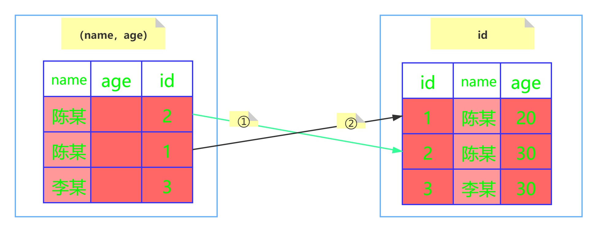
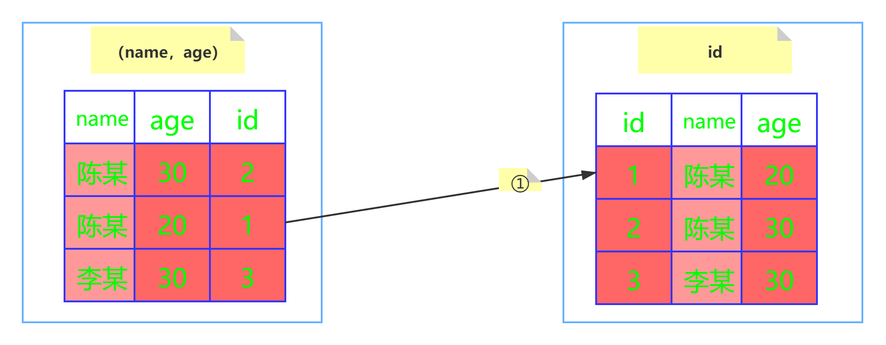

[TOC]


## 数据库

> [面试必问的 MySQL](https://zhuanlan.zhihu.com/p/179975206?utm_source=wechat_session&utm_medium=social&utm_oi=772721587307712512)

### 基础

#### 数据库类型

1. 关系型数据库：适合存储结构化数据。MySQL, SQL Server, Oracle
2. 非关系型数据库：存储非结构化数据。mongodb（文档数据库），Redis（Key-Value数据库），HBase，图数据库

#### char vs varchar

- char：定长，适合存储很短的字符串，或者所有值都接近同一长度。因为长度固定，存取速度快。若插入长度<char的固定长度，用空格填充（最多存放255个字符）
- varchar：可变长，比定长类型更省空间，使用额外1或2个字节存储字符串长度。最多存放65532个字符

#### 内连接、左连接、右连接

- 内连接/等值连接 inner join <=>join
  只返回两个表中连接字段相等的行。
- 左连接 left join
  返回包括左表中的所有记录和右表中连接字段相等的记录。
- 右连接 right join
  返回包括右表中的所有记录和左表中连接字段相等的记录。
- 全外连接 full join
  返回左右表中所有的记录和左右表中连接字段相等的记录。

#### `union all`  vs  `union`

union all 不会合并重复的记录，效率高

- 尽量用 union all 替换 union（如果检索结果中不会有重复的记录，推荐union all 替换 union。）

```mysql
# 以下语句更优，相当于select * from user where userid=1 or age=10
select * from user where userid=1
union all
select * from user where age = 10  
```

如果使用union，不管检索结果有没有重复，都会尝试进行合并，然后在输出最终结果前进行排序。如果已知检索结果没有重复记录，使用union all 代替union，这样会提高效率。

### 事务

> [深入学习MySQL事务：ACID特性的实现原理](https://www.cnblogs.com/kismetv/p/10331633.html)

#### 事务的四大特性

事务是最小执行单位，不允许分割
ACID：原子性、一致性、隔离性、持久性

- 原子性：一个事务开始后要么全部完成，要么全都不执行 `start transaction;`  `commit;`或`rollback;` `show variables like 'autocommit';` `set autocommit=0;`
- 一致性：事务在执行前后数据库的完整性约束没有被破坏。如：实体完整性(eg.
  行的主键存在且唯一)、列完整性（如字段的类型、大小、长度要符合要求）、外键约束、用户自定义完整性（eg.转账前后两个账户金额之和保持不变）
- 隔离性：多个事务并发执行时，一个事务不被其它事务所干扰
- 持久性：一个事务提交后，它对数据库的改变时持久的，即使系统或介质发生故障也不会有任何影响（通过数据库备份与恢复来保证）

#### ACID实现原理

> InnoDB存储引擎提供了两种事务日志
>
>   - redo log（重做日志）用于保证事务持久性
>   - undo log（回滚日志）是事务原子性和隔离性实现的基础

1. **原子性**。利用**undo log**：当事务对数据库进行修改时，InnoDB会生成对应的undo log；如果事务执行失败或调用了rollback，导致事务需要回滚，便可以利用undo log中的信息将数据回滚到修改之前的样子
2. **持久性**。利用**redo log**：redo log采用的是WAL（Write-ahead logging，预写式日志），<u>所有修改先写入redo log，再更新到Buffer Pool</u>，保证了数据不会因MySQL宕机而丢失，从而满足了持久性要求。如果MySQL宕机，重启时可以读取redo log中的数据，对数据库进行恢复。redo log 需要在事务提交时将日志写入磁盘
3. **隔离性**。保证事务执行尽可能不受其他事务影响；InnoDB默认的隔离级别是可重复读（RR），RR的实现主要基于锁机制、数据的隐藏列、undo log和<u>类next-key lock机制</u>[避免幻读]  锁机制,MVCC保证隔离性
4. **一致性**。
   1. 保证原子性、持久性、隔离性
   2. 数据库本身提供保障，如不允许向整形列插入字符串值、字符串长度不能超过列的限制等
   3. 应用层面进行保障，例如如果转账操作只扣除转账者的余额，需要增加接收者的余额

> 由于数据是存放在磁盘中的，如果每次读写都要磁盘I/O，效率会很低。因此InnoDB采用缓存机制(Buffer Pool)，Buffer Pool中包含了磁盘中部分数据页的映射，作为访问数据库的缓冲：当从数据库读取数据时，会首先从Buffer Pool中读取，如果Buffer Pool中没有，则从磁盘读取后放入Buffer Pool；当向数据库写入数据时，会首先写入Buffer Pool，Buffer Pool中修改的数据会定期刷新到磁盘中（这一过程称为刷脏）。Buffer Pool的使用大大提高了读写数据的效率，但是也带了新的问题：如果MySQL宕机，而此时Buffer Pool中修改的数据还没有刷新到磁盘，就会导致数据的丢失，事务的持久性无法保证。
> **[拓] 为什么redo log比直接将Buffer Pool中修改的数据写入磁盘(即刷脏)要快？**
> （1）刷脏是随机IO，因为每次修改的数据位置随机，但写redo log是追加操作，属于顺序IO
> （2）刷脏是以数据页（Page）为单位的，MySQL默认页大小是16KB，一个Page上一个小修改都要整页写入；而redo log中只包含真正需要写入的部分，无效IO大大减少。

#### 事务并发带来的问题

多个事务多同一数据进行操作

- **脏读**：事务A可以读到事务B中未提交的数据（脏数据）【读到其他事务未提交的数据】
- **不可重复读**：事务A先后两次读取同一个数据的结果不一样【读到其他事务已提交的数据，强调修改】
- **幻读**：事务A按照某个条件先后两次查询数据库，两次查询结果的条数不同【强调增删】


#### 事务的隔离级别

`select @@tx_isolation;`

##### MySQL实现事务隔离的方式

- 未提交读：不加锁
- 已提交读：快照读（普通select）使用MVCC，当前读（select lock in share mode/select for update/update/delete）使用Record Lock，可能出现不可重复读


- 可重复读：快照读使用MVCC，当前读使用Next-Key Lock

  - 如果读语句使用unique key，则InnoDB会将next-key lock降级为record lock，仅锁住索引本身而不是范围，因为唯一索引保证了数据不会重复，同一条数据的gap不会再插入新的数据。（通过主键或唯一索引来锁定不存在的值，也会产生gap锁定）
  - 如果是其他查询，则使用next-key lock（record lock+gap lock），这会导致更新一行锁住两行的现象

- 可串行化：普通select 隐式转换为select ... in share mode，与X锁互斥。如果有未提交的修改，所有读取这些行的select都会被阻塞，没有MVCC

  在每个读的数据行上加共享锁。强制对事务进行排序，使其不发生冲突。

InnoDB的锁是加在索引上的，如果查询/更新没有使用索引，则会锁全表。因为没有使用索引字段查询/更新，InnoDB只好使用主键索引，此时InnoDB无法确定更新条目的gap，只好锁全表（所著所有行和间隙）

1. 当前读：加锁读，读取记录的最新版本，会加锁保证其他并发事务不能修改当前记录，直至获取锁的事务释放锁（MVCC无法解决当前读下的幻读问题，需要使用Gap lock 或Next-key lock解决）

```mysql
select * from table where ? lock in share mode; #获取行共享锁
select * from table where ? for update;  #获取行排他锁
insert into table values (...);  #获取行排他锁
update table set ? where ? ;  #获取行排他锁
delete from table where ? ;  #获取行排他锁
```

2. 快照读：不显式加lock in share mode和for update的select操作都属于快照读，使用MVCC，解决幻读问题

### 锁

> [幻读、间隙锁、行锁、next-key lock、加锁规则、间隙锁导致的死锁、隔离级别设置、for update的理解](https://blog.csdn.net/h2604396739/article/details/86518943)

1. record lock：行锁，单行索引记录上的锁

   跟行锁有冲突的是另外一个行锁

2. gap lock：间隙锁，锁定一个范围，但不包括记录本身，开区间( , )。防止幻读

   跟间隙锁存在冲突的是往这个间隙中插入一个记录的操作

3. next-key lock（record lock+gap lock）：锁定一个范围，并锁记录本身，防止幻读

   - 前开后闭区间 ( , ]，查找过程中访问到的对象才会加锁
   - 对于索引上的等值查询，给唯一索引加锁时，退化为record lock
   - 索引上的等值查询，向右遍历时且最后一个值不满足等值条件的时候，next-key lock 退化为gap lock。

表级锁：将整个表锁定，锁定力度大，并发度低，适合以查询为主，少量更新的应用

行级锁：粒度小，发生锁冲突的概率低、并发度高，加锁慢，容易发生死锁

InnoDB行锁：锁的是索引

对于主键索引：直接锁住主键索引即可

对于普通索引：先锁住普通索引，再锁住主键索引（通过主键索引确保锁是唯一的，避免不同事务对同一条数据的不同索引分别加锁）


读锁（共享锁，S锁）多个事务都能读同一数据，但不能修改

写锁（排他锁，X锁）与其他锁互斥，只有获取排他锁的事务可以对数据进行读取和修改

#### 乐观锁 悲观锁

**读取频繁使用乐观锁，写入频繁用悲观锁**

数据库管理系统（DBMS）中的并发控制任务是确保在多个事务同时存取数据库张同一数据时不破坏事务的隔离性和统一性以及数据库的统一性。

- 悲观锁：总认为会发生并发冲突，屏蔽一切可能违反数据完整性的操作。在查询完数据的时候就把事务锁起来，直到提交事务。

  - 实现方式：使用数据库中的锁机制
  - 优：利用数据库中的锁机制实现数据变化的顺序执行
  - 缺：一个事务用悲观锁对数据加锁后，其他事物不能对加锁数据进行除查询外的所有操作。若该事务执行时间很长，必将导致其他事务等待，而导致系统吞吐量下降
  - 适用于：多写场景

- 乐观锁：总认为不会发生并发冲突，允许多个事务同时对数据进行变动，因此不会上锁，只在提交操作时检查是否违反数据完整性。

  - 实现方式：一般使用版本号机制或CAS算法实现。
    - version机制：给数据表加一个版本号version字段，数据被修改时，version+1。事务要更新数据时读取数据及version值，在提交更新时，若当前数据库中的version和刚才读到的version相等，才更新操作，否则重试更新操作
    - CAS（compare and swap）：无锁算法，非阻塞同步。涉及3个操作数，数据所在的内存值、预期值、新值。需要更新时，判断当前内存值与之前取到的值是否相等，若相等（说明内存中的值没被别的线程改过）则用新值更新，若失败则重试
- 优：不在数据库上加锁，任何事务都可以对数据进行操作，在更新时才进行校验，避免了悲观锁造成的吞吐量下降的问题
  - 缺：人为实现的，仅适用于自己的业务，若有外来事务插入，可能发生错误
  - 适用于：多读场景（此时冲突很少发生，乐观锁省去了锁的开销，加大系统吞吐量）


#### MVCC 多版本并发控制

MVCC为表提供了额外的隐藏字段，记录当前行创建的版本号，删除时的版本号（可能为空）和回滚指针，确保

1. 查找版本早于当前事务版本
2. 行的删除操作的版本要么未定义（未删除），要么大于当前事务的版本号（说明事务A读之前该数据未被删除）

这样即使其他事务在A读之后进行了insert，delete提交，都不会影响A的读取，从而解决了幻读。

ReadView记录系统中当前活跃着的读写事务（start了但是还未commit的事务），以此判断记录的某个版本对当前事务是否可见

> 假设当前列表里的事务id为[80,100]。
>
> 1. 如果要访问的记录版本的事务id为50，比当前列表最小的id80小，那说明这个事务在之前就提交了，所以对当前活动的事务来说是可访问的。
> 2. 如果要访问的记录版本的事务id为70,发现此事务在列表id最大值和最小值之间，那就再判断一下是否在列表内，如果在那就说明此事务还未提交，所以版本不能被访问。如果不在那说明事务已经提交，所以版本可以被访问。
> 3. 如果要访问的记录版本的事务id为110，那比事务列表最大id100都大，那说明这个版本是在ReadView生成之后才发生的，所以不能被访问。这些记录都是去版本链里面找的，先找最近记录，如果最近这一条记录事务id不符合条件，不可见的话，再去找上一个版本再比较当前事务的id和这个版本事务id看能不能访问，以此类推直到返回可见的版本或者结束。


#### MVCC（多版本并发控制）

> [innodb MVCC实现原理](https://zhuanlan.zhihu.com/p/52977862?utm_source=wechat_session&utm_medium=social&utm_oi=772721587307712512)
>
> [MVCC例子](https://zhuanlan.zhihu.com/p/66791480)


基本思想：MVCC是在并发访问数据库时，通过保存数据的历史版本，实现了非锁定读操作（写操作只锁定必要行），提高并发性能

实现方式：innodb的MVCC在每行记录后面增加3个隐藏列，分别记录行ID、操作该数据行的事务ID、回滚指针（指向上一个版本数据在undo log的位置）。利用ReadView记录系统中活跃着的读写事务，通过这个列表来判断记录的某个版本是否对当前事务可见。

不同隔离级别下，ReadView的生成策略不同

- 已提交读：事务在每次查询开始都会生成一个独立的ReadView
- 可重复读：在事务第一次读的时候生成一个ReadView，之后的读都复用之前的ReadView

详细：

1. 事务版本号：每次事务开启前都会从数据库获得一个自增长的事务ID，可以从事务ID判断事务的执行先后顺序。
2. 表的隐藏列（3个）
   - **DB_TRX_ID:** 记录操作该数据事务的事务ID；
   - **DB_ROLL_PTR：**回滚指针，指向上一个版本数据在undo log 里的位置指针；
   - **DB_ROW_ID:** 隐藏ID ，当创建表没有合适的索引作为主键索引时，会用该隐藏ID创建主键;
3. undo log：记录数据被修改之前的日志，在表信息修改之前先会把数据拷贝到undo log 里，当事务进行回滚时可以通过undo log 里的日志进行数据还原。通过读取undo log的历史版本数据可以实现不同事务版本号都拥有自己独立的快照数据版本。
4. read view：在innodb 中每个SQL语句执行前都会得到一个read_view。(保存了当前数据库系统中正处于活跃（没有commit）的事务的ID号)，通过这个列表来判断记录的某个版本是否对当前事务可见
   - **trx_ids:** 当前系统活跃(未提交)事务版本号集合。
   - **low_limit_id:** 当前系统的最大事务ID+1，创建当前read view 时“当前系统最大**事务版本号**+1”。
   - **up_limit_id:** 最小活跃事务ID，创建当前read view 时“系统正处于**活跃事务**最小版本号”
   - **creator_trx_id:** 创建当前read view的事务版本号；

分情况讨论：

1. **数据事务ID <up_limit_id，显示** ，数据事务ID小于read view中的最小活跃事务ID，说明该数据是在当前事务启之前就已经存在了的,所以可以显示。
2. **数据事务ID>=low_limit_id，不显示**，数据事务ID>read view 中的当前系统的最大事务ID，则说明该数据是在当前read view 创建之后才产生的，所以数据不予显示
3. **up_limit_id <**数据事务ID<**low_limit_id 则与活跃事务集合**trx_ids**里匹配**，此时这个数据有可能是在当前事务开始的时候还没有提交的，因此需要把数据的事务ID与当前read view 中的活跃事务集合trx_ids 匹配:
   - 如果事务ID不存在于trx_ids 集合（则说明read view产生的时候事务已经commit了），这种情况数据则可以显示.
   - 如果事务ID存在trx_ids则说明read view产生的时候数据还没有提交，但是如果数据的事务ID等于creator_trx_id ，那么说明这个数据就是当前事务自己生成的，自己生成的数据自己当然能看见，所以这种情况下此数据也是可以显示的。
   - 如果事务ID既存在trx_ids而且又不等于creator_trx_id那就说明read view产生的时候数据还没有提交，又不是自己生成的，所以这种情况下此数据不能显示。

不满足条件时从undo log中获取数据，然后数据历史版本事务号回头再来和read view 条件匹配 ，直到找到一条满足条件的历史数据，或者找不到则返回空结果；


MVCC手段只适用于Msyql隔离级别中的读已提交（Read committed）和可重复读（Repeatable Read）。

Read uncimmitted由于存在脏读，即能读到未提交事务的数据行，所以不适用MVCC，原因是MVCC的创建版本和删除版本只要在事务提交后才会产生。

### 数据库引擎

存储引擎是MySQL的组件，用于处理不同表类型的SQL操作。不同的存储引擎提供不同的存储机制、索引技巧、锁定水平等功能，使用不同的存储引擎，还可以获得特定的功能。

**一个数据库中多个表可以使用不同引擎以满足各种性能和实际需求**，使用合适的存储引擎，将会提高整个数据库的性能 。

InnoDB 现在是 MySQL 默认的存储引擎，支持**事务、行级锁定和外键**

#### InnoDB 和 MyISAM 的区别

|                                    | MyISAM                                                       | InnoDB                                                       |
| ---------------------------------- | ------------------------------------------------------------ | ------------------------------------------------------------ |
| 事务                               | 不支持                                                       | 支持                                                         |
| 崩溃后安全恢复                     | 不能                                                         | 能                                                           |
| 外键                               | 不支持                                                       | 支持                                                         |
| 最小锁粒度                         | 表锁（table-level locking，一个更新语句会锁住整个表，导致其它查询和更新都被阻塞，不适合高并发操作） | 行锁（row-level locking，操作时只锁某一行，不对其他行产生影响，适合高并发操作） |
| MVCC                               | 不支持                                                       | 支持                                                         |
| 索引                               | 非聚簇索引                                                   | 聚簇索引                                                     |
| 表主键                             | 允许没有任何索引和主键的表存在                               | 若没有设定主键或非空唯一索引，就会自动生成一个6字节的主键（用户不可见） |
| 存储结构                           | 三个文件：表定义文件(.frm)、数据文件(.MYD)、索引文件(.MYI)   | 所有表都存在一个数据文件中（表的大小之受限于操作系统文件的大小，一般为2GB） |
| `select count(*) from table; `速度 | 快（用一个变量保存了整个表的行数，执行该语句只需要读出该变量即可） | 不保存表的具体行数（与MVCC有关），执行该语句时需要全表扫描   |
| 应用场景                           | 管理非事务表，提供高速存储和检索及全文搜索能力。在应用中需执行大量select操作，或表比较小，且可以忍受修复操作 | 用于事务处理，在应用中执行大量insert和update操作             |

> 一张表，里面有ID自增主键，当insert了17条记录之后，删除了第15,16,17条记录，再把Mysql重启，再insert一条记录，这条记录的ID是18还是15 ？

如果表的类型是MyISAM，那么是18。因为MyISAM表会把自增主键的最大ID 记录到数据文件中，重启MySQL自增主键的最大ID也不会丢失；

如果表的类型是InnoDB，那么是15。因为InnoDB 表只是把自增主键的最大ID记录到内存中，所以重启数据库或对表进行OPTION操作，都会导致最大ID丢失。


#### InnoDB为什么要用自增id作为主键

- 如果表使用自增主键，那么每次插入新的记录，记录就会顺序添加到当前索引节点的后续位置，当一页写满，就会自动开辟一个新的页
- 如果使用非自增主键（如果身份证号或学号等），由于每次插入主键的值近似于随机，因此每次新纪录都要被插到现有索引页得中间某个位置， 频繁的移动、分页操作造成了大量的碎片，得到了不够紧凑的索引结构，后续不得不通过OPTIMIZE TABLE（optimize table）来重建表并优化填充页面。

### 索引

- 优点

大大加快数据的检索速度，提高系统性能

- 缺点

时间：创建和维护索引需要时间，对表的增加、删除、修改需要动态维护索引

空间：需要额外的物理空间

#### 索引类型

- 主键索引`primary key`：一个表只能有一个主键，且不能为空。一般在建表同时创建
- 唯一索引`unique index`：索引列的值唯一，但允许为空（如果是组合索引，列值的组合必须唯一）
- 普通索引`index`：没有任何限制，用于加速查询
- 全文索引`fulltext`：用于查找文本中的关键字，而不是直接与索引中的值相比较，更像一个搜索引擎

#### 全文索引

创建全文索引

```sql
create table data(
fulltext()
)
FULLTEXT (name) WITH PARSER ngram
```


#### 聚集索引 vs 非聚集索引

主索引：主键索引，键值不能重复； 辅助索引：普通索引（非主键索引）键值可重复

- 聚簇索引（将数据存储与索引放在一起）
  - InnoDB的**数据文件本身就是主键索引文件**（按B+树组织的索引结构文件），一个表只能有一个聚簇索引
  - 聚簇索引文件放在主键索引的叶子节点上，因此InnoDB**必须有主键**（推荐整型自增主键），通过主键索引效率很高。
  - 存储内容：InnoDB引擎索引结构的**叶节点存放的就是实际的数据记录**（主索引叶节点存储的是表中所有的数据记录，辅助索引叶节点存储的是主键值<保证数据一致性、节省存储空间>）。
  - 数据查找流程：不管是主键索引还是辅助索引，都需先查找索引节点，才能拿到相应的数据。辅助索引需要两次查询，先查询到主键，然后再通过主键查询到数据。因此，主键不宜过大，否则其它索引也会很大。
- 非聚集索引（将数据存储与索引分开）
  - 索引文件和数据文件分离
  - 存储内容：MyISAM引擎索引的叶节点存放的是**数据记录的地址**（而不是实际数据记录）。主键索引和辅助索引相互独立。
  - 通过索引查找数据流程：从索引文件中查找到索引节点->从中拿到数据的文件指针->到数据文件中通过文件指针定位具体数据

##### 【拓】InnoDB叶节点存放的内容

MyISAM：

- 主键索引和辅助索引存放的都是键值及其数据记录的地址

InnoDB：

- 主键索引存放的是键值及其对应的数据记录；

- 辅助索引存放的是键值及其对应的主键值（因此使用辅助索引时，可能需要检索两次索引：首先检索辅助索引得到主键值，然后用主键值到主键索引中获得数据记录<回表查询>）

##### 【拓】走普通索引，一定会出现回表查询吗？

不一定，如果查询语句所要求的字段全部命中了索引，那么就不必再进行回表查询。很容易理解，有一个 user 表，主键为 id，name 为普通索引，则再执行：select id, name from user where name = 'joonwhee' 时，通过name 的索引就能拿到 id 和 name了，因此无需再回表去查数据行了。

##### 【拓】索引覆盖（无需回表查询）

索引覆盖：当索引上包含了查询语句中的所有列时，我们无需进行回表查询就能拿到所有的请求数据，因此速度会很快。

```sql
--table中含有一个(key1, key2)的普通索引
select key2 from table where key1 = 'val'; --无需回表查询
```


#### 索引的数据结构

- hash索引：底层的数据结构就是哈希表，根据键值调用hash函数获得对应的hash值，找到对应的数据行地址，并根据地址获得数据。在绝大多数需求为单条记录查询时可以选择哈希索引，查询性能最快。但是不支持范围查询

- B树：多路搜索树，n路搜索树表示每个节点最多有n个子节点。每个节点存储关键字key和数据
- B+树：B+树的叶子节点存储键值和数据，非叶节点只存储键值（可容纳的关键字更多）。且叶节点之间通过指针连接，构成双向链表，因此遍历整棵树只需要一次线性遍历叶子节点即可

#### Why B+树？

> 为什么B+树更适合应用于数据库索引和操作系统的文件索引？

- 红黑树：红黑树是二叉树，数据量大时树的层数很高，从树的根节点往下寻找，每读一个节点相当于一次IO操作，

- hash索引：单值查询效率很高，但不支持范围查询；不支持多列联合索引的最左匹配规则；如果有大量重复键值的情况，哈希索引的效率很低（哈希碰撞）
- B树：在非叶节点存放了数据记录的地址，导致一个节点能存放的关键字数量更少，树的层数更高。范围查询时需要做局部中序遍历，可能要跨层访问（额外的IO操作）
- B+树：
  - B+树的磁盘读写代价更低。B+树只有叶子节点才存储数据，非叶节点只存储关键字信息，每个非叶节点（可理解为数据页）能容纳的关键字数量也越多，相对来说树的高度降低，磁盘I/O的读写次数也降低了
  - B+树的查询效率更加稳定。任何关键字的查找都必须走一条从根节点到叶节点的路径，因此所有关键字查询的路径长度相同，使得每个数据的查询效率相当
  - B+支持基于范围的查询。B+树在叶子节点中是双向链表，且在链表的头节点和尾节点也是循环指向的，因此只要遍历叶节点就可以实现整棵树的遍历。B树只适合随机检索

数据库索引存储在磁盘上，当数据量大时，不能把整个索引加载到内存中，只能逐个加载每个磁盘页（对应索引树的节点）。

[不懂数据库索引的底层原理？那是因为你心里没点b树](http://www.17coding.info/article/25)

##### 【拓】B+树种一个节点多大

1页，MySQL 的 Innodb 引擎中1页的默认大小是16k，可以使用命令SHOW GLOBAL STATUS LIKE 'Innodb_page_size' 查看。

##### 【拓】为什么一个节点为1页就够了？

对于叶子节点：我们假设1行数据大小为1k（对于普通业务绝对够了），那么1页能存16条数据。对于非叶子节点：key 使用 bigint 则为8字节，指针在 MySQL 中为6字节，一共是14字节，则16k能存放 16 * 1024 / 14 = 1170个。那么一颗高度为3的B+树能存储的数据为：1170 * 1170 * 16 = 21902400（千万级）。

#### MySQL 索引的作用和实现

创建索引的原则

1. 最左前缀匹配原则，组合索引时，mysql会一直向右匹配知道遇到范围查询(<,>,between,like)就停止匹配（将where子句中使用最频繁的一列放在最左边）
2. 对较频繁作为查询条件的字段创建索引
3. 定义有外键的列要建索引
4. 更新频繁的字段不适合创建索引
5. 不能有效区分数据的列不适合做索引（eg.性别）
6. 尽量扩展索引，不要新建索引（如已经有了a索引，现在加(a,b)的索引，只需修改原来的索引即可）
7. 定义为text、image、bit的数据类型列不要建索引

> 【字客1】对于 SELECT id, age FROM user WHERE status = 0 and age > 12; 这条语句，怎样建立索引比较好？


#### explain查看是否使用索引

`explain`+SQL 语句
（1）可以查看表的读取顺序；（2）可以查看数据读取操作的操作类型；（3）可以查看哪些索引可以使用；（4）可以查看哪些索引被实际使用；（5）可以查看表与表之间的引用关系；（6）可以查看每张表有多少行记录被优化器查询。

type：all 表示这条查询遍历了所有行，没有使用索引；其他（如const, eq_ref, ref, range, index等）都会用到索引
key：表示实际使用的索引，NULL表示没有使用索引

extra：using index condition(表明使用索引下推)


#### 索引失效的原因

>  如果一条语句的查询关键字包含了索引中的关键字，但是 MySQL 引擎还是没有使用索引，有可能是什么原因？[字客1]

- 条件中有or，索引失效【可以改成union/union all】 （要想使用or，又想让索引生效，只能将or条件中的每个列都加上索引）
- 复合索引，但是没有用到左列字段
- like以%开头
- where中索引列有运算、函数、(手动/自动)类型转换[字符串不加单引号等]
- mysql在使用不等于（！=或者<>）的时候无法使用索引会导致全表扫描
- 数据很少，MySQL觉得全表扫描更快

- 存储引擎不能使用索引范围条件右边的列 (`select * from myTest  where a>4 and b=7 and c=9;` a用到了  b没有使用，c没有使用)
- 尽量使用覆盖索引（只访问索引的查询（索引列和查询列一致）），减少`select *

#### 慢SQL优化

1. 首先用explain分析语句的执行计划，查看是否使用索引，如果没走索引，可以加索引解决
2. 分析语句，查看是否存在导致索引失效的用法，是否加载了不需要的列
3. 如果无法进行语句优化了，则考虑表中的数据量是否过大，若是可以考虑进行垂直拆分/水平拆分

#### 索引优化策略

- 最左前缀匹配原则
- 主键外键一定要建索引
- 对 where, on, group by, order by 中出现的列使用索引
- 尽量选择区分度高的列作为索引,区分度的公式是`count(distinct col)/count(*)`，表示字段不重复的比例，比例越大我们扫描的记录数越少，唯一键的区分度是1，而一些状态、性别字段可能在大数据面前区分度就是0
- 对较小的数据列使用索引,这样会使索引文件更小,同时内存中也可以装载更多的索引键索引列不能参与计算，保持列“干净”，比如from_unixtime(create_time) = ’2014-05-29’就不能使用到索引，原因很简单，b+树中存的都是数据表中的字段值，但进行检索时，需要把所有元素都应用函数才能比较，显然成本太大。所以语句应该写成create_time = unix_timestamp(’2014-05-29’);
- 为较长的字符串使用前缀索引
- 尽量的扩展索引，不要新建索引。比如表中已经有a的索引，现在要加(a,b)的索引，那么只需要修改原来的索引即可
- 不要过多创建索引, 权衡索引个数与DML之间关系，DML也就是插入、删除数据操作。这里需要权衡一个问题，建立索引的目的是为了提高查询效率的，但建立的索引过多，会影响插入、删除数据的速度，因为我们修改的表数据，索引也需要进行调整重建
- 对于like查询，”%”不要放在前面。 
  `SELECT * FROM user WHERE username LIKE 'Jack%' `-- 走索引 
  ` SELECT * FROM user WHERE username LIKE '%Jack%' `--- 不走索引查询
- where条件数据类型不匹配也无法使用索引 (eg字符串与数字比较不使用索引)
- 正则表达式不使用索引,这应该很好理解,所以为什么在SQL中很难看到regexp关键字的原因


#### 索引下推ICP

> https://blog.csdn.net/mccand1234/article/details/95799942

MySQL5.6对索引的优化

```sql
set optimizer_switch = 'index_condition_pushdown=on' --默认开启
```

索引下推在**非主键索引**上的优化，可以有效减少回表的次数，大大提升了查询的效率

未使用ICP：首先根据索引来查找记录，然后再根据where条件来过滤记录

使用ICP优化：MySQL会在取出索引的同时，**判断是否可以进行where条件过滤再进行索引查询**，也就是说提前执行where的部分过滤操作

**举例**

```sql
--用户表(user)，其中主要几个字段有：id、name、age、address。建立联合索引（name，age）
SELECT * from user where  name like '陈%' and age=20
```

mysql5.6之前版本：会忽略age这个字段，直接通过name进行查询，在(name,age)这课树上查找到了两个结果，id分别为2,1，然后拿着取到的id值一次次的回表查询，因此这个过程需要**回表两次**





mysql5.6+：InnoDB并没有忽略age这个字段，而是在索引内部就判断了age是否等于20，对于不等于20的记录直接跳过，因此在(name,age)这棵索引树中只匹配到了一个记录，此时拿着这个id去主键索引树中回表查询全部数据，这个过程只需要**回表一次**


### 触发器

由事件触发某个操作，事件包括insert、update、delete语句，触发器用于加强数据的完整性约束和业务规则等

- 行级触发器是对DML语句影响的每个行执行一次，如UPDATE语句影响多行，就会对每行都激活一次触发器。
- 语句级触发器是对每个DML语句执行一次，如INSERT语句在表中即使插入了100多行，表上的INSERT语句级触发器也只会执行一次。

**触发器应用场景**：

1. 当向一张表中添加或删除记录时，需要在相关表中进行同步操作。
   比如，当一个订单产生时,订单所购的商品的库存量相应减少。

2. 当表上某列数据的值与其他表中的数据有联系时。
   比如，当某客户进行欠款消费，可以在生成订单时通过设计触发器判断该客户的累计欠款是否超出了最大限度。

3. 当需要对某张表进行跟踪时。
   比如，当有新订单产生时，需要及时通知相关人员进行处理，此时可以在订单表上设计添加触发器加以实现


