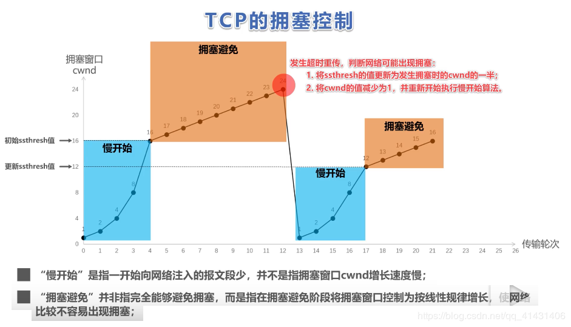

## 计算机网络

https://www.nowcoder.com/discuss/1937

#### C/S vs B/S

- C/S
  - 

- B/S 只需在一端部署服务器，而另外一端使用每台PC默认配置的浏览器即可完成数据的传输

|      | C/S（客户端/服务器）                             | B/S                                |
| ---- | ------------------------------------------------ | ---------------------------------- |
| 优   | 缓存大量数据、协议选择灵活；速度快；应用程序更新 | 安全性、可以跨平台、开发工作量较小 |
| 缺   | 安全性、不能跨平台、既要开发客户端又要开发服务器 | 不能缓存大量数据、严格遵守http     |


>  [TCP/IP详解 卷1：协议](http://www.52im.net/topic-tcpipvol1.html?mobile=no)

### 网络体系结构

五层结构：应用层、传输层、网络层、数据链路层、物理层

数据链路层：关注以太网/其他二层网络内网络包的传输

IP层：关注每个网络分组如何到达目的主机

传输层：关注端到端的传输，一台主机上进程发出的包如何到达目的主机的某个进程

应用层：

#### 传输流程

数据在没有封装之前是不能在网络中传输的

- 应用进程数据先传送到应用层，再加上应用层首部，成为应用层PDU

- 应用层PDU传送到传输层，加上传输层首部，成为传输层报文

- 运输层报文传送到网络层，再加上网络层首部，成为IP数据报（分组）

- IP数据报再传送到数据链路层，再加上链路层首部和尾部，形成数据链路层帧

  数据链路层帧传送到物理层

由物理层把比特流传送到物理媒体，电/光信号在物理媒体中传播，从发送端物理层传到接收端物理层

#### 协议

- 协议：控制两个对等实体进行通信的规则的集合。（水平的）

- 服务：由下层向上层通过层间接口提供的（垂直的）

- 在协议控制下，两个对等实体间的通信使得本层能够向上一层提供服务

- 要实现本层协议，还需要使用下层所提供的的服务

- 本层服务用户只能看见服务而看不见下面的协议，下面的协议对上面的服务用户是透明的

  

|            |                                                              | 扩展局域网         |
| ---------- | ------------------------------------------------------------ | ------------------ |
| 物理层     | 确定与传输媒体（同轴电缆、光纤、通信卫星、微波等）的接口的一些特性，保证通信信道上传输**比特流** | 集线器             |
| 数据链路层 | 负责在两个相邻结点间的线路上无差错地传送以帧为单位的数据，并进行流量控制（流量控制<由收方控制发方的数据流>、差错处理等） | 网桥、以太网交换机 |
| 网络层     |                                                              | 路由器             |
|            |                                                              | 网关               |
|            |                                                              |                    |

- 集线器使用电子器件来模拟实际电缆线的工作
- 硬件地址/物理地址/MAC地址
- 网桥根据MAC帧的目的地址对收到的帧进行转发。具有过滤帧的功能（先检查帧的目的地址，再确定将该帧转发到哪个端口），在MAC子层没有流量控制功能，只适合用户数不多和通信量不大的局域网，否则会产生广播风暴
- 中间设备：中间系统、中继系统

##### 各层对应的工作设备

物理层：中继器、集线器

数据链路层：网桥、交换机

网络层中继系统：路由器

网络层以上的中继系统：网关


> http://www.ruanyifeng.com/blog/2017/06/tcp-protocol.html

- 以太网协议：规定了电子信号如何组成数据包，解决了子网内部的点对点通信。但以太网协议不能解决多局域网如何互通。

- IP协议：定义了一套自己的地址规则（IP地址），实现了路由功能，允许某个局域网的主机向另一个局域网的主机发送消息

  路由器基于IP协议，局域网之间要靠路由器连接

  路由表注明了不同IP目的地址的数据包要发往哪个网口

- TCP协议：保证数据通信的完整性和可靠性，防止丢包 （缓存满了，新来的数据包就会丢失）


数据包大小

- 以太网数据包（packet）的大小是固定的，最初是1518字节，后来增加到1522字节。其中， 1500 字节是负载（payload），22字节是头信息（head）

- IP 数据包在以太网数据包的负载里面，它也有自己的头信息，最少需要20字节，所以 IP 数据包的负载最多为1480字节

- TCP 数据包在 IP 数据包的负载里面。它的头信息最少也需要20字节，因此 TCP 数据包的最大负载是 1480 - 20 = 1460 字节。由于 IP 和 TCP 协议往往有额外的头信息，所以 TCP 负载实际为1400字节左右。

  因此，一条1500字节的信息需要两个 TCP 数据包。HTTP/2 协议的一大改进， 就是压缩 HTTP 协议的头信息，使得一个 HTTP 请求可以放在一个 TCP 数据包里面，而不是分成多个，这样就提高了速度。


接收方收到TCP数据包后，由操作系统将其按照顺序组装好（不会处理数据包里的数据），并将组装好的TCP数据包转交给应用程序（端口号用来指定转交给监听该端口的应用程序）

TCP提供表示原始文件大小的机制。应用层协议规定了原文件的大小。如HTTP中头信息`Content-Length`表示信息体的大小


### 数据链路层


### 网络层

实现两个主机之间的通信。真正进行通信的实体是在主机中的进程，是一个主机中的一个进程与另一个主机中的一个进程交换数据。

IP协议虽然能把数据报文送到目的主机，但没有交付给主机的具体应用进程，而端到端的通信才应该是应用进程之间的通信。

网络层上的服务：

|                            | 数据报服务                                        | 虚电路服务                                                   |
| -------------------------- | ------------------------------------------------- | ------------------------------------------------------------ |
| 连接                       | 无连接的                                          | 面向连接的                                                   |
| 思路                       | 可靠通信由用户主机（TCP）保证，网络尽最大努力交付 | 可靠通信由网络保证                                           |
| 端到端的差错处理和流量控制 | 由用户主机负责                                    | 由分组交换网或由用户主机负责                                 |
| 目的站地址                 | 每个分组都携带完整的目的地址                      | 仅在连接建立阶段使用，每个分组使用短的虚电路号，不需要携带完整的目的地址 |
| 分组转发                   | 每个分组独立选择路由进行转发                      | 属于同一条虚电路的分组均按照同一路由进行转发                 |
| 分组顺序                   | 到达目的站时不一定按照发送顺序                    | 总是按照发送顺序到达目的站                                   |
| 当结点发生故障市           | 故障节点可能丢失分组，一些路由可能发生变化        | 所有通过出现故障结点的虚电路均不能工作                       |

- 数据报服务还适合于将一个分组发送到多个地址（广播或多播）
- 流量控制往往指在给定的发送端和接收端之间的点对点通信量的控制，所要做的就是抑制发送端发送数据的速率，以便使接收端来得及接收
- 路由器总是具有两个或以上的IP地址，路由器的每个接口都有一个不同网络号的IP地址
- 在同一个局域网上的主机或路由器的IP 地址中的网络号必须是一样的
- 网络层及以上使用IP地址，数据链路层及以下使用硬件地址

#### 地址解析协议（ARP）

- 每个主机都设有一个ARP高速缓存，里面有所在局域网上的各主机和路由器的IP地址到硬件地址的映射表
- 为了减少网络上的通信量，主机A在发送ARP请求分组时，就将自己的IP地址到硬件地址的映射写入ARP请求分组；当主机B收到A的ARP请求分组时，会将主机A的地址映射写入主机B自己的ARP高速缓存中
- 解决同一个局域网上的主机或路由器的IP地址和硬件地址的映射问题

#### 划分子网

IP地址 ::= {<网络号>, <子网号>, <主机号>}  

- 无法从一个IP数据报的首部判断源主机或目标主机所连接的网络是否进行子网划分
- 使用**子网掩码**可找到IP地址中的子网部分
- 先用个网络的子网掩码与收到分组的目的IP地址逐比特相与，看是否和相应的网络地址匹配

#### IP首部

> [IP数据报格式&IP数据报分片](https://blog.csdn.net/weixin_44827418/article/details/106261233?utm_medium=distribute.pc_relevant.none-task-blog-BlogCommendFromMachineLearnPai2-1.channel_param&depth_1-utm_source=distribute.pc_relevant.none-task-blog-BlogCommendFromMachineLearnPai2-1.channel_param)


生存时间(TTL, time to live)：设置数据包在路由节点的跳转上限，每经过一个路由节点，该值-1，当减为0时，有义务将该数据包丢弃

首部检验和：只检验IP首部

源IP、目的IP（32位 --- 4字节）

（网络字节序[大端序]，最高位在左边，记为0）


IP地址：可以在网络环境中，唯一标识一台主机

端口号：可以在网络的一台主机上，唯一标识一个进程

IP地址+端口号：可以在网络环境中，唯一标识一个进程


#### ICMP（网络控制报文协议）

> https://www.cnblogs.com/Akagi201/archive/2012/03/26/2418475.html

ping是使用ICMP协议来进行工作的。 ICMP:网络控制报文协议

* 首先，ping命令会构建一个ICMP请求数据包，然后由ICMP协议将这个数据包连同目的IP地址源IP地址一起交给IP协议。
* 然后IP协议就会构建一个IP数据报，并且在映射表中查找目的IP对应的mac地址，将其交给数据链路层。
* 然后数据链路层就会构建一个数据帧，附上源mac地址和目的mac地址发送出去。

目的主机接收到数据帧后，就会检查包上的mac地址与本机mac是否相符，如果相符，就接收并把其中的信息提取出来交给IP协议，IP协议就会将其中的信息提取出来交给ICMP协议。然后构建一个ICMP应答包，用相同的过程发送回去。


### 传输层

#### TCP vs UDP

- TCP是面向连接的、可靠的字节流传输协议（包含建立连接、数据传输、断开连接过程）；UDP是无连接、不可靠的数据发送协议（传输时连接的建立与断开、传输可靠性均有上层应用程序处理）
- TCP是一对一的传输；UDP支持一对一、一对多、多对一、多对多的交互通信
- TCP是面向字节流的（[本身没有数据包的概念，不会按照数据包发送数据]把应用层传来的报文看成字节流，将字节流拆分成大小不等的数据块，并添加TCP首部，首部是20个字节）；UDP是面向报文的，不对应用层传来的报文拆分或合并，只是添加了UDP首部（8个字节）
- TCP保证传输可靠性的方式：确认应答、超时重传、数据有序、流量控制、拥塞控制；UDP仅提供最基础的数据传输能力，发送方根据对方的IP地址发送数据包，但不保证接受发送包的质量，数据无序还容易丢包。虽然UDP协议不稳定但是在即时通讯（QQ聊天、在线视频、网络语音电话）的场景下，可以允许偶尔的断续，但是这种协议开销小、简单、传输速度快。
- TCP对应应用层的协议主要有SMTP(25)、TELNET(23)、HTTP(80)、FTP(21,20)等；UDP对应应用层的协议主要有DNS(53)、TFTP(69)、DHCP、SNMP、NFS等。

##### TCP、UDP首部

- **TCP首部**（20-40字节）


1. 序号seq：4个字节，用于标记数据段的顺序，TCP把连接中发送的所有数据字节都编上一个序号，第一个字节的编号由本地随机产生，给字节编上序号后，就给每个报文段指派一个序号；序号seq就是这个报文段中第一个字节的数据编号。（由于TCP数据包大小有限制，TCP传输会将数据拆分为若干个包，因此需要对数据包进行编号，接收方可利用seq进行排序）<作用：使得一个TCP接收方可以丢弃重复的包，对数据包进行排序>

   【拓】序列号生成：seq = C + H (源IP地址，目的IP地址，源端口，目的端口)。其中，C是一个计时器，每隔一段时间值就会变大，H是消息摘要算法，输入是一个四元组（源IP地址，目的IP地址，源端口，目的端口）。

2. 确认号ack：4个字节，表示期待收到对方下个报文段的第一个数据字节的序号；当前报文段最后一个字节的编号+1即为确认号

3. 6个标志位:

   1. URG
   2. 确认ACK：1位，仅当ACK1=1时，确认号字段有效
   3. PSH：接收方立即将数据提交给应用层，而不是等待缓冲区满
   4. RST：重置连接
   5. 同步SYN：连接建立时用于同步序号。SYN=1表示这是一个连接请求、连接接收报文。SYN=1, ACK=0：此为连接请求报文段；SYN=1, ACK=1：此为同意连接接收报文。SYN只有在TCP建立连接时才会为1，握手完成后为0。
   6. 终止FIN：释放一个连接。FIN=1表示此报文段的发送方和数据已经发送完毕，并要求释放传输连接。

4. TCP检验和：必须的，用于发现TCP首部和数据是否被改动（计算时需要加上12字节的伪首部）
5. 窗口：滑动窗口大小，用来控制对方发送的数据量，通知发送方的发送窗口上限

- **UDP首部**

  源端口号（2字节）、目标端口号（2字节）、UDP长度（2字节，表示UDP首部+UDP数据长度，理论范围在[8,65535]）、校验和（由发送端计算，接收端验证，用于发现UDP首部和数据是否被改动,计算时需要加上12字节的伪首部）


伪首部(12字节，用于计算检验和)：源IP地址(4)、目标IP地址(4)、0填充(1)、协议(1)、TCP/UDP长度(2)

##### TCP、UDP包大小

> [TCP、UDP数据包大小的限制](https://blog.csdn.net/hellozhxy/article/details/80280197)


**数据链路层**：由以太网的物理特性决定了数据帧的长度为(46＋18) ~ (1500＋18)之间，在该长度范围之外的以太网帧都被视为错误的数据帧（会被丢弃）

其中的18是数据帧的头（14=6[目标MAC地址]+6[源MAC地址] + 2[Type/Length]）和尾（4[CRC校验]），也就是说数据帧的内容最大为1500(不包括帧头和帧尾)，即MTU(Maximum Transmission Unit)为1500； 　

**网络层**：IP数据报首部20字节(...+4[源IP地址] + 4[目标IP地址])，MTU=1500 - 20 = 1480

**传输层**：

- UDP包首部8字节。理论上，UDP数据包的最大长度为65535字节（64K）【socket编程时，UDP协议要求包小于64K】

  为了避免IP分片带来数据包无法重组的可能性，应限制UDP中的数据量小于MTU-28 = 1500 - 28 = 1472

- TCP没有限定应用层数据的大小，TCP协议会根据MSS对数据进行分段

  TCP包头部没有长度字段，而完全依靠IP层处理分帧，因此成为基于数据流的协议，开发者不必关系数据包的大小，只要把socket看作一条数据流的入口，往里面传输数据即可，TCP协议本身会进行拥塞/流量控制。 （在用send函数时，数据长度参数不受限制。而实际上，所指定的这段数据并不一定会一次性发送出去，如果这段数据比较长，会被分段发送，如果比较短，可能会等待和下一次数据一起发送。）

如果TCP包或UDP包超过范围，导致IP数据报>1500，则发送方会在IP层进行分片，接收方在IP层进行数据报的重组。由于UDP不保证可靠传输，如果接收方无法重组数据包，会导致整个IP数据报被丢弃。


##### IP分片 vs TCP分段

> [为什么TCP/IP协议会拆分数据](https://draveness.me/whys-the-design-tcp-segment-ip-packet/)

- MTU、MSS简介

  - IP协议的MTU是物理设备上的限制，表示路径能够发送数据包的上限

  - TCP协议的MSS是操作系统内核层面的限制，通信双方会在三次握手时确定此次连接的MSS

> 最大传输单元(MTU):IP数据包能够传输的数据上线（大的MTU以为着更低的额外开销，小的MTU意味着更低的网络延迟）
>
> 每个物理设备都有自己的MTU，两个主机之间的MUT由整个链路上MTU最小的物理设备决定[靠ICMP（互联网控制消息协议）确定，其能在IP主机之间传递控制消息]
>
> IP主机的路基MTU一般都为1500,去掉IP首部20.如果待传输的数据大于1480,IP协议就会将数据包分片传输

> 最大分段大小(MSS):TCP数据段能够携带的数据上限
>
> 正常情况下：TCP连接的MSS=MTU - 40 =1500 - 40 = 1460
>
> 如果通信双方没有设定MSS：默认MSS= 536


IP协议分片：对数据量大的包进行分片，避免物理设备的限制

TCP协议分段：对数据量大的段进行分段，保证传输性能


- IP协议对UDP进行分片

  数据的接收方在收到数据包时会对分片的数据进行重组（UDP首部有2个字节表示UDP数据报的总长度），不过因为第二个数据包中不包含 UDP 协议的相关信息，一旦发生丢包，整个 UDP 数据报就无法重新拼装。如果 UDP 数据报需要传输的数据过多，那么 IP 协议就会大量分片，增加了不稳定性。

  

  eg.假设传输2000字节的数据,加上UDP首部8字节,IP协议需要传输2008字节的数据.此时会将UDP数据拆成两个数据包:

  1. IP协议头(20) + UDP协议头(8) + 数据(1472)

  2. IP协议头(20) + 数据(528)

- TCP分段

  TCP协议是面向字节流的，应用层交给TCP协议的数据不会以消息为单位向目的主机发送，TCP协议会对应用层的数据进行拆分或组装(Nagle)

  为了保证可靠性，TCP协议会通过IP协议的MTU计算MSS，并根据MSS分段避免IP协议对数据包的分片（否则IP分片会导致部分数据包没有TCP协议头，以但数据包发生丢失就只能丢弃全部数据）


#### TCP

> [TCP的三次握手与四次挥手理解及面试题](https://blog.csdn.net/qq_38950316/article/details/81087809?utm_medium=distribute.pc_relevant_t0.none-task-blog-BlogCommendFromMachineLearnPai2-1.nonecase&depth_1-utm_source=distribute.pc_relevant_t0.none-task-blog-BlogCommendFromMachineLearnPai2-1.nonecase)
>
> https://blog.csdn.net/baidu_32045201/article/details/78021536

##### TCP可靠传输▲

TCP保证传输可靠性的方式：确认应答、超时重传、数据有序、流量控制、拥塞控制

1. 确认应答：接收方收到报文会进行确认。（ACK携带两个信息：a)期待收到下一个数据包的编号 b)接收方的接收窗口的剩余容量）
2. 丢包处理：如果下个数据包没有收到，那么ack编号不会发生变化。如果发送方发现收到3个连续的重复ACK，或者超时还没收到ACK，就会确认丢包，重新发送数据包
3. 超时重传：TCP发出一个数据段后，它会将该数据段的副本放到重传队列上并开启计时器，等待接收端确认收到这个报文段。如果不能及时收到一个确认，将重发这个报文段。 
4. 数据有序：每个数据包中都有序列号，接收端会将接收到的数据包根据序列号进行排序，并且去掉重复序列号的数据。
5. 流量控制：接收方采用滑动窗口控制发送方的发送量，可以防止接收方可用的数据缓冲空间溢出。滑动窗口会指明接收能够接收的最大数据量【接收方能来得及接收】 
6. 拥塞控制：如果网络拥塞，分组将会丢失，此时发送方会重传，导致网络拥塞程度更高。采用“慢启动”、“拥塞避免”、“快速重传 ”、“快速恢复”4种算法控制发送方的速率。【降低整个网络的拥塞程度】
7. 校验和：检验首部和数据


##### 拥塞控制▲

> [TCP的拥塞控制（详解）](https://blog.csdn.net/qq_41431406/article/details/97926927)

为了进行拥塞控制，TCP发送方要维持一个**拥塞窗口**(cwnd)的状态变量，其大小取决于网络的拥塞程度，并动态变化。发送方让自己的发送窗口=min(拥塞窗口,接收窗口)


- 慢开始：当主机开始发送数据时，如果立即把大量数据字节注入到网络，可能会引起网络阻塞。先探测以下，由小到大逐渐增大发送窗口<拥塞窗口数值cwnd>，cwnd初值为1，每经过一个传播轮次（RTT时间），cwnd加倍（1,2,4,8,16,..呈指数增长）
- 拥塞避免：让拥塞窗口cwnd缓慢增大，每经过一个往返时间RTT就把发送方的cwnd+1（线性增长）
- 快重传：让发送方尽快进行重传，而不是等超时重传计时器超时再重传
- 快恢复：发送方一旦收到3个重复确认，就知道现在只是丢失了个别报文段，于是不启动慢开始算法，而执行快恢复算法。

- 发送方将慢开始门限ssthresh以及cwnd都设为当前窗口的一半，并开始执行拥塞避免算法

慢开始门限ssthresh

- 当cwnd<ssthresh：采用慢开始算法
- 当cwnd>ssthresh：采用阻塞避免算法
- 当发送方超时重传，则误以为网络发送拥塞，将ssthresh设为发生拥塞时cwnd的一半，并将cwnd重置为1，重新采用慢开始算法

##### 拥塞控制 vs 流量控制

- 流量控制：**控制发送方发送速率，保证接收方来得及接收**。TCP利用滑动窗口实现流量控制。（接收方发送的ACK报文中的窗口字段可以用来控制发送方窗口大小）<点对点通信量的控制，是端到端的问题>
- 拥塞控制：**降低整个网络的拥塞程度，防止过多的数据注入到网络中，使网络中的路由器或链路不至于过载。**<是全局性过程，涉及所有主机、路由器以及于降低网络传输性能有关的所有因素>（拥塞：对网络中某一资源的需求超过该资源所能提供的可用部分，网络的性能可能就要变坏）


##### 三次握手（建立连接）▲

刚开始客户端处于closed状态，服务端处于listen状态

1. 第一次握手：客户端给服务器端发送一个**SYN报文**，并指明客户端的初始化序列号seq=x（SYN=1,ACK=0,seq=x）。此时客户端处于SYN_Send<同步已发送>状态。
   - <u>SYN</u>报文段不能携带数据，但需要<u>消耗一个序列号</u>
2. 第二次握手：服务器收到客户端的SYN报文后，发送**SYN+ACK**报文，会以自己的SYN报文作为应答，同时也指定了自己的初始化序列号seq=y（SYN=1,ACK=1,seq=y,ack=x+1），同时会把客户端的序列号x+1<SYN会消耗一个序列号>作为确认号ack，表示自己已经收到了客户端的SYN，此时服务器处于SYN_REVD<同步收到>状态
3. 第三次握手：客户端收到SYN+ACK报文后，会发送一个**ACK报文**（ack=y+1），表示已经收到了服务器端的SYN报文，此时客户端处于established<已建立连接>状态（TCP连接成功）
   - ACK报文段可以携带数据，如果不携带数据则**不消耗序列号**
4. 服务器端收到ACK报文后，也处于established状态，此时双方建立起了连接，客户端和服务器端可以正式开始传送数据

SYN只有在TCP建立连接时才为1，握手完成后为0


> [“三次握手，四次挥手”你真的懂吗？](https://www.cnblogs.com/qcrao-2018/p/10182185.html)

##### 【拓】SYN Flood

通过重复发送初始连接请求（SYN）数据包，攻击者能够占用服务器上的所有可用端口，导致服务器无法响应正常的连接请求

服务端在收到SYN信号后会将SYN+ACK数据包返回给客户端，并将该连接计入**半连接队列**数目中，当半连接数目大于系统设定的最大值（`/proc/sys/net/ipv4/tcp_max_syn_backlog`）时系统将不能再接收其他的连接，所以攻击者利用这个原理，在服务器向客户端发送SYN+ACK信号后不做任何回应，这样连接将一直不会被释放，直到累计到连接最大值而不能再创建新的连接，从而达到了让服务器无法响应正常请求的目的。

解决方式

1. 延迟TCB分配。当建立正常连接之后再分配TCB，减轻服务器资源的消耗（SYN Cache、SYN Cookie）

- SYN cookie：给每一个请求连接的IP地址分配一个Cookie，如果短时间内连续受到某个IP的重复SYN报文，就认定是受到了攻击，并记录地址信息，以后从这个IP地址来的包会被一概丢弃。（net.ipv4.tcp_syncookies = 1）使用一种特殊的算法生成序列号(考虑对方IP、端口、己方IP、端口及对方不知道而己方直到的固定信息<如MSS、时间等>，在收到对方的ACK报文后重新计算，看其是否与对方回应报文中的序列号-1相同)
- SYN Cache：用一个hash表保存这种半连接信息，直到收到正确的ACK报文后再分配TCB。
- 首包丢弃：第一个SYN包仅用于记录IP信息，利用重传机制，如果是第二个SYN包，则返回SYN+ACK

##### 【拓】连接队列

- 半连接队列：syns queue `/proc/sys/net/ipv4/tcp_max_syn_backlog`
- 全连接队列：accept queue `min(backlog, /proc/sys/net/core/somaxconn)`

linux中TCP参数：

tcp_syncookies：是否打开SYN Cookie功能，若开启，则当SYN半连接队列满了，启动cookie来处理

tcp_max_syn_backlog：半连接队列长度

min(backlog, somaxconn)：全连接队列长度

当外部连接请求到来时，TCP模块会首先查看max_syn_backlog，如果处于SYN_RCVD状态的连接数目超过这一阈值，进入的连接会被拒绝。根据tcp_abort_on_overflow字段来决定是直接丢弃，还是直接reset.

从服务端来说，三次握手中，第一步server接受到client的syn后，把相关信息放到半连接队列中，同时回复syn+ack给client. 第三步当收到客户端的ack, 将连接加入到全连接队列。


##### 【拓】accept是在3次握手之后返回

> [accept建立连接](https://blog.csdn.net/russell_tao/article/details/9111769)

应用层调用类似于accept的API就可以建立TCP连接

这两个队列是内核实现的，当服务器绑定、监听了某个端口后，这个端口的SYN队列和ACCEPT队列就建立好了。客户端使用connect向服务器发起TCP连接，当图中1.1步骤客户端的SYN包到达了服务器后，内核会把这一信息放到SYN队列（即未完成握手队列）中，同时回一个SYN+ACK包给客户端。一段时间后，在较中2.1步骤中客户端再次发来了针对服务器SYN包的ACK网络分组时，内核会把连接从SYN队列中取出，再把这个连接放到ACCEPT队列（即已完成握手队列）中。而服务器在第3步调用accept时，其实就是直接从ACCEPT队列中取出已经建立成功的连接套接字而已。

TOMCAT等服务器会使用独立的线程，只做accept获取连接这一件事，以防止不能及时的去accept获取连接。

Nginx等一些服务器，在一个线程内做accept的同时，还会做其他IO等操作（listen时设置的套接字为非阻塞模式）

##### 四次挥手（终止连接）▲

1. 第一次挥手：客户端发送一个**FIN报文**，报文中会指定一个序列号（seq=u,FIN=1,u=前面已经传来的数据的最后一个字节的序号+1）。此时客户端处于FIN_WAIT1状态。
   - FIN报文段即使不携带数据，也要消耗一个序号
2. 第二次挥手：服务器端收到FIN报文后，会发送**ACK报文**，且把客户端的序列号+1作为ACK报文，表明已经收到客户端的报文了（seq=v,ACK=1,ack=u+1），此时服务器端处于CLOSE_WAIT状态。
   - TCP服务器通知高层的应用进程，客户端向服务器的方向就释放了，这时处于半关闭状态（客户端已经没有要发送的数据了，但服务器若发送数据，客户端仍要接收。整个状态需要持续一段时间，也就是整个CLOSE_WAIT持续的时间）
3. 客户端收到服务器的ACK报文后，就进入FIN_WAIT2状态，等待服务器端发送FIN报文（在这之前还需要接受服务器端发送的最后的数据）
4. 第三次挥手：如果服务器端将最后的数据发送完毕后，也想断开连接了，就和客户端的第一次挥手一样，发出**FIN报文**，由于在半关闭状态，服务器很可能又发送了一些数据，假定此时的序列号为w（FIN=1,seq=w,ack=u+1）。此时服务器端处于LAST_ACK状态等待客户端的确认。
5. 第四次挥手：客户端收到FIN报文后，同样发送一个**ACK报文**作为应答（ACK=1,seq=u+1,ack=w+1），此时客户端处于TIME_WAIT状态。【注】此时TCP连接还未释放，需要经过2xMSL（最长报文段寿命）的时间后，确保服务器端收到自己的ACK报文后才进入CLOSED状态。（seq=x,ack=y）
6. 服务器端收到ACK报文后，就立即关闭连接，处于CLOSED状态。（可以看出，服务器结束TCP连接的时间比客户端早一些）


##### 为什么TCP不是两次握手or四次握手？ 

> [TCP的三次握手与四次挥手理解及面试题（很全面）](https://blog.csdn.net/qq_38950316/article/details/81087809?utm_medium=distribute.pc_relevant.none-task-blog-BlogCommendFromMachineLearnPai2-1.nonecase&depth_1-utm_source=distribute.pc_relevant.none-task-blog-BlogCommendFromMachineLearnPai2-1.nonecase)

**为什么不是两次握手？**

- **防止失效的连接请求报文段被服务端接收而产生错误。**<失效的连接请求：若客户端向服务端发送的连接请求丢失，客户端等待应答超时后就会再次发送连接请求，此时上一个连接请求就是**失效的**>
  若建立连接只进行两次握手，那客户端没有太大变化，仍需要获得服务器应答后才进入establish状态，而服务器段在收到连接请求后就进入establish状态。若此时网络拥塞，客户端发送的连接请求迟迟到不了服务器，客户端就会超时重发请求，如果服务端正确接收并确认应答，双方便开始通信，通信结束后会释放连接。此时如果那个失效的连接请求到达服务端，由于只有两次握手，服务端收到请求后进入establish状态，会等待发送数据或主动发送数据。但此时客户端早已进入closed状态，那么服务器端将会一直等下去，会浪费服务端的连接资源。
- 双方都需要确认对方收到了自己发送的序列号

**为什么是四次挥手?**

- 建立连接时，服务器端可以直接发送SYN+ACK报文
- 关闭连接时，服务器端会先回复一个ACK报文，但可能还需要发送一些数据后再发送FIN报文，表示同意关闭连接。因此，ACK报文和FIN报文往往是分开发送的。

TCP 三次握手和四次挥手。TIME_WAIT 为什么是 2MSL 而不是 1MSL 或者 3MSL？

##### TIME_WAIT 

2MSL就是一个发送和一个回复所需的最大时间。

TIME_WAIT状态就是用来重发可能丢失的ACK报文

- 保证客户端发送的最后一个ACK报文能达到服务器。（如果网络不可靠，可能会丢失最后的ACK报文。如果在2MSL内客户端再次收到FIN，那么会重发并再次等待2MSL。如果直到2MSL，Client都没有再次收到FIN，那么Client推断ACK已经被成功接收，则结束TCP连接。）
- 防止类似三次握手中提到的“已失效的连接请求报文段”出现。可能会在相同的IP地址和端口建立新的连接，为了防止新连接中出现旧连接的请求报文。客户端发送完最后的ACK报文后，在2MSL时间内，可以使本连接持续时间内所产生的所有报文段从网络中消失。

##### 【拓】出现大量TIME_WAIT的原因

持续的到达一定量的高并发短连接，会使服务器因端口资源不足而拒绝为一部分客户服务。同时，这些端口都是服务器临时分配，无法用SO_REUSEADDR选项解决这个问题。

解决：

```
netstat -an | awk '/^tcp/ {++S[$NF]} END {for(a in S) print a, S[a]}'  查看连接状态统计
LAST_ACK 14
SYN_RECV 3480
ESTABLISHED 2270
FIN_WAIT1 172
FIN_WAIT2 217
CLOSING 33
TIME_WAIT 1228

使用命令：vim /etc/sysctl.conf
net.ipv4.tcp_tw_reuse = 1 表示开启重用。允许将TIME-WAIT sockets重新用于新的TCP连接，默认为0，表示关闭；
#net.ipv4.tcp_tw_recycle = 1表示开启TCP连接中TIME-WAIT sockets的快速回收，默认为0，表示关闭。（已在Linux4.12中移除，tcp_tw_recycle依赖于timestamp配置）
net.ipv4.tcp_fin_timeout修改系統默认的TIMEOUT时间
```

##### TCP keep alive

<u>解决已经建立了连接，但是客户端突然出现故障的情况。</u>为防止资源浪费，TCP还设有一个保活计时器。服务器每收到一次客户端的请求后都会重新复位这个计时器，时间通常是设置为2小时，若两小时还没有收到客户端的任何数据，服务器就会发送一个探测报文段，以后每隔75秒钟发送一次。若一连发送10个探测报文仍然没反应，服务器就认为客户端出了故障，接着就关闭连接。


- ping:用来测试两个主机之间的连通性，是应用层直接使用网络层ICMP的例子，没有通过传输层TCP或UDP

##### TCP粘包

TCP是基于字节流的传输，TCP首部没有表示数据长度的字段

从接收方的缓冲区看，就是后一个数据包的头紧接着前一个数据包的尾

- 粘包的两种情况：

  1. 发送方等缓冲区满才发送出去：为了提高TCP的传输效率，发送方要收集足够多的数据后才发送。

     延迟发送数据的方式

     - nagle算法：将数据量小、时间间隔短的数据合并为一条发送
     - TCP_CORK：当发送数据小于MSS时，TCP就会延迟200ms发送该数据，或等待缓冲区中数据超过MSS

  2. 接收方没有及时接收缓冲区的包

- 粘包问题的解决：基于长度、基于终结符
  1. 为字节流加上自定义固定长度报头，报头中含有字节流的长度，然后发送；接收方先从缓冲区获取定长的报头，然后再读取相应长度的数据（http协议中Content-Length表示数据长度）
  2. 基于固定长度进行粘包拆包处理，所有应用层消息都使用统一大小
  3. 设置消息边界的方式进行粘包拆包（当http使用块传输机制时，头部不包含Content-Length，会使用负载大小为0的http消息作为终结符表示边界）
  4. 基于特定规则实现消息边界（使用TCP协议发送JSON数据，判断数据能否被解析为合法的JSON确定是否终结）

linux内核关闭Nagle算法

```shell
TCP_NODELAY = 1
```


##### TCP连接状态

```shell
查看Apache的并发请求数及其TCP连接状态：
Linux命令：
netstat -n | awk '/^tcp/ {++S[$NF]} END {for(a in S) print a, S[a]}'
```

LISTEN： 侦听来自远方的TCP端口的连接请求

SYN-SENT： 发送连接请求后等待匹配的连接请求

SYN-RECEIVED：收到和发送一个连接请求后等待对方对连接请求的确认

ESTABLISHED： 代表一个打开的连接

FIN-WAIT-1： 等待远程TCP连接中断请求，或先前的连接中断请求的确认

FIN-WAIT-2： 从远程TCP等待连接中断请求

CLOSE-WAIT： 等待从本地用户发来的连接中断请求

CLOSING： 等待远程TCP对连接中断的确认

LAST-ACK： 等待原来的发向远程TCP的连接中断请求的确认

TIME-WAIT： 等待足够的时间以确保远程TCP接收到连接中断请求的确认

CLOSED： 没有任何连接状态

SYN_RECV表示正在等待处理的请求数；

ESTABLISHED表示正常数据传输状态；

TIME_WAIT表示处理完毕，等待超时结束的请求数。

#### socket

在通信过程中，socket必须是成对出现的


管道有两个文件描述符（一个读端fd0、一个写端fd1）

一个文件描述符指向一个socket，socket内部有两个缓冲区（发送缓冲区和接收缓冲区）

##### 网络字节序

大端：高位存低地址（网络数据流）

小端：高位存高地址（pc本地存储，intel）

网络字节序：网络编程中,TCP/IP统一采用大端方式传送数据，所以有时我们也会把大端方式称之为网络字节序。

UDP/TCP/IP协议规定:把接收到的第一个字节当作高位字节看待,这就要求发送端发送的第一个字节是高位字节;而在发送端发送数据时,发送的第一个字节是该数值在内存中的起始地址处对应的那个字节,也就是说,该数值在内存中的起始地址处对应的那个字节就是要发送的第一个高位字节(即:高位字节存放在低地址处);由此可见,多字节数值在发送之前,在内存中因该是以大端法存放的;
　　所以说,网络字节序是大端字节序;

当两台采用不同字节序的主机通信时，在发送数据之前都必须经过字节序的转换成为网络字节序(即大端方式)后再进行传输。保持交互时数据的一致

- 字节序转换函数

```c
#include <arpa/inet.h>
/* 相关函数
//将主机(host)字节序转化为网络字节序 
//本地->网络(IP) 192.168.1.11->string->atoi->int->htol->网络字节序
uint32_t htonl(uint32_t hostlong);  
//本地->网络(port) 
uint16_t htons(uint16_t hostshort);

//将网络(net)字节序转换为主机字节序
uint32_t ntohl (uint32_t netlong);
uint16_t ntohs (uint16_t netshort);
*/
int main()
{
        struct in_addr ipaddr;
        unsigned long addr = inet_addr("192.168.1.100");
        printf("addr = %u\n", ntohl(addr));
 
        ipaddr.s_addr = addr;
        printf("%s\n", inet_ntoa(ipaddr));      
        return 0;       
}
/*
IP地址转换函数
//本地字节序string IP->网络字节序
int inet_pton(int af, const char* src, void *dst);
af: AF_INET, AF_INET6
src:传入IP地址（点分十进制）
dst:传出转换后的网络字节序的IP地址

//网络字节序->本地字节序
const char *inet_ntop(int af, const void *src, char *dst, socklen_t size);
*/
```


```cpp
struct sockaddr_in addr;
addr.sin_family = AF_INET;
addr.sin_port = htons(9572);
addr.sin_addr.s_addr = htonl(INADDR_ANY);   //INADDR_ANY：取出系统中有效的任意IP地址（二进制）
bind(fd, ())
```


socket建立，一个客户端和一个服务器总计3个socket：用于通信的有两个套接字，服务器还有一个套接字用于监听

#### 

> https://blog.csdn.net/codedoctor/article/details/87978716


socket()：创建一个socket并返回socket描述符（与普通文件打开类似）

bind()：服务器在启动时会绑定一个众所周知的地址（IP+端口号）用于提供服务。由于客户端不用指定，在connect时由系统随机生成

listen()：设置监听上限（同时于服务器建立socket连接的上限）

accept()：阻塞监听客户端连接，调用成功返回一个socket

connect()：绑定IP和端口


### 应用层

【拓展阅读】

> [深度解密HTTP通信细节](https://www.cnblogs.com/qcrao-2018/p/10285348.html)
>
> [为什么这么设计系列文章](https://draveness.me/whys-the-design/)

|        |                |      | 端口号 |                                                              |
| ------ | -------------- | ---- | ------ | ------------------------------------------------------------ |
| SMTP   | 邮件传送协议   |      |        | 发信人的用户代理向源邮件服务器发送邮件，以及源邮件服务器向目的邮件服务器发送邮件，都是使用 SMTP 协议 |
| POP    | 邮件读取协议   |      |        | 用户从目的邮件服务器上读取邮件所使用的协议                   |
| IMAP   | 邮件读取协议   |      |        | 用户从目的邮件服务器上读取邮件所使用的协议                   |
| FTP    | 文件传送协议   | TCP  | 21,20  | 将文件从一台计算机复制到另一台可能相距很远的计算机（FTP使用了两个不同的端口号，所以数据连接与控制连接不会发生混乱） |
| TFTP   | 文件传送协议   | UDP  | 69     | 只支持文件传输而不支持交互                                   |
| TELNET | 远程终端协议   | TCP  |        | 用户在其所在地通过 TCP 连接注册（即登录）到远地的另一个主机上（使用主机名或IP地址） |
| HTTP   | 超文本传送协议 | TCP  | 80     |                                                              |
| SNMP   | 网络管理协议   | UDP  |        |                                                              |

#### 浏览器输入一个URL到页面加载的过程▲

> [从输入URL到页面加载发生了什么](https://segmentfault.com/a/1190000006879700)

1. DNS解析
2. 三次握手建立TCP连接
3. 客户端发送HTTP请求
4. 服务器处理请求并返回HTTP报文
5. 浏览器解析渲染页面
6. 连接结束

#### DNS解析（采用UDP）

首先在浏览器dns缓存中寻找是否有解析的ip地址，如果没有，则在本机hosts文件中找；如果还没有，则请求本地域名系统解析域名，如果本地域名系统的缓存中没有相应的ip地址，那么本地域名系统则会依次向根域名系统、顶级域名系统、次域名系统进行逐级迭代查询，最后本地域名系统会将URL对应的IP地址返回给主机。

#### HTTP 包结构

- 定义：用于HTTP协议交互的信息被称为HTTP报文，HTTP报文本身是由多行数据构成的字符串文本。（HTTP使用统一资源标识符（Uniform Resource Identifiers, URI）来传输数据和建立连接。）

- 结构（HTTP报文由**报文首部**和**报文主体**构成，中间由一个空行(CRLF)分隔。）

  1. 报文首部：是客户端或服务器端需处理的响应或请求的内容及属性，可以传递额外的重要信息。
2. 空行（回车+换行 CR+LF）
  3. 报文主体：包含应被发送的数据。通常不一定由报文主体。

- 类别：

  1. **请求报文**：客户端的HTTP报文

     - 请求行：请求方法 URI资源位置 HTTP协议版本，用空格分开
     `GET /index.html HTTP/1.1`
     - 请求头部：描述请求正文，用于说明请求源、连接类型及Cookie信息等
     - 空行
     - 请求正文：一般用于存放POST请求类型的请求正文，如`username=jack&sex=man`

     

     

  2. **响应报文**：服务器端的HTTP报文

     - 状态行：HTTP版本 响应返回状态码 响应描述

  - 响应头部：返回服务器的基本信息，及Cookie值等

  - 空行

  - 响应体：为请求需要得到的具体数据，可以是任何类型，网页浏览一般返回html文件内容
  
        

#### HTTP 请求方法▲

GET：从服务器端获取数据（幂等的）

HEAD：类似于 GET 请求，用于获取报头，不返回消息正文。获取资源类型(content-type)、资源长度(content-length)等信息，用于检查资源/超链接的有效性

POST：向服务器端发送数据，提交表单

PUT：从客户端向服务器端存储数据，取代指定资源的内容（幂等的）

DELETE：请求服务器删除指定页面

OPTIONS：

GET/HEAD/PUT/DELETE/TRACE/OPTIONS等方法都是幂等的。

##### GET vs POST▲

> https://www.oschina.net/news/77354/http-get-post-different

  - GET是从服务器上获取数据（即下载），POST是向服务器传送数据（即上传）

  - GET参数通过URL传递，POST放在Request body中 （GET传递的请求数据按照key-value的方式放在URL后面，在网址中可以直接看到，使用?分割URL和传输数据，传输的参数之间以&相连，如：login.action?name=user&password=123,安全性差。POST会把请求的参数放到请求正文中以&分隔各个字段，URL中不会额外附带参数，安全性高。)

  - 发送数据大小：GET有限制，POST无。(不同浏览器对请求的处理方式不同，大多数浏览器会限制URL的长度)

  - 对参数的数据类型，GET只接受ASCII字符，而POST没有限制

  - GET产生一个TCP数据包；POST产生两个TCP数据包。

    对于GET方式的请求，浏览器会把http header和data一并发送出去，服务器响应200（返回数据）；而对于POST，浏览器先发送header，服务器响应100 continue，浏览器再发送data，服务器响应200 ok（返回数据）。并不是所有浏览器都会在POST中发送两次包，Firefox就只发送一次。

  - <u>GET是安全的和幂等的</u>（安全的：操作用于获取信息而非修改信息，幂等的：对同一 URL 的多个请求应该返回同样的结果）

  

  

  #### http1.0 vs http1.1 vs http2.0

>  [http2](https://imququ.com/post/header-compression-in-http2.html)

  - http1.0：短连接，连接无法复用。浏览器的每次请求都需要与服务器建立一个TCP连接，服务器完成请求处理后立即断开TCP连接。

  - http1.1：

    1. 长连接，在一个TCP连接上可以传送多个HTTP请求和响应，减少了建立和关闭连接的消耗和延迟。`Connection=Keep-Alive`
    2. Host头：HTTP1.0中认为每台服务器都绑定一个唯一的IP地址，因此，请求消息中的URL并没有传递主机名，现在有了虚拟主机技术，一台服务器上可以多个虚拟主机，有了host字段可以将请求发给同一台服务器上的不同站点
    3. 支持断点续传 `range:bytes`,可以要求服务器从文件的某个字节处开始传送

  - http2.0：

    1. 二进制分帧层：http1.0，1.1的头信息是基于文本的ASCII码，而http2.0的报头和报文主体都是二进制码

       http2.0把HTTP通信的基本单位缩小为帧，把首部信息放到header帧，主体信息放到data帧

    2. 多路复用：在一个连接里，客户端和浏览器都可以同时发送多个请求和响应，而不用按照顺序一一对应，这样避免了“队头堵塞”并行地在同一个 TCP 连接上双向交换消息（http1.1中浏览器客户端在同一时间，针对同一域名下的请求有一定数量限制。超过限制数目的请求会被阻塞）。

    3. header压缩：header带有大量的信息，且每次都要重复发送，HTTP2.0使用encoder来减少需要传输的header大小，采用HPACK头部压缩技术，浏览器和服务端各自维护一份静态字典、动态字典和支持基于静态哈夫曼码表的哈夫曼编码（Huffman Coding），既避免了重复header的传输，又减小了需要传输的大小。

    4. **服务端推送**（server push），把客户端所需要的资源伴随着index.html一起发送到客户端。比如客户端的网页有一个sytle.css的请求，在客户端收到sytle.css数据的同时，服务端会将sytle.js的文件推送给客户端，当客户端再次尝试获取sytle.js时就可以直接从缓存中获取到，不用再发请求了

  ##### 长连接 短连接

  - 短连接：假设有一个网页，里面包含好多图片，还包含好多**外部的**CSS 文件和 JS 文件。在“短连接”的模式下，浏览器会先发起一个 TCP 连接，拿到该网页的 HTML 源代码（拿到 HTML 之后，这个 TCP 连接就关闭了）。然后，浏览器开始分析这个网页的源码，知道这个页面包含很多外部资源（图片、CSS、JS）。然后针对**每一个**外部资源，再分别发起一个个 TCP 连接，把这些文件获取到本地（同样的，每抓取一个外部资源后，相应的 TCP 就断开）

    HTTP1.0默认使用短连接

  - 长连接：浏览器也会先发起一个 TCP 连接去抓取页面。但是抓取页面之后，该 TCP 连接并不会立即关闭，而是暂时先保持着（所谓的“Keep-Alive”）。然后浏览器分析 HTML 源码之后，发现有很多外部资源，就用刚才那个 TCP 连接去抓取此页面的外部资源。

    HTTP1.1默认采用长连接

  #### Cookie & Session

HTTP是无状态的协议，协议自身不对请求和响应之间的通信状态进行保存，每次服务端接收到客户端的请求时，都是一个全新的请求，服务器并不知道客户端的历史请求记录

##### Cookie

Cookie 支持跨域名访问，例如，将 domain 属性设置为“.google.com”，则"mail.google.com"、"www.google.com"等以“.google.com”为后缀的一切域名均能够访问该Cookie。跨域名Cookie如今被普遍用在网络中，例如，Google、Baidu、Sina等。

实例：自动登录、个性化界面

##### Session

通过服务端记录用户状态（在同一个会话期间的操作记录），给用户创建特定的Session用于标识并跟踪该用户

服务器第一次接收到请求时，开辟了一块 Session 空间（创建了Session对象），同时生成一个 sessionId ，并通过响应头的 **Set-Cookie：JSESSIONID=XXXXXXX **命令，向客户端发送要求设置 Cookie 的响应； 客户端收到响应后，在本机客户端设置了一个 **JSESSIONID=XXXXXXX **的 Cookie 信息

##### Cookie vs Session

  - cookie数据存放在用户的浏览器上，主要用于保存用户信息；session数据放在服务器上，主要用于记录用户状态
  - cookie安全性一般，可用过分析存放在本地的cookie进行欺骗。重要交互信息比如权限等就要放在Session中，一般的信息记录放Cookie就好了。cookie信息加密
  - 单个Cookie保存的数据不能超过4K，很多浏览器都限制一个站点最多保存20个Cookie
  - 每次HTTP请求时，客户端都会发送相应的Cookie信息到服务端。
  - session会在一定时间内保存在服务器上。当访问增多，服务器的存储压力较大，一般采用内存数据库redis保存session

  在浏览器关闭后这次的Session就消失了，下次打开就不再拥有这个Session。其实并不是Session消失了，而是Session ID变了，服务器端可能还是存着你上次的Session ID及其Session 信息，只是他们是无主状态，也许一段时间后会被删除。

【拓】Session跟踪

 目前大多数的应用都是用Cookie 实现Session跟踪的。第一次创建Session时，服务端会通过在HTTP协议中反馈到客户端，需要在 Cookie 中记录一个Session ID，以便今后每次请求时都可分辨你是谁。

【拓】如果客户端的浏览器禁用了 Cookie 怎么办？

利用URL重写，把Session ID附加在URL路径后，以便服务端依此识别用户。

  #### HTTP 状态码▲

  状态码是用来告知客户端服务器端处理请求的结果。

  状态码是由3位数组成，第一个数字定义了响应的类别，且有五种可能取值:

  - 1xx：通知–表示请求已接收，继续处理。
  - 2xx：成功–表示请求已被成功接收、理解、接受。
  - 3xx：重定向–要完成请求必须进行更进一步的操作。
  - 4xx：客户端错误–请求有语法错误或请求无法实现。
  - 5xx：服务器端错误–服务器未能实现合法的请求。

  平时遇到比较常见的状态码有:200（客户请求成功），201（服务器按照客户端的请求创建了一个新资源）, 204, 301（请求永久重定向，该状态码表示请求的资源已经被分配了新的URL，以后应该使用资源现在指定的URL）, 302（请求临时重定向）, 304, 400, 401, 403（forbidden表明请求访问的资源被拒绝了）, 404, 422, 500, 503（Service unavailable，由于超载或系统维护，服务器暂时的无法处理客户端的请求）。

  #### http vs https▲

  - http(Hypertext transfer protocol)超文本传输协议，通过浏览器和服务器进行数据交互，进行超文本（文本、图片、视频等）传输的规定。也就是说，http协议规定了超文本传输所要遵守的规则。

  - https：在http(超文本传输协议)基础上提出的一种安全的http协议，因此可以称为安全的超文本传输协议。http协议直接放置在TCP协议之上，而https提出在http和TCP中间加上一层加密层。从发送端看，这一层负责把http的内容加密后送到下层的TCP，从接收方看，这一层负责将TCP送来的数据解密还原成http的内容。

    1、https协议需要到CA申请证书，一般免费证书较少，因而需要一定费用。
    2、http是超文本传输协议，信息是明文传输，https则是具有安全性的ssl加密传输协议。
    3、http和https使用的是完全不同的连接方式，用的端口也不一样，前者是80，后者是443。
    4、http的连接很简单，是无状态的；HTTPS协议是由SSL+HTTP协议构建的可进行加密传输、身份认证的网络协议，比http协议安全。

  #### https安全

  - http是明文传输，而网络请求中间有很多的服务器路由器的转发，之间的结点都可能监听、伪装、篡改信息。

    - 监听：通信内容被获取。数据在客户端与服务端通信过程中，任何一点都可能被劫持（eg.发送了银行卡号和密码，中间人劫取数据就能看到卡号和密码）
    - 伪装：冒充他人身份参与通信。http通信时，无法保证通信双方是合法的，通信方可能是伪装的（eg.修改用户的请求头URL，导致用户的请求被劫持到另一个网址，导致用户的请求到不了真正的服务器）
    - 篡改：通信内容被修改。接收方不知道数据已经被中间人篡改（eg. 中间人将广告链接嵌入到服务器发送给用户的http报文里，导致用户界面出现不良链接）

  - 而https在http加了一个安全协议(SSL/TSL<Transport Layer Security,传输层安全协议>)，保证传输安全，防止传输过程被监听、防止数据被窃取，可以确认网站的真实性。

    通过数据加密、校验数据完整性和身份认证三种机制来保障安全

    - 防监听：数据加密，监听到的是密文
    - 防伪装：通信双方携带证书（相当于身份证），有证书认为是合法的，无证书非法（证书由第三方颁布，难以伪造）
    - 防篡改：https对数据做了摘要，篡改数据会被发现

  #### 加密算法

  - 对称加密：
    - 加密解密采用同样的密钥
    - 计算量小、加密速度快、效率高
    - 常见算法由：AES、DES
  - 非对称加密：使用了一对密钥，公钥和私钥。（RSA）
    公钥是公开的，任何人/客户端都可以获取，客户端使用公钥加密数据，服务端用私钥解密数据
  - 摘要算法：经过算法运算后生成固定长度的数据，是不可逆的过程。主要用于验证消息完整性（每个数据生成的MD5值不同）、安全访问认证（账号登录的密码）、数字签名（结合非对称加密算法和CA证书）
    - MD5：将任意长度的字符串转变为128位的大整数，是不可逆的字符串变换算法（无法将一个MD5的值转变回原始的字符串），速度快
      - SHA1:160位，强度更高

  #### https整个加密过程▲

  > http://www.ruanyifeng.com/blog/2014/02/ssl_tls.html

  SSL： 在传输层。在TCP协议之上，应用层之下运作，是用来传输敏感信息的。使用SSL连接的URL地址以https开头，而不是http。
  优点： 非对称加密只使用了一次，后续所有的通信消息都是用对称加密，效率比非对称加密高。

  - 服务器端需要认证的通信过程

    1. 客户端发起 HTTPS 请求，包含(a)一个客户端生成的随机数(Client random) (b)客户端支持的加密协议及(c)支持的协议版本（SSL/TLS）

       客户端(如浏览器)对一些加解密算法的支持程度不一样，但是在TLS协议传输过程中必须使用同一套加解密算法才能保证数据能够正常的加解密。在TLS握手阶段，客户端首先要告知服务端，自己支持哪些加密算法，所以客户端需要将本地支持的加密套件(Cipher Suite)的列表传送给服务端。

    2. 服务端返回证书，包含(a)服务器证书<包含公钥>(b)一个服务器端生成的随机数(Server random)(c)确认使用的加密通信协议版本(d)确认使用的加密方法

    3. 客户端使用根证书验证证书合法性，验证通过后，客户端生成一个新的随机数(Premaster secret)，通过证书中的公钥对其进行加密，发送到服务端

       浏览器判断证书发布者CA是否属于系统中内置的受信任的证书发布机构，校验证书的合法性->取出公钥对证书里的签名进行解密->使用相同的hash算法计算证书的hash值，并将计算得到的hash值与证书中的签名对比

    4. 服务端使用私钥解密得到随机数(Premaster secret)

    5. 客户端和服务器端使用前面的三个随机数，生成对话密钥(session key)，握手之后的对话使用对话密钥加密（对称加密）对称密钥解密数据

    6. SSL加密建立（之后的数据交互通过对称加密算法进行加解密）

  - 客户端需要认证的通信过程
    支付宝、银行客户端等金融应用需要在客户端安装证书

  HTTPS= 数据加密+网站认证+完整性验证+HTTP

  对称加密的缺点：

  （1）不同的客户端、服务器数量庞大，所以双方都需要维护大量的密钥，维护成本很高

  （2）因每个客户端、服务器的安全级别不同，密钥极易泄露

  

  >  [拓]12306刚上线的时候，有证书，为什么还提示证书不可信呢  [字客1]

SSL（安全套接层，Secure Socket Layer），可对万维网客户与服务器之间传送的数据进行加密和鉴别

- 在发送方，SSL 接收应用层的数据（如 HTTP 或 IMAP 报文），对数据进行加密，然后将加了密的数据送往 TCP 插口。
- 在接收方，SSL 从 TCP 插口读取数据，解密后将数据交给应用层。